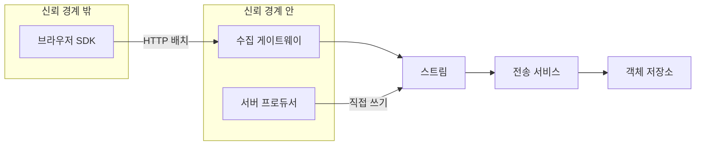

# 브라우저와 서버가 같은 이벤트를 보낼 때의 수집 구조

## 상황

사용자 행동 로그를 모은다. 화면에서 일어나는 일은 브라우저가 안다.
결제가 확정됐는지는 서버만 안다. 그래서 둘 다 이벤트를 만들어야 한다.

같은 이벤트 체계를 쓰는 건 정해져 있다. 분석하는 쪽에서 보면
`page_view`와 `purchase`가 한 테이블에 있어야 깔때기를 그릴 수 있다.

문제는 **보내는 길을 하나로 둘 것인가**다.

하나로 두면 단순하다. 수집 엔드포인트 하나를 만들고 둘 다 거기로 보낸다.
나누면 코드가 두 벌이 된다. 그런데 실제 구조를 보면 나누는 쪽이 많다.
왜 그런지 손으로 만져보고 싶었다.

## 확인하고 싶었던 것

**수집 경로를 하나로 둘 것인가 프로듀서에 따라 나눌 것인가.**

그리고 나눈다면 무엇이 달라지는지. 게이트웨이가 실제로 무엇을 막는지.
게이트웨이를 건너뛰면 무엇을 잃는지.

## 만든 구조



**브라우저는 게이트웨이를 거친다.** 서버는 건너뛴다.
이 비대칭이 이 구조의 핵심이고, 아래 측정은 그 이유를 확인한 것이다.

```bash
npm run lab:ingest
```

## 왜 브라우저는 직접 쓸 수 없는가

**자격증명을 둘 데가 없다.** 브라우저가 스트림에 직접 쓰려면
쓰기 권한이 있는 키가 클라이언트에 있어야 한다.
그 키는 개발자 도구를 열면 보인다. 누구나 아무 이벤트나 쓸 수 있게 된다.

분석 데이터라 대수롭지 않아 보일 수 있다. 그런데 그 데이터로
광고 정산을 하거나 실험 결과를 판단한다면 조작할 이유가 생긴다.

**그리고 브라우저가 보내는 값을 믿을 수 없다.** 게이트웨이가
실제로 무엇을 막는지 재봤다.

| 막는 것 | 결과 |
|---|---|
| 봇 UA | 거절 |
| 허용되지 않은 Origin | 거절 |
| 잘못된 이벤트 4건 중 | 3건 거절, 1건 통과 |
| 디바이스 한도 초과 10건 중 | 6건 거절, 4건 통과 |

잘못된 이벤트를 **건별로 거른다**는 점이 중요하다.
배치에 하나가 섞였다고 전체를 실패시키면 나머지가 같이 사라진다.
응답은 부분 성공이다. 실패한 건만 돌려준다.

**수신 시각은 서버가 항상 덮어쓴다.** 프로듀서가 보낸 값을 쓰지 않는다.

```typescript
// 수신 시각은 서버가 항상 덮어쓴다. 프로듀서 시계를 믿지 않는다.
accepted.push({ ...e, receivedAt })
```

기기 시계는 틀린다. 시간대가 어긋나기도 하고 사용자가 바꾸기도 한다.
2019년으로 맞춰진 기기에서 온 이벤트가 2019년 파티션에 들어가면
그 데이터는 사실상 사라진다. 아무도 그 날짜를 다시 읽지 않는다.

발생 시각은 따로 저장한다. 버리는 게 아니라 파티션에 쓰지 않을 뿐이다.

## 왜 서버는 게이트웨이를 건너뛰는가

**게이트웨이가 하는 일이 전부 필요 없기 때문이다.**

| 게이트웨이가 하는 일 | 서버 프로듀서에게 |
|---|---|
| 봇 차단 | 해당 없음 |
| Origin 검사 | 해당 없음 |
| rate limit | 해당 없음 |
| 시각 덮어쓰기 | 자기 시계가 이미 신뢰 대상 |
| 형식 검증 | 타입으로 이미 보장 |

**홉이 하나 줄면 지연과 고장 지점이 같이 준다.**

| 경로 | 지연 |
|---|---:|
| 브라우저에서 스트림까지 | 361ms |
| 브라우저에서 저장소까지 | 862ms |
| 서버에서 스트림까지 | 0ms |

브라우저 쪽 361ms는 네트워크가 아니라 **클라이언트 버퍼**다.
이벤트를 모아 보내느라 기다린 시간이다. 버퍼가 없으면 클릭 한 번에
요청 한 번이 나가고 그건 감당이 안 된다.

버퍼가 세 겹이라는 점도 봐야 한다. 클라이언트, 게이트웨이, 전송 서비스.
각각이 자기 이유로 모으고, 지연은 더해진다.
실시간 대시보드를 기대하면 안 되는 구조다.

## 기다리지 않고 응답하면 무엇을 잃는가

게이트웨이가 스트림 쓰기를 기다릴지 말지는 선택이다.
기다리지 않으면 응답이 빨라진다. 실제로 무엇이 달라지는지 재봤다.

### 스트림이 잠깐 죽었다 살아날 때

| 방식 | 클라이언트가 본 결과 | 전송 시도 | 실제 적재 | 유실 |
|---|---|---:|---:|---:|
| 기다리지 않음 | 성공 | 1 | 0 | 5 |
| 기다림 | 성공 | 3 | 5 | 0 |

**기다리면 전부 살아난다.** 첫 시도가 실패하면 클라이언트가 다시 보내고,
그 사이 스트림이 돌아와 있다.

**기다리지 않으면 전부 잃는다.** 클라이언트는 200을 받았으니
보낸 줄 안다. 재시도할 이유가 없다. 스트림이 1초 뒤에 살아나도
그 이벤트는 이미 없다.

### 스트림이 계속 죽어 있을 때

| 방식 | 클라이언트가 본 결과 | 전송 시도 | 유실 |
|---|---|---:|---:|
| 기다리지 않음 | 성공 | 1 | 5 |
| 기다림 | 실패 | 4 | 5 |

둘 다 잃는다. 다른 점은 **아는가 모르는가**다.

기다리는 쪽은 클라이언트가 실패를 알고 큐에 남겨둘 수 있다.
기다리지 않는 쪽은 아무도 모른다. 지표가 줄어든 걸 나중에 눈으로 보고
"트래픽이 줄었나" 하고 넘어간다.

### 그래서 어느 쪽인가

**기다리지 않는 선택 자체가 틀린 것은 아니다.** 응답이 빨라지고,
스트림 장애가 사용자 화면에 영향을 주지 않는다.

문제는 그 선택에 **죽은 편지함이 따라붙지 않았을 때**다.
쓰기가 실패한 건을 어딘가에 남겨두면 나중에 다시 넣을 수 있다.
남기지 않으면 그 구간은 복구 수단이 없다.

기다리지 않기로 했다면 최소한 실패 건수를 지표로 내보내야 한다.
그래야 "지금 유실되고 있다"를 알 수 있다.

## 파티션 시간대가 어긋날 때

관리형 전송 서비스는 대개 UTC로 경로를 만든다.
서비스가 KST로 돌아가면 하루 경계에서 파티션이 어긋난다.

KST 기준 하루치 4건을 넣고 읽어봤다.

| | 결과 |
|---|---|
| UTC 파티션 | 2026-03-01에 1건, 2026-03-02에 3건 |
| KST 파티션 | 2026-03-02에 4건 |
| UTC에서 그날 파티션만 읽기 | **3건** |
| UTC에서 앞뒤로 넓게 읽고 거르기 | 4건 |

**하루만 읽으면 한 건이 빠진다.** KST 00시 30분 이벤트가
UTC로는 전날 15시 30분이기 때문이다.

이 어긋남은 오류를 내지 않는다. 숫자가 조금 적을 뿐이다.
매일 자정 직후 트래픽만큼 빠지고, 그 비율이 일정해서
추세를 봐도 이상해 보이지 않는다.

우회하는 방법은 앞뒤 파티션까지 넓게 읽고 이벤트 안의 KST 시각으로
다시 거르는 것이다. 읽는 양이 세 배가 되지만 정확해진다.

```typescript
const keys = options.widen
  ? [shiftDay(kstDate, -1), kstDate, shiftDay(kstDate, 1)]
  : [kstDate]
```

애초에 파티션을 KST로 만들면 이 우회가 필요 없다.
관리형 서비스가 지원하지 않으면 못 하는 선택이고,
그래서 많은 곳이 넓게 읽는 쪽으로 간다.

**어느 쪽이든 그 사실을 아는 사람이 있어야 한다.**
모르고 하루만 읽는 쿼리를 새로 짜면 조용히 틀린 숫자가 나온다.

## 이 구조의 이점

**프로듀서가 늘어도 수집 계약이 하나다.** 브라우저든 서버든
같은 이벤트 형태를 만든다. 분석하는 쪽에서는 출처가 뭐든 한 테이블이다.

**검증을 한곳에서 한다.** 브라우저에서 오는 것만 의심하면 된다.
서버 이벤트까지 같은 검증을 태우면 쓸데없는 일을 두 번 한다.

**스트림이 완충 역할을 한다.** 저장소가 잠깐 느려져도 프로듀서는 모른다.
전송 서비스가 알아서 밀어 넣는다.

**저장 형식과 조회가 분리된다.** 원본은 그대로 두고 분석용 형식을
따로 만들면, 스키마를 잘못 잡았을 때 원본에서 다시 만들 수 있다.

## 고려해야 할 부분

**실시간이 아니다.** 버퍼가 세 겹이라 이벤트가 저장소에 닿기까지
분 단위가 걸린다. 운영 알림이나 실시간 개인화에는 쓸 수 없다.

**게이트웨이가 단일 장애점이다.** 브라우저 이벤트는 전부 여기를 지난다.
여기가 죽으면 프론트 이벤트가 통째로 멈춘다. 서버 이벤트는 계속 간다.
그래서 장애 중에도 지표가 절반만 살아 있는 이상한 상태가 된다.

**중복은 반드시 생긴다.** 클라이언트 재시도가 있으니 최소 한 번 전달이다.
`insertId`로 조회 시점에 거르는 전제가 깔려 있고, 그 전제를 모르는 사람이
집계 쿼리를 새로 짜면 숫자가 부풀어 오른다.

**스키마를 바꾸면 조용히 틀린다.** 이벤트 형태가 바뀌어도 오류가 안 난다.
옛 형식을 읽는 쿼리는 NULL을 세지 않을 뿐이다.
`schemaVersion`을 저장해두고 버전별 건수를 보는 장치가 필요하다.

**비용이 데이터 양에 비례한다.** 자동 수집을 켜면 클릭 하나하나가 이벤트다.
저장 비용보다 조회 비용이 먼저 문제가 되는 경우가 많다.

**개인정보가 섞여 들어온다.** 자유 형식 필드를 열어두면
누군가 전화번호나 이메일을 넣는다. 게이트웨이에서 걸러야 하는데
무엇을 거를지는 정책이라 코드로만 풀리지 않는다.

## 다시 한다면

### 죽은 편지함을 처음부터 만든다

기다리지 않고 응답하기로 했다면 실패한 쓰기를 남겨야 한다.
나중에 붙이려면 그 사이 유실된 구간은 영영 못 메운다.

### 파티션 시간대를 문서 첫 줄에 적는다

UTC인지 KST인지가 쿼리를 짜는 모든 사람에게 영향을 준다.
코드 주석이 아니라 데이터 카탈로그에 있어야 한다.

### 이벤트 타입을 한곳에 모은다

이 실험은 타입이 문자열이다. 실제로는 어딘가에 목록이 있어야
오타로 만들어진 유령 이벤트 타입을 막을 수 있다.
[버전 분기 모듈](../version-dispatch)에서 다룬 것과 같은 문제다.

### 게이트웨이 없이 가는 길을 열어둘지 정한다

이 실험은 서버가 스트림에 직접 쓴다. 대신 서버 쪽 이벤트는
게이트웨이의 검증을 하나도 받지 않는다. 형식이 틀려도 그대로 들어간다.
타입으로 막는다는 전제인데, 그 전제가 깨지는 날이 온다.

최소한의 형식 검증은 스트림 뒤쪽 어딘가에 한 번 더 두는 편이 낫다.

---

## 직접 실행해보기

Docker가 필요 없다. 스트림과 저장소를 인메모리로 흉내 낸다.

```bash
git clone https://github.com/xo0449/backend-lab.git
cd backend-lab && npm install
```

### 1. 네 가지 전부 돌리기

```bash
npm run lab:ingest
```

### 2. 하나만 돌리기

```bash
ONLY=1 npm run lab:ingest   # 게이트웨이가 거르는 것
ONLY=2 npm run lab:ingest   # 기다리는 쪽과 안 기다리는 쪽
ONLY=3 npm run lab:ingest   # 파티션 시간대
ONLY=4 npm run lab:ingest   # 끝에서 끝까지 지연
```

### 3. 게이트웨이를 통과시켜보기

`src/gateway.ts`의 `isBot`이 항상 `false`를 반환하게 바꾼다.

```typescript
function isBot(ua: string): boolean {
  return false
}
```

```bash
ONLY=1 npm run lab:ingest
```

봇 UA가 통과하고 스트림 도달 건수가 늘어난다.
검증 하나를 빼면 무엇이 들어오는지 숫자로 보인다.

### 4. 결론을 뒤집어보기

`bench/run.ts`의 시나리오 2에서 스트림이 살아나는 시점을 늦춘다.

```typescript
setTimeout(() => stream.setMode('ok'), 60)   // 이 값을 5000으로
```

```bash
ONLY=2 npm run lab:ingest
```

"기다림"도 유실 5로 바뀐다. 재시도가 살릴 수 있는 것은
**재시도 창 안에 복구되는 장애뿐**이라는 뜻이다.
기다리는 쪽이 항상 안전한 것이 아니다.

### 5. 클라이언트 버퍼를 바꿔보기

`bench/run.ts`의 시나리오 4에서 `CLIENT_FLUSH`를 조정한다.

```bash
ONLY=4 npm run lab:ingest
```

버퍼를 줄이면 지연이 줄고 요청 수가 는다.
어느 쪽을 택할지는 이벤트 양이 정한다.

### 6. 파티션을 KST로 바꿔보기

`bench/run.ts`의 시나리오 3에서 `partitionAll(stream.all, 'utc')`를
`'kst'`로 바꾼다.

```bash
ONLY=3 npm run lab:ingest
```

하루만 읽어도 4건이 전부 나온다. 넓게 읽을 이유가 사라진다.

### 7. 테스트

```bash
npx vitest run modules/analytics-ingest
```
