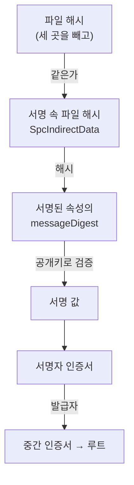

# 코드 서명이 뭔지 몰라서 서명된 exe를 직접 풀어 봤다

## 상황

사이드 프로젝트로 만든 데스크톱 앱의 설치 파일을 처음으로 남에게 건넸다.
받은 사람의 Windows가 "알 수 없는 게시자"라고 물었다. 내 랩탑에서는 스마트 앱 컨트롤이
서명 없는 빌드 산출물의 실행을 아예 막았다.

답은 다들 안다. "코드 서명 인증서를 사서 서명하면 된다."
그런데 나는 서명이 파일의 어디에 들어가는지, 무엇을 보장하는지 몰랐다.
서버 쪽에서 JWT나 웹훅 서명은 매일 다루면서, 내가 배포하는 실행 파일의 서명은 "사서 붙이는 것"으로만 알고 있었다.
돈을 쓰기 전에 그게 무엇인지부터 공부했다. 개념은 [블로그의 서명 공부 기록](https://xo0449.github.io/posts/2026-09-27-signature-mac-vs-digital/)에 정리했고,
여기에는 읽은 것이 맞는지 손으로 확인한 과정을 둔다.

## 확인하고 싶었던 것

**Windows 실행 파일의 코드 서명(Authenticode)은 파일의 어디를 지키고, 어디를 안 지키는가.**

서명 도구를 돌려 "Valid"를 보는 것으로는 알 수 없다. 서명을 직접 풀어서 검증하는 코드를 짜고,
서명된 진짜 파일을 여기저기 고쳐 보면서 어디서 깨지고 어디서 안 깨지는지 봤다.

## 재현

먼저 공부한 것을 세 줄로 줄이면 이렇다.

- 전자서명은 개인키로 만들고 공개키로 검증한다. 파일을 통째로 서명하지 않고 **파일의 해시에 서명한다**
- 그 공개키가 누구 것인지는 **인증서**가 말해 준다. 인증서는 위의 발급자가 서명했고, 그 줄의 끝에 운영체제가 미리 믿는 루트가 있다
- Windows 실행 파일은 이 서명과 인증서들을 **파일 안에** 넣고 다닌다. 이 형식이 Authenticode다

읽기만 해서는 "파일 안에 들어 있는 서명이 어떻게 그 파일 자신을 서명하나"가 이해되지 않았다. 그래서 진짜 파일을 열었다.

표본은 Microsoft가 서명해서 배포하는 WebView2 설치 부트스트래퍼다. 1,844,944바이트.
(SHA-256 `83004a28…028e459c`. 2026-09-19에 받은 것. 이 주소의 파일은 새 버전으로 바뀔 수 있다.)

서명은 파일 안에 들어 있다. PE 헤더의 데이터 디렉터리 다섯 번째 항목이 Certificate Table을 가리키고,
그 표가 파일 맨 끝에 붙어 있다. 안에는 PKCS#7 SignedData가 통째로 들어 있다. 이 파일에서는 11,976바이트다.

검증은 네 단계의 사슬이다.



앞의 세 단계는 수학이라 어디서 돌려도 같다. 이 모듈이 구현한 것이 여기까지다.
마지막 단계, 그 루트를 믿을지는 Windows의 신뢰 저장소가 정한다.

파일 해시를 계산할 때 빼는 곳이 세 군데다. 이 파일에서는 11,996바이트.

| 빼는 곳 | 크기 | 이유 |
|---|---|---|
| 옵셔널 헤더의 CheckSum | 4 | 서명을 붙이면 파일이 바뀌니 체크섬도 바뀐다 |
| 데이터 디렉터리의 Certificate Table 항목 | 8 | 서명을 붙여야 위치와 크기가 정해진다 |
| Certificate Table | 11,984 | 서명이 들어갈 자리다. 자기 자신을 해시할 수는 없다 |

있는 그대로 돌리면 이렇게 나온다.

```
서명 속 해시    1bc73d3e897becdf76096f4d19b7e94103c52e6ce7f5a54fe80cb68e732514a4
다시 계산       1bc73d3e897becdf76096f4d19b7e94103c52e6ce7f5a54fe80cb68e732514a4
판정            파일 해시 통과 · 내용 해시 통과 · 서명 값 통과
서명자          O=Microsoft Corporation, CN=Microsoft Corporation (Apr 16 2026 ~ Apr 15 2027)
들어 있는 인증서 Microsoft Corporation  ←  Microsoft Code Signing PCA 2024
들어 있는 인증서 Microsoft Code Signing PCA 2024  ←  Microsoft Root Certificate Authority 2011
타임스탬프      rfc3161
```

내가 짠 해시가 Microsoft가 서명할 때 계산한 해시와 같다. "세 곳을 뺀다"를 맞게 이해했다는 뜻이다.
서명이 없는 내 설치 파일은 Certificate Table 항목이 0, 0이고, 빠지는 곳이 12바이트뿐이다.

## 접근

Node의 `crypto`만 썼다. PE 헤더에서 세 곳의 위치를 찾고(`src/pe.ts`), DER를 필요한 만큼만 읽어서(`src/der.ts`)
PKCS#7을 걸어 다닌다(`src/signature.ts`). 걸린 곳이 둘이었다.

- **내용 해시는 SpcIndirectData의 태그와 길이를 빼고 계산한다.** 통째로 해시하면 messageDigest와 안 맞는다
- **서명된 속성은 `[0]` 태그로 들어 있지만, 서명할 때는 첫 바이트를 SET(0x31)으로 바꿔서 해시한다.** 그대로 검증하면 실패한다

버린 선택지.

- **osslsigncode나 signtool로 검증한다.** "Valid" 한 줄이 나온다. 어디를 지키는지는 안 나온다
- **내 파일을 직접 서명해 본다.** SignedData를 만드는 쪽은 DER 쓰기가 필요하고, 자체 서명 인증서는 어차피 Windows가 안 믿는다. 읽는 쪽이 질문에 더 가깝다
- **ASN.1 라이브러리를 쓴다.** 읽기만 하면 51줄이다. 의존성을 늘릴 일이 아니었다

그다음 파일을 고쳤다(`src/tamper.ts`). 해시 구간 안에서 비트 하나를 뒤집는 것을 2,000번, 해시 밖은 다섯 가지.

## 결과

**해시 구간 안은 빈틈이 없었다.** 무작위로 고른 자리의 비트 하나를 뒤집은 2,000번이 전부 잡혔다.
헤더든 코드든 리소스든 같다. 해시 계산은 1.8MB에 0.85ms(50번 중앙값)라 비용도 없다.

**해시 밖은 이랬다.** 다섯 경우 모두 파일의 SHA-256은 달라졌다.

| 고친 것 | 파일 해시 | 내용 해시 | 서명 값 |
|---|---|---|---|
| 체크섬을 `0xDEADBEEF`로 | 통과 | 통과 | 통과 |
| 파일 끝에 1KB 덧붙이기 (표 크기는 그대로) | **실패** | 통과 | 통과 |
| Certificate Table을 1KB 늘려 그 안에 넣기 | 통과 | 통과 | 통과 |
| Certificate Table을 1MB 늘려 그 안에 넣기 | 통과 | 통과 | 통과 |
| 서명 값의 비트 하나 뒤집기 | 통과 | 통과 | **실패** |

세 번째와 네 번째는 공부할 때는 예상하지 못한 것이다. 표의 크기(디렉터리 항목과 `dwLength`)를 같이 올리면
PKCS#7 뒤에 아무 바이트나 넣을 수 있다. PKCS#7은 자기 길이를 DER 안에 갖고 있어서 뒤에 붙은 것은 읽히지 않고,
표 자체는 해시 밖이다. **1,844,944바이트짜리 서명된 파일이 2,893,520바이트가 됐는데 세 단계가 전부 통과했다.**

이건 내가 찾은 구멍이 아니다. Microsoft가 2013년에 CVE-2013-3900으로 공지했고,
표 안의 여분 데이터를 거절하는 검사(`EnableCertPaddingCheck`)를 기본값이 아니라 선택 사항으로 냈다.
**이 실험은 Windows의 판정을 보지 않았다.** 내 검증 코드가 통과시켰다는 것까지가 잰 것이다.
Windows에서 확인하는 명령은 아래 "직접 실행해보기"에 적었다.

정리하면 서명이 말해 주는 것은 이렇다.

- **지킨다**: 실행되는 코드와 헤더, 리소스. 비트 하나도
- **안 지킨다**: 서명이 들어 있는 표 안의 여분. 그래서 "서명이 유효하다"와 "파일이 배포한 것과 바이트 단위로 같다"는 다른 말이다.
  받은 파일이 그 파일인지는 서명이 아니라 SHA-256으로 본다. 내 릴리스 노트에 해시를 같이 적어 둔 것이 쓸모없는 일이 아니었다
- **말해 주지 않는다**: 이 코드가 안전한지. 서명은 "누가 만들었고 그 뒤로 안 바뀌었다"까지다

하나 더. 표본의 서명자 인증서는 유효 기간이 1년이다(2026-04-16 ~ 2027-04-15).
그런데 서명에 RFC 3161 타임스탬프가 붙어 있다. 제3자가 "이 시각에 이 서명이 있었다"고 덧서명한 것이다.
인증서가 만료된 뒤에도 그 전에 한 서명이 유효하게 남는 근거가 이것이다. 서명할 때 타임스탬프를 빼먹으면 1년 뒤에 설치 파일이 전부 경고를 띄운다.

## 다시 한다면

- **Windows의 판정을 같이 본다.** 고친 파일 다섯 개를 Windows로 가져가 `Get-AuthenticodeSignature`로 보고,
  `EnableCertPaddingCheck`를 켠 뒤에 다시 본다. 이 모듈의 가장 큰 빈자리다
- **타임스탬프 토큰 안을 검증하지 않았다.** 붙어 있는지만 봤다. 그 안에도 서명 사슬이 하나 더 있다
- **인증서 사슬을 검증하지 않았다.** 들어 있는 인증서의 이름만 읽었다. 폐기 여부(CRL, OCSP)도 안 봤다
- **서명이 둘 이상인 파일**(SHA-1과 SHA-256을 같이 단 옛 파일)은 첫 번째만 읽는다
- 다루지 않은 것: 서명을 해도 SmartScreen이 한동안 묻는 이유(평판), 인증서의 종류와 값, macOS의 공증. 재현할 수 없는 것이라 여기 두지 않았다

참고한 문서: Microsoft, *Windows Authenticode Portable Executable Signature Format* (2008). RFC 5652 5.4절. Microsoft 보안 공지 CVE-2013-3900.

---

## 직접 실행해보기

Docker가 필요 없습니다. Node만 있으면 됩니다. 처음 돌릴 때 표본 1.8MB를 Microsoft에서 받습니다.

### 0. 준비

```bash
git clone https://github.com/xo0449/backend-lab.git
cd backend-lab
npm install
```

### 1. 전부 돌리기

```bash
npm run lab:signing
```

네 가지가 차례로 나옵니다. 3번이 2,000번 해시를 계산해서 몇 초 걸립니다.

### 2. 하나만 돌리기

```bash
ONLY=1 npm run lab:signing   # 있는 그대로: 해시 구간, 서명자, 인증서, 타임스탬프
ONLY=2 npm run lab:signing   # 해시 계산 시간
ONLY=3 npm run lab:signing   # 해시 구간 안에서 비트 뒤집기
ONLY=4 npm run lab:signing   # 해시 밖을 고치기
```

### 3. 숫자와 파일을 바꿔 보기

```bash
FLIPS=20000 SEED=7 ONLY=3 npm run lab:signing     # 더 많이, 다른 자리를
FILE=/path/to/any.exe npm run lab:signing          # 내 파일로. 서명이 없으면 1번만 돕니다
```

가지고 있는 설치 파일 아무거나 넣어 보면 누가 서명했는지, 타임스탬프가 있는지 나옵니다.

### 4. 결론을 뒤집어 보기

`src/pe.ts`의 `hashedRanges`에서 이 줄을

```typescript
const end = layout.certTable ? layout.certTable.offset : buf.length
```

이렇게 바꾸면 Certificate Table까지 해시에 넣게 됩니다.

```typescript
const end = buf.length
```

`ONLY=1`로 돌리면 "파일 해시 실패"가 나옵니다. 서명이 자기 자신을 해시에 넣을 수 없다는 것,
그래서 그 자리가 비어 있을 수밖에 없다는 것이 보입니다.

### 5. 상태를 직접 들여다보기

```bash
# 서명 덩어리를 openssl로 본다. 표의 위치와 크기는 ONLY=1의 출력(해시 구간의 끝)에서 읽는다
tail -c +1832969 /tmp/lab-signing-sample.exe | openssl pkcs7 -inform DER -print_certs -noout
```

Windows가 있으면 고친 파일을 가져가서 봅니다. 이 명령은 제가 돌려 보지 못했습니다.

```bash
mkdir -p out && OUT=out ONLY=4 npm run lab:signing    # out/case1.exe ~ case5.exe
```

```powershell
Get-ChildItem out\*.exe | Get-AuthenticodeSignature | Format-Table Path, Status
```

### 6. 테스트

```bash
npx vitest run modules/code-signing-authenticode
```

가짜 PE 헤더로 돌아서 네트워크가 필요 없습니다.
