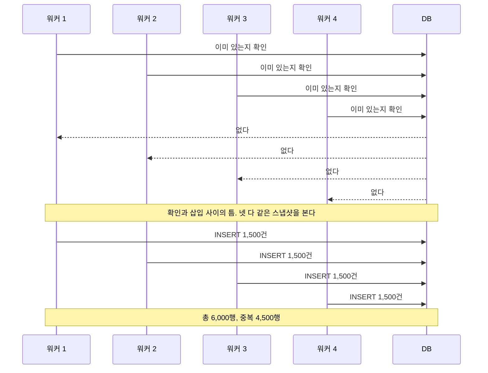
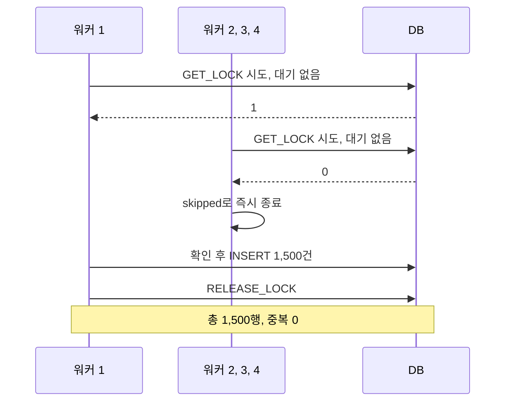
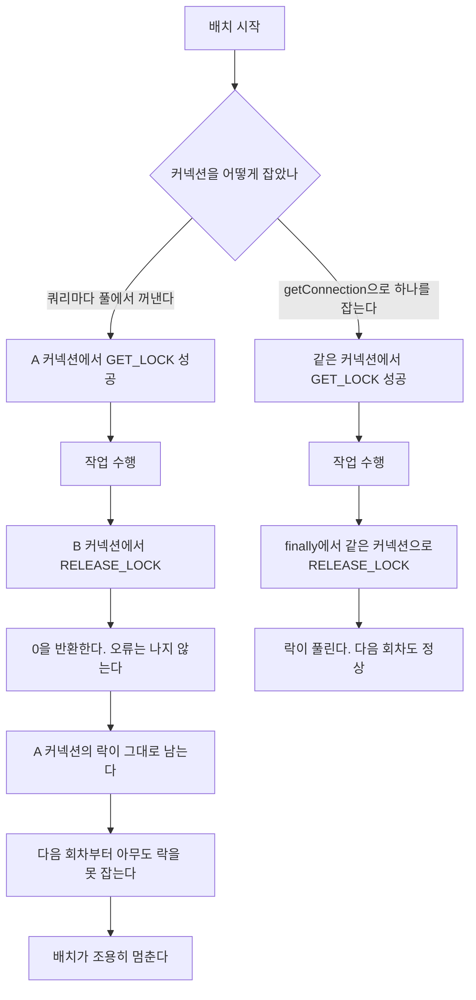

# 다중 인스턴스에서 크론이 중복 실행되는 문제

## 상황

자정마다 도는 배치가 있다. 조건에 맞는 아이템을 찾아 결과 테이블에
넣는 일을 한다. 읽고, 계산하고, 쓴다.

크론은 애플리케이션 프로세스 안에 등록되어 있다.
서버를 띄우면 스케줄러도 같이 뜨는 구조다. 흔한 방식이고,
서버가 하나일 때는 아무 문제가 없다.

문제는 서버를 늘릴 때 시작된다. 트래픽이 늘어 컨테이너를 두 개로,
네 개로 늘린다. 이건 무해한 변경처럼 보인다. 웹 요청은 앞단에서
나눠주니까 인스턴스가 몇 개든 상관없다.

**그런데 크론은 나눠지지 않는다.** 인스턴스 네 개면 자정에 네 번 돈다.

배치가 멱등하면 네 번 돌아도 결과가 같다. 그런데 이 배치는 그렇지 않다.
"이미 있는지 확인하고 없으면 넣는" 구조인데, 확인과 삽입 사이에 틈이 있다.
네 실행이 거의 동시에 시작해 같은 시점의 스냅샷을 읽으면
넷 다 "아직 없다"고 판단한다. 그리고 넷 다 넣는다.

이런 문제는 배포 직후에 안 드러난다. 다음 자정에 드러난다.
그것도 오류로 드러나지 않는다. 행이 네 배로 늘어날 뿐이다.

## 확인하고 싶었던 것

단일 프로세스를 가정한 코드가 어디서 깨지는지 손으로 만져보고 싶었다.
그리고 막는 방법이 여럿인데 왜 하나를 고르는지 근거를 갖고 싶었다.

## 재현

워커 4개를 동시에 돌린다.

```bash
npm run db:up
npx tsx modules/cron-duplicate-execution/bench/seed.ts
npx tsx modules/cron-duplicate-execution/bench/run.ts
```

```json
{
  "mode": "naive",
  "workers": 4,
  "insertedPerWorker": [1500, 1500, 1500, 1500],
  "totalRows": 6000,
  "distinctItems": 1500,
  "duplicated": 4500
}
```

네 워커가 각각 1,500건을 넣었다. 실제로 필요한 건 1,500건이다.



재현에 한 가지 장치를 넣었다. 계산 구간에 200ms 지연을 뒀다.

```typescript
// 실제 배치의 계산 구간을 흉내낸다. 이 구간이 길수록 경합이 잘 드러난다.
await new Promise((r) => setTimeout(r, 200))
```

이게 없으면 재현이 들쭉날쭉하다. 운이 좋으면 중복이 안 나온다.
실제 배치는 수만 건을 계산하느라 몇 초씩 걸리므로 틈이 훨씬 크다.
지연은 그 틈을 안정적으로 만들기 위한 것이지 문제를 만들어낸 게 아니다.

**재현되지 않는 문제는 고칠 수 없다.** 간헐적으로 나오는 상태로 두면
고쳤는지 아닌지도 알 수 없다. 여기서 확실히 재현하고 넘어갔다.

## 막는 방법 네 가지를 놓고 봤다

### 유니크 제약

`(condition_id, item_id)`에 유니크 제약을 걸면 중복 행은 막힌다.
가장 먼저 떠오르는 방법이고, 실제로 넣어야 한다.

그런데 이것만으로는 부족하다. **배치가 네 번 도는 것 자체는 그대로다.**
나머지 세 번은 전부 삽입에 실패한다. 그 실패를 무시할지 재시도할지
또 정해야 한다. 로그에는 매일 자정마다 오류가 세 번씩 찍힌다.
진짜 오류와 구분이 안 된다.

전체 스캔도 네 번 한다. 배치가 무거워지면 그게 부하가 된다.

증상을 막는 것과 원인을 없애는 것은 다르다.
제약은 마지막 방어선으로 유효하다. 해결책은 아니다.

그래서 이 실험의 스키마에는 유니크 제약을 일부러 넣지 않았다.
제약이 있으면 문제가 안 보인다.

### Redis 분산 락

의존성이 하나 늘어난다. 이미 MySQL을 쓰고 있고 배치는 어차피 그 MySQL에
쓴다. 락과 데이터가 같은 곳에 있으면 생각할 것이 줄어든다.

Redis가 필요해지는 경우는 있다. 락을 잡는 쪽과 데이터를 쓰는 쪽이
다른 저장소일 때, 또는 락 획득이 잦아 DB 커넥션을 오래 점유하는 것이
부담일 때다. 자정에 한 번 도는 배치는 둘 다 아니다.

Redis 락은 만료 시간을 정해야 한다는 부담도 있다.
너무 짧으면 배치가 끝나기 전에 풀리고, 너무 길면 인스턴스가 죽었을 때
다음 회차까지 막힌다. 배치 소요 시간이 데이터 양에 따라 변하면
적당한 값을 정하기 어렵다.

### 리더 선출

인스턴스 중 하나만 스케줄러를 돌리게 한다. 근본적이지만
선출 자체가 또 하나의 분산 문제다. 배치 하나 때문에 도입할 크기가 아니다.

### MySQL 네임드 락

고른 방법이다. 이미 있는 것으로 풀리고, 만료 시간을 정할 필요가 없다.
커넥션이 끊기면 자동으로 풀리므로 인스턴스가 죽어도 교착이 없다.

네 가지를 한자리에 놓으면 이렇다.

| 방법 | 막는 것 | 안 막는 것 | 새로 지는 부담 |
|---|---|---|---|
| 유니크 제약 | 중복 행 | 배치가 네 번 도는 것, 전체 스캔 네 번 | 삽입 실패를 무시할지 재시도할지 정해야 한다. 자정마다 오류가 세 번 찍혀 진짜 오류와 섞인다 |
| Redis 분산 락 | 동시 실행 | 크론이 프로세스마다 등록되는 구조 | 의존성이 하나 늘어난다. 만료 시간을 정해야 하는데 짧으면 배치 중에 풀리고 길면 다음 회차까지 막힌다 |
| 리더 선출 | 중복 실행 자체. 스케줄러가 한 인스턴스에서만 돈다 | 없다. 원인을 없앤다 | 선출 자체가 또 하나의 분산 문제다. 배치 하나 때문에 도입할 크기가 아니다 |
| MySQL 네임드 락 | 동시 실행 | 실행의 완결성, 크론이 프로세스마다 등록되는 구조 | 획득부터 해제까지 같은 커넥션을 유지해야 한다. 배치가 여러 개가 되면 락 이름 설계가 따라온다 |

## 고친 코드

```typescript
export async function reevaluateWithLock(pool: Pool, conditionId: number) {
  const conn = await pool.getConnection()
  try {
    const [rows] = await conn.query('SELECT GET_LOCK(?, 0) AS ok', [LOCK_NAME])
    if (rows[0]?.ok !== 1) return { inserted: 0, skipped: true }

    try {
      return await reevaluate(pool, conditionId)
    } finally {
      await conn.query('SELECT RELEASE_LOCK(?)', [LOCK_NAME])
    }
  } finally {
    conn.release()
  }
}
```

```bash
MODE=lock npx tsx modules/cron-duplicate-execution/bench/run.ts
```

```json
{
  "mode": "lock",
  "workers": 4,
  "insertedPerWorker": [1500, 0, 0, 0],
  "totalRows": 1500,
  "duplicated": 0
}
```



### 왜 같은 커넥션이어야 하는가

네임드 락은 커넥션 단위다. 이게 가장 걸리기 쉬운 부분이다.

풀을 쓰면 쿼리마다 다른 커넥션이 나올 수 있다.
`GET_LOCK`을 A 커넥션에서 잡고 `RELEASE_LOCK`을 B 커넥션에서 부르면
해제가 0을 반환하고 락은 그대로 남는다. 오류가 나지 않는다.

다음 회차부터 아무도 락을 못 잡는다. 배치가 조용히 멈춘다.
중복 삽입보다 알아채기 어려운 고장이다.



그래서 `getConnection()`으로 하나를 잡고 획득부터 해제까지 유지한다.
해제는 `finally`에 둔다. 예외가 나도 락이 남지 않아야 한다.

### 왜 즉시 반환인가

`GET_LOCK(name, 0)`은 락을 못 잡으면 바로 0을 준다.

대기하게 만들면 어떻게 되는지 생각해보면 답이 나온다.
첫 번째가 끝난 뒤 두 번째가 깨어나 같은 일을 다시 한다.
이미 처리된 상태라 삽입할 것은 없다. 하지만 전체 스캔은 한다.
네 번째까지 순서대로 깨어나면서 스캔을 네 번 한다.

배치는 웹 요청과 다르다. 요청은 대기하면 결과를 받을 수 있지만,
배치는 이미 끝난 일을 다시 하는 것뿐이다. 건너뛰는 게 맞다.

## 결과

| 항목 | 개선 전 | 개선 후 |
|---|---:|---:|
| 중복 행 | 4,500 | 0 |
| 총 행 수 | 6,000 | 1,500 |
| 실제 삽입한 워커 | 4 | 1 |

테스트 두 개로 고정했다.

```typescript
it('락이 없으면 중복 행이 생긴다', async () => {
  await Promise.all([1, 2, 3, 4].map(() => reevaluate(pool, 1)))
  expect(await duplicateCount()).toBeGreaterThan(0)
})
```

첫 번째 테스트가 중요하다. 문제가 실재했다는 증거를 코드로 남긴다.
고친 코드만 테스트하면 나중에 누군가 락을 걷어냈을 때
왜 있었는지 알 방법이 없다.

## 다시 한다면

### 스케줄러를 애플리케이션에서 분리한다

락은 증상을 막는 해결이다. 크론이 프로세스마다 등록된다는 구조 자체가
원인이다. 별도 스케줄러가 작업을 큐에 넣고 워커가 꺼내 가면
중복 실행이 애초에 생기지 않는다.

다만 그건 인프라가 하나 늘어나는 일이다. 배치가 몇 개 안 될 때는
락 한 줄이 합리적인 타협이다. 배치가 늘어나면, 특히 배치끼리
순서가 생기기 시작하면 그때 옮긴다. 옮기는 시점을 미리 정해두는 게
좋다. "배치가 열 개를 넘으면" 같은 식으로.

### 락을 잡은 인스턴스가 죽으면

커넥션이 끊기면 MySQL이 락을 자동으로 푼다. 영구 교착은 없다.

대신 그 회차는 중간까지만 처리된 채 끝난다.
다음 자정까지 그 상태로 있는다. 배치가 중간부터 다시 시작할 수 있는
구조인지는 별개로 확인해야 한다. 이 실험에서는 다루지 않았다.

**락은 동시 실행을 막을 뿐 실행의 완결성은 보장하지 않는다.**
두 가지를 같은 것으로 착각하기 쉽다.

### 배치가 하나가 아니게 되면

지금은 락 이름이 하나다. 배치가 여러 개면 이름을 나눠야 하고,
나누는 규칙을 정해야 한다. 이름이 겹치면 관계없는 배치끼리 서로를 막는다.
이름이 너무 잘게 나뉘면 같이 돌면 안 되는 배치가 같이 돈다.

이 실험은 배치 하나만 다뤘다. 여러 개가 되는 순간
락 이름 설계가 새 문제로 등장한다.

---

## 직접 실행해보기

```bash
git clone https://github.com/xo0449/backend-lab.git
cd backend-lab && npm install
npm run db:up
npm run lab:cron:seed
```

### 1. 중복을 재현하기

워커 4개가 동시에 같은 배치를 돈다.

```bash
npm run lab:cron
```

`duplicated`가 0보다 크면 재현된 것이다.
안 나오면 아이템을 늘려 계산 구간을 길게 만든다.

```bash
ITEMS=5000 npm run lab:cron:seed && npm run lab:cron
```

### 2. 락을 걸고 다시 보기

```bash
MODE=lock npm run lab:cron
```

한 워커만 삽입하고 나머지 셋은 건너뛴다.

### 3. 워커 수 바꿔보기

```bash
WORKERS=8 npm run lab:cron
MODE=lock WORKERS=8 npm run lab:cron
```

### 4. 락이 실제로 잡혀 있는지 보기

배치가 도는 동안 다른 창에서 확인한다.

```bash
docker exec backend-lab-mysql-1 mysql -h127.0.0.1 -uroot -plab -e "
SELECT IS_USED_LOCK('reevaluate:discount') AS holder_connection_id;"
```

### 5. 테스트

```bash
npx vitest run modules/cron-duplicate-execution
```

### 정리

```bash
npm run db:down
```
