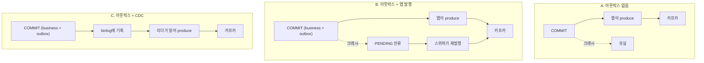
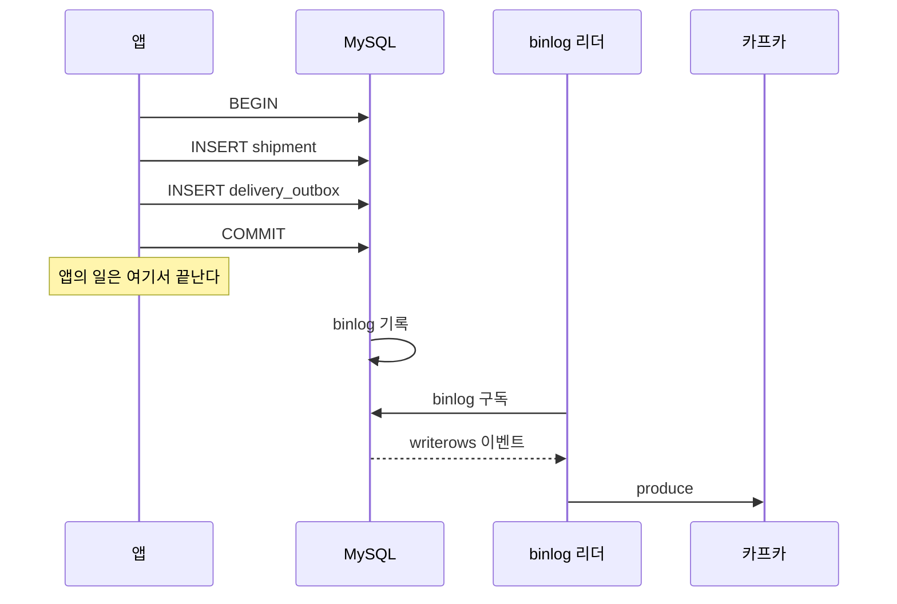

# 아웃박스, CDC, 카프카로 이벤트를 전달하는 세 가지 방법

## 고민

"이벤트로 전달한다"는 한 문장인데 실제로는 결정이 두 개다.

**어디에 쓸 것인가.** DB에 남기는가, 브로커에 바로 던지는가.
**누가 브로커에 올리는가.** 애플리케이션인가, 변경 로그를 읽는 별도 프로세스인가.

이 두 축이 섞이면서 방식이 갈린다. 브로커를 카프카로 바꾸면
아웃박스가 필요 없어지는 것처럼 이야기되는 경우가 있는데 그렇지 않다.
**카프카는 두 번째 축의 답이 아니라 브로커의 종류다.**

이 실험은 그 구분을 손으로 확인하려고 만들었다.

## 비교 대상

브로커는 셋 다 카프카로 맞췄다. 브로커 차이가 아니라 발행 경로의
차이를 보려는 것이다.

| | 트랜잭션 안에 남기는가 | 브로커에 올리는 주체 | 복구 장치 |
|---|---|---|---|
| A. 아웃박스 없음 | 안 남긴다 | 애플리케이션 | 없다 |
| B. 아웃박스 + 앱 발행 | 남긴다 | 애플리케이션 | 스위퍼 |
| C. 아웃박스 + CDC | 남긴다 | binlog 리더 | 오프셋 |



## 실행

```bash
npm run db:up
npx tsx modules/delivery-comparison/bench/run.ts
```

MySQL은 binlog를 ROW 포맷으로 쓰고 있고, 카프카는 KRaft 모드로 뜬다.
리더는 복제 권한을 가진 별도 계정으로 붙는다.

## 시나리오 1. 커밋 직후 프로세스가 죽는다

가장 자주 인용되는 시나리오다. 실제로 돌려봤다.

| | 크래시 직후 | 복구 후 |
|---|---|---|
| A. 아웃박스 없음 | 유실 | 복구 경로 없음 |
| B. 아웃박스 + 앱 발행 | 미도달 | 스위퍼가 1건 복구해 도달 |
| C. 아웃박스 + CDC | 도달 | 복구 절차 없이 도달 |

**A는 되살릴 근거가 없다.** 주문 행은 남아 있지만 "이 주문이
통보되었는가"를 아는 방법이 없다. 나중에 전수 대사를 돌리는 수밖에 없다.

**B는 근거가 남아 있다.** `PENDING` 행이 그것이다. 대신 그 행을
주워갈 누군가가 필요하다. 스위퍼가 없으면 근거만 쌓이고 아무 일도
일어나지 않는다.

**C에서는 이 시나리오가 성립하지 않는다.** 애플리케이션에 발행 코드가
아예 없기 때문이다. 커밋했다면 binlog에 있고, 리더가 읽는다.
실험에서 발행 코드를 호출하지 않았는데도 2건이 도달했다.



## 시나리오 2. CDC 리더가 멈췄다 돌아온다

C에서 새로 생긴 고장 지점이다. 리더는 별도 프로세스라 죽을 수 있다.

| | 건수 |
|---|---:|
| 리더 정지 중 도달 | 0 |
| 재시작 후 도달 | 2 |

정지 중에는 하나도 안 나간다. 재시작하면 밀린 것을 따라잡는다.
**따라잡는 조건은 리더가 자기 위치를 저장해뒀다는 것이다.**

저장을 안 하면 재시작할 때 두 선택지밖에 없다.
처음부터 읽으면 전부 중복이고, 끝에서 시작하면 멈춘 동안의 것을 잃는다.
이 실험에서는 MySQL에 위치를 물어 저장하는 방식으로 처리했다.

실제 운영에서는 여기에 하나가 더 붙는다. **binlog 보존 기간이다.**
리더가 보존 기간보다 오래 멈춰 있으면 그 구간은 영영 못 읽는다.
B의 `PENDING` 행은 기한이 없지만 binlog는 지워진다.

## 시나리오 3. 오프셋을 되감아 재처리한다

큐에는 없는 동작이다. 카프카가 로그이기 때문에 가능하다.

| | 건수 |
|---|---:|
| 되감기 후 다시 읽은 메시지 | 5 |
| 그중 고유 건수 | 5 |

소비자 버그를 고친 뒤 과거 구간을 다시 처리할 수 있다.
작업 큐에서는 이미 꺼내간 잡이 사라져 있어 할 수 없는 일이다.

대신 재처리는 소비자가 멱등할 때만 안전하다.
되감기는 "다시 보내주는" 기능이지 "제대로 처리해주는" 기능이 아니다.

## 재시도 관점에서 본 세 방식

재시도를 한 덩어리로 보면 비교가 안 된다. 구간을 나눠야 한다.


**발행 구간**은 커밋과 브로커 도착 사이다. 여기가 세 방식이 갈리는 곳이다.
**소비 구간**은 브로커에서 꺼내 처리하는 사이다. 여기는 브로커가 정한다.

| 구간 | A | B | C |
|---|---|---|---|
| 발행 실패 시 근거 | 없음 | PENDING 행 | binlog |
| 발행 재시도 주체 | 없음 | 스위퍼 | 리더 |
| 재시도 기한 | 해당 없음 | 없음 | binlog 보존 기간 |
| 소비 재시도 | 컨슈머 구현 | 컨슈머 구현 | 컨슈머 구현 |
| 소비 실패 격리 | 직접 구현 | 직접 구현 | 직접 구현 |

**소비 구간은 세 방식이 같다.** 브로커를 카프카로 맞췄기 때문이다.
여기서 드러나는 것이 하나 있다. 카프카에는 큐가 주는 재시도와
죽은 편지함이 없다. 재시도 횟수, 백오프, 실패 격리를 직접 만들어야 한다.

BullMQ 같은 작업 큐를 쓰면 그게 내장이다. 대신 오프셋 되감기가 없다.
**둘 다 갖고 싶다면 둘 다 만들어야 한다.** 한쪽을 고르면 다른 쪽이 숙제로 남는다.

## 안정성 평가

### 유실

| 구간 | A | B | C |
|---|---|---|---|
| 커밋 전 실패 | 유실 없음 | 유실 없음 | 유실 없음 |
| 커밋 후 발행 전 | **유실** | 지연 후 복구 | 유실 없음 |
| 브로커 장애 | 유실 | 지연 후 복구 | 지연 후 복구 |
| 리더 장기 정지 | 해당 없음 | 해당 없음 | **보존 기간 초과 시 유실** |
| 소비 실패 | 브로커 설정에 의존 | 같음 | 같음 |

A는 커밋 직후 구간이 통째로 비어 있다.
B는 그 구간을 스위퍼로 메우지만 복구가 스위퍼 주기만큼 늦는다.
C는 그 구간이 구조적으로 없는 대신 리더 정지가 새 위험이 된다.

### 중복

세 방식 모두 최소 한 번 전달이다. 정확히 한 번은 어디에도 없다.
중복이 생기는 지점만 다르다.

| 방식 | 중복이 생기는 지점 |
|---|---|
| A | 발행 후 응답 유실로 재발행할 때 |
| B | 스위퍼가 이미 나간 행을 다시 올릴 때 |
| C | 리더가 위치를 잃고 뒤로 돌아갈 때 |

**그래서 셋 다 소비자 멱등성이 전제다.** 이건 방식 선택으로 피할 수 없다.
발행 쪽을 아무리 정교하게 만들어도 소비자가 멱등하지 않으면
언젠가 두 번 처리된다.

### 운영 부담

| | A | B | C |
|---|---|---|---|
| 새로 뜨는 프로세스 | 없음 | 스위퍼 | binlog 리더 |
| 새로 봐야 할 지표 | 없음 | PENDING 적체 | 리더 지연, 오프셋 |
| DB 부담 | 없음 | 아웃박스 테이블, 폴링 | 아웃박스 테이블, binlog |
| 스키마 변경 대응 | 없음 | 없음 | 리더가 테이블 구조를 안다 |

C의 마지막 줄이 실제로 성가신 부분이다. 리더는 컬럼 순서와 타입을
알고 있어야 한다. 아웃박스 테이블 스키마가 바뀌면 리더도 같이 바꿔야 하고,
배포 순서를 틀리면 잘못 읽는다.

## 무엇을 고를 것인가

**A는 선택지가 아니다.** 이벤트가 사라져도 되는 경우에만 쓸 수 있는데,
그런 이벤트라면 굳이 보낼 이유를 다시 생각해보는 게 낫다.

**B가 기본값이다.** 부품이 적고, 실패했을 때 무엇이 남는지 눈에 보인다.
`PENDING` 행을 SELECT 한 번으로 셀 수 있다는 게 생각보다 큰 장점이다.
운영 중에 상태를 확인하는 가장 빠른 방법이 SQL 한 줄이다.

**C는 B가 불편해졌을 때 간다.** 불편해졌다는 신호는 이런 것들이다.
발행 코드를 빠뜨린 사고가 반복된다. 스위퍼 주기가 요구 지연에 비해 길다.
아웃박스를 쓰는 도메인이 여럿이라 발행 코드가 중복된다.

**카프카는 이 축의 답이 아니다.** 브로커를 바꿔도 커밋과 발행 사이의 틈은
그대로다. 카프카를 고르는 이유는 순서 보장, 팬아웃, 재처리다.
그건 소비 구간의 요구이지 발행 구간의 해결이 아니다.

## 다시 한다면

### 지연을 재본다

이 실험은 유실과 중복만 봤다. 커밋에서 소비까지 걸리는 시간은 재지 않았다.
B는 스위퍼 주기가 최악 지연을 정하고, C는 리더의 처리 속도가 정한다.
평균이 아니라 최악을 봐야 하는 값이다.

### 순서를 확인한다

같은 키의 이벤트 두 개가 순서대로 도착하는지 확인하지 않았다.
카프카는 파티션 단위로 순서를 보장하는데, 리더가 여러 개면
그 보장이 깨질 수 있다. 확인이 필요한 지점이다.

### 리더를 이중화해본다

이 실험의 리더는 하나다. 실제로는 그게 단일 장애점이다.
둘로 늘리면 같은 행을 둘 다 읽어 중복이 배로 늘어난다.
리더 사이의 조정이 또 하나의 분산 문제가 된다.
여기까지 가면 직접 만들지 말고 Debezium 같은 것을 쓰는 게 맞다.

### 스키마 변경을 겪어본다

C에서 아웃박스 테이블에 컬럼을 추가하고 리더를 그대로 두면
무슨 일이 생기는지 확인하지 않았다. 배포 순서에 따라
잘못 읽을 가능성이 있고, 그게 CDC의 실제 운영 비용이다.
