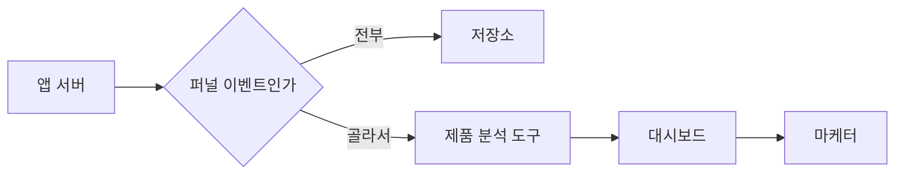

# 경로가 둘이면 고장도 둘인데, 둘 다 조용히 고장 난다

## 상황

마케터가 매일 아침 같은 걸 묻는다.
어제 장바구니에 담은 사람이 몇 명이고 그중 결제까지 간 비율이 얼마인가.

질문이 고정돼 있고 묻는 사람은 쿼리를 안 쓴다.
그러면 조회 엔진을 붙일 일이 아니라 제품 분석 도구를 붙일 일이다.

그런데 도구에만 보내면 원본이 우리 쪽에 안 남는다.
도구를 바꾸는 날 과거를 못 꺼낸다.
그래서 **같은 이벤트를 저장소와 도구 양쪽으로 보낸다.**

이 구조를 여러 곳에서 봤고, 처음에는 낭비로 보였는데 이유가 있었다.
저장소는 나중에 다른 질문을 하기 위한 것이고 도구는 지금 보기 위한 것이다.

문제는 그다음이다. **경로가 둘이면 고장도 둘이다.**

## 확인하고 싶었던 것

**한쪽만 끊겼을 때 어떻게 알아채는가.**

저장소 쪽이 끊기면 알기 쉬울 것 같았다. 파일이 안 생기니까.
도구 쪽이 끊기면 어떻게 아는지가 감이 안 왔다.

## 재현

같은 이벤트를 두 곳으로 보내는 구조를 만들었다.



저장소에는 전부 보낸다. 나중에 무엇을 물을지 모르기 때문이다.
도구에는 퍼널에 쓰는 것만 보낸다. 이벤트 수로 돈을 받기 때문이다.

하루 2만 건 기준이다.

| | 건수 |
|---|---|
| 하루에 만들어진 이벤트 | 20,000건 |
| 그중 퍼널에 쓰는 것 | 11,546건 |
| 전부 보내면 도구가 세는 수 | 20,000건 |
| 골라 보내면 | 11,546건 (42% 적음) |

골라 보내는 건 아끼자는 이야기만은 아니다.
화면 스크롤이나 서버 내부 로그가 퍼널 화면에 섞이면 보기도 나빠진다.
안 보낸 것도 저장소에는 그대로 남아 있어서 나중에 물을 수 있다.

### 도구 쪽만 30분 끊어봤다

| | 결과 |
|---|---|
| 저장소에 들어간 것 | 20,000건 (전부) |
| 도구에 들어간 것 | 11,291건 |
| 도구가 받았어야 할 것 | 11,546건 |
| 끊긴 동안 흘린 것 | 255건 |

여기가 이 모듈의 요점이다.

**저장소는 멀쩡하다. 도구 화면에도 숫자가 나온다.**
어제보다 2.2% 적은 숫자인데, 그 정도는 그냥 그런 날이다.
주말이었나 보다, 광고를 안 돌렸나 보다 하고 넘어간다.

에러 알림도 안 온다. 도구는 요청을 거절했을 뿐이고
우리 쪽 서버는 그걸 삼키고 계속 돌았다.
삼킨 게 잘못은 아니다. 도구가 죽었다고 저장소 적재까지 멈추면 그게 더 나쁘다.

## 접근

알아채려면 **세어보는 수밖에 없다.**

저장소를 기준으로 삼는다. 전부 들어가 있는 쪽이 그쪽이기 때문이다.

| 이벤트 | 저장소 | 도구 | 차이 |
|---|---|---|---|
| cart_add | 2,877 | 2,819 | 58 |
| checkout_view | 2,829 | 2,771 | 58 |
| item_view | 2,952 | 2,877 | 75 |
| purchase | 2,888 | 2,824 | 64 |

합계 255건. 끊긴 동안 흘린 수와 같다.

이건 대단한 장치가 아니다. 쿼리 한 줄과 도구 API 한 번이다.
그런데 이게 없으면 영원히 모른다.

### 언제 알아채는가

대조를 얼마나 자주 돌리느냐가 곧 알아채는 시점이다.

| 주기 | 최악의 경우 알아채기까지 | 그동안 흘릴 수 있는 양 |
|---|---|---|
| 1일에 한 번 | 1일 | 255건 |
| 7일에 한 번 | 7일 | 1,785건 |
| 30일에 한 번 | 30일 | 7,650건 |

그리고 이 표에서 진짜 중요한 건 숫자가 아니다.
**그 사이에 누군가 그 숫자로 판단을 내린다는 것**이다.

7일 동안 2% 낮은 전환율을 보고 "이번 배너는 별로였다"고 결론 내린 다음,
대조를 돌려서 도구가 끊겼던 걸 알게 되면 그 결론을 되돌릴 수 있는가.
숫자는 고칠 수 있는데 이미 내린 판단은 못 고친다.

## 결과

### 빠진 걸 알아도 다시 보낼 수 있어야 한다

대조로 255건이 빠진 걸 알았다고 하자. 어디까지 들어갔는지는 모른다.
그러면 그날 것을 통째로 다시 보내게 된다.

| 다시 보내는 방법 | 처음 | 다시 보낸 뒤 |
|---|---|---|
| 그냥 보냄 | 1,137건 | 2,274건 (두 배) |
| 멱등 열쇠를 같이 보냄 | 1,137건 | 1,137건 (그대로) |

열쇠가 없으면 재전송이 그대로 중복이 된다.
**그러면 빠진 걸 알아도 다시 보낼 수가 없다.**

고칠 방법이 없는 문제를 발견하는 장치만 만들어두면 소용이 없다.
대조 장치와 멱등 열쇠는 같이 있어야 한다. 하나만 있으면 둘 다 값이 없다.

### 그래서 정한 것

| 정한 것 | 왜 |
|---|---|
| 도구에는 퍼널 이벤트만 보낸다 | 이벤트 수로 돈을 받는다. 나머지는 저장소에 남는다 |
| 도구가 죽어도 저장소 적재는 계속한다 | 원본이 비는 게 훨씬 비싼 손해다 |
| 보낼 때 멱등 열쇠를 같이 보낸다 | 없으면 재전송이 중복이 된다 |
| 하루 한 번 양쪽 건수를 맞춘다 | 안 돌리면 영원히 모른다 |
| 대조는 저장소를 기준으로 한다 | 전부 들어가 있는 쪽이 그쪽이다 |

## 다시 한다면

**대조 결과를 사람이 보는 화면에 붙인다.**
지금은 돌려야 보인다. 차이가 나면 알림이 가야 한다.
대조 장치를 만들어놓고 아무도 안 보면 안 만든 것과 같다.

**허용 오차를 정해둔다.**
양쪽이 정확히 같을 수는 없다. 자정 경계에 걸친 것도 있고
도구가 자기 기준으로 거르는 것도 있다.
몇 건까지는 정상인지를 안 정해두면 알림이 매일 울리고, 그러면 아무도 안 본다.

**이 모듈이 다루지 않은 것.**
도구 쪽에서 세는 기준이 우리와 다를 때는 안 봤다.
같은 이벤트를 보냈는데 도구가 세션을 다르게 묶으면 숫자가 또 갈린다.
그건 대조로 못 잡는다.

재전송을 자동으로 하는 것도 안 만들었다.
지금은 빠진 걸 알아내는 데까지다.

### 클라우드에서는 이 자리에 무엇이 오는가

| 이 모듈 | 실제 |
|---|---|
| 저장소 | Amazon S3 + Amazon Data Firehose |
| 제품 분석 도구 | Mixpanel, Amplitude, GA4 |
| 멱등 열쇠 | Mixpanel의 `$insert_id`, Amplitude의 `insert_id` |
| 대조 쿼리 | Amazon Athena |
| 대조 스케줄 | EventBridge Scheduler |
| 차이 알림 | CloudWatch 지표 + 알람 |

대부분의 제품 분석 도구가 중복을 거르는 열쇠를 받는다.
보통 며칠 안에 들어온 같은 열쇠까지만 본다.
한 달 지난 걸 다시 보내면 그때는 중복으로 들어간다.

---

## 직접 실행해보기

### 0. 준비

```bash
git clone https://github.com/xo0449/backend-lab.git
cd backend-lab
npm install
docker compose up -d minio
```

### 1. 전부 돌리기

```bash
npm run lab:dual
```

넷이 차례로 나옵니다.
무엇을 보낼 것인가, 한쪽이 끊겼을 때, 대조, 다시 보낼 때.

### 2. 하나만 돌리기

```bash
ONLY=1 npm run lab:dual
ONLY=2 npm run lab:dual
ONLY=3 npm run lab:dual
ONLY=4 npm run lab:dual
```

### 3. 얼마나 끊을지 바꿔보기

기본은 30분입니다.

```bash
BROKEN_MINUTES=5 npm run lab:dual
BROKEN_MINUTES=240 npm run lab:dual
```

5분만 끊으면 0.4% 정도 모자랍니다. 이건 정말 아무도 못 알아챕니다.

### 4. 결론을 뒤집어보기

`src/router.ts`에서 도구 전송 실패를 삼키지 말고 던져봅니다.

```typescript
try {
  await tool.send(picked)
} catch (e) {
  throw e          // 삼키지 않는다
}
```

그러면 도구가 죽는 동안 저장소 적재까지 멈춥니다.
알아채기는 쉬워지는데 **원본이 빕니다.**
그게 왜 더 나쁜 선택인지 숫자로 보입니다.

### 5. 멱등 열쇠를 꺼보기

`bench/run.ts`의 4번 시나리오가 이미 켠 것과 끈 것을 같이 보여줍니다.
`src/tool.ts`의 `AnalyticsTool` 생성자 기본값을 `false`로 바꾸면
2번과 3번 시나리오도 중복이 섞인 상태가 됩니다.

### 6. 저장소를 직접 들여다보기

```bash
docker exec backend-lab-minio-1 mc alias set local http://localhost:9000 lab labsecret
docker exec backend-lab-minio-1 mc ls --recursive local/lake/dual-lake/
```

### 7. 테스트

```bash
npx vitest run modules/dual-write-reconcile
```

### 8. 정리

```bash
docker compose down -v
```
