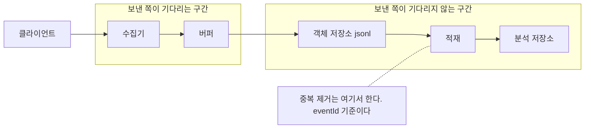
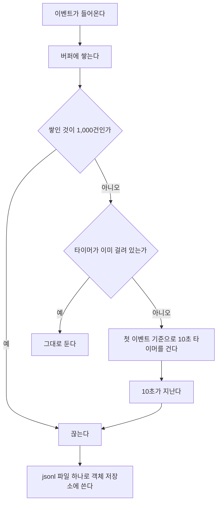

# 이벤트 수집 파이프라인

## 고민

### 무엇을 먼저 포기할 것인가

앱이 이벤트를 보낸다. 응답이 늦어 타임아웃이 난다. 보낸 쪽은 실패로
간주하고 다시 보낸다. 그런데 서버는 첫 번째 요청을 이미 받아 두었다.
같은 이벤트가 두 번 들어온다.

반대로 재시도를 아예 하지 않으면 그 이벤트는 사라진다. 네트워크가
끊긴 몇 초 동안 발생한 것들이 통째로 없어진다.

둘 다 막는 방법은 있다. 보내는 쪽과 받는 쪽이 매번 확인을 주고받으면
된다. 대신 왕복이 늘고 수집이 느려진다. 수집이 느려지면 이벤트를
보낸 쪽이 그만큼 기다린다.

**중복을 받아들이고 나중에 거르는 쪽을 골랐다.** 이벤트는 분석용이다.
같은 것이 두 번 들어와도 나중에 지울 수 있다. 안 들어온 것은
되살릴 수 없다. 그래서 받는 쪽은 최대한 관대하게 받고, 거르는 일은
적재 시점으로 미룬다.

이 선택이 뒤의 결정을 거의 다 결정했다. 중복을 전제하니 수집 단계에
상태를 둘 이유가 없다. 상태가 없으니 수집기는 빠르고, 죽어도
복구할 게 적다. 대신 적재는 반드시 멱등해야 한다.

## 접근

### 실제 구성의 대역

실제 구성을 로컬에서 돌릴 수 있는 것으로 바꿔 끼웠다.

| 실제 구성 | 이 실험의 대역 |
|---|---|
| 앱 API, 프론트 | 테스트 스크립트 |
| S3 | MinIO 컨테이너 |
| Redshift | DuckDB |

MinIO를 고른 이유는 S3와 API가 같아서다. 코드에서 바꿔야 할 것은
엔드포인트와 자격증명뿐이다.

```typescript
export function createS3() {
  return new S3Client({
    endpoint: 'http://127.0.0.1:9000',
    region: 'us-east-1',
    credentials: { accessKeyId: 'lab', secretAccessKey: 'labsecret' },
    forcePathStyle: true,
  })
}
```

DuckDB는 컬럼 저장이고 SQL 문법이 Redshift와 비슷하다. 파일 하나로
끝나서 컨테이너도 필요 없다. 실험을 반복해서 돌리기에 유리하다.

### 단계

```
1. 수집기        받고, 최소한만 검증하고, 즉시 응답한다
2. 버퍼          모았다가 조건이 차면 내보낸다
3. 객체 저장소    jsonl 파일로 쌓인다
4. 적재          eventId 기준으로 넣는다
5. 분석 저장소    쿼리한다
```

앞의 두 단계는 보낸 쪽이 기다리는 구간이다. 뒤의 세 단계는 아니다.
이 경계가 무엇을 어디에 둘지 판단하는 기준이 된다.



## 결정과 이유

### 파일을 언제 끊을 것인가

크기 1,000건과 시간 10초 중 먼저 오는 쪽으로 끊는다.

**먼저 버린 것은 매 요청 즉시 쓰기다.** 버퍼가 없으면 코드가 훨씬
단순해진다. 요청이 오면 파일 하나를 쓰고 끝이다. 문제는 두 가지다.
첫째, 객체 저장소에 요청 수만큼 파일이 생긴다. 새벽 3시에 이벤트
5건이 따로따로 들어오면 파일 5개다. 둘째, 수집기가 PUT 응답을
기다려야 한다. 보낸 쪽의 대기 시간에 객체 저장소 지연이 그대로 더해진다.

**크기 조건만 두는 안도 버렸다.** 새벽 3시에 5건이 들어온 상황을 다시
보자. 상한이 1,000건이면 이 5건은 995건이 더 쌓일 때까지 버퍼에
남는다. 트래픽이 돌아오는 아침까지 나가지 않는다. 그 사이 배포가
있으면 프로세스와 함께 사라진다. 버퍼는 메모리에만 있다.

**시간 조건만 두는 안도 버렸다.** 세일이 시작되면 10초 동안 들어온
이벤트가 전부 한 파일에 담긴다. 그 파일이 얼마나 커질지는 트래픽이
정한다. 미리 알 수 없는 값을 파일 크기가 따라가게 두는 셈이다.
크기 상한을 같이 두면 파일 하나의 최대치가 1,000건분으로 묶인다.

그래서 둘 다 둔다. 한산할 때는 시간이 먼저 오고, 몰릴 때는 크기가
먼저 온다. 각각이 반대쪽 극단을 막는다.



타이머를 거는 방식에 한 가지 함정이 있었다.

```typescript
if (this.events.length >= this.maxEvents) {
  this.drain()
  return
}
this.timer ??= setTimeout(() => this.drain(), this.maxAgeMs)
```

`??=`인 이유가 있다. 매번 타이머를 다시 걸면 이벤트가 꾸준히 들어오는
동안 기한이 계속 뒤로 밀린다. 10초가 지나도 안 나가는 일이 생긴다.
첫 이벤트가 들어온 시점부터 10초를 센다.

### 파티션을 어느 시각으로 나눌 것인가

서버가 받은 시각으로 나눈다. 경로는 `events/dt=2026-09-20/hour=14/`
형태가 된다. 클라이언트 시각은 컬럼으로 함께 저장하되 경로에는 쓰지 않는다.

**클라이언트 시각으로 나누는 안을 버렸다.** 기기 시계는 틀린다. 시간대가
어긋나기도 하고 사용자가 직접 바꾸기도 한다. 시계가 2019년으로
설정된 기기에서 온 이벤트는 `dt=2019-03-04` 파티션에 들어간다.
그 데이터는 사실상 사라진다. 아무도 2019년 파티션을 다시 읽지 않기
때문이다. 오늘 들어온 이벤트인데 오늘 조회에서 빠진다.

버리지는 않고 `occurredAt`으로 남긴다. 기기에서 실제로 언제 일어났는지는
분석에 쓸모가 있다. 다만 그 값을 믿고 파일을 어디에 둘지 정하지는 않는다.
믿을 수 없는 값은 데이터로 두고, 경로 같은 구조에는 쓰지 않는다.

`receivedAt`은 요청 하나당 한 번만 찍는다. 같은 요청으로 들어온
이벤트는 같은 값을 갖는다. 그래서 파일 키를 만들 때 배치의 첫 이벤트만
보면 된다. 다만 버퍼가 여러 요청을 묶으므로 자정을 걸친 배치는 첫
이벤트의 날짜로 전부 들어간다. 알고 남겨둔 한계다.

### 중복을 어디서 거를 것인가

적재 시점에 `eventId`를 기준으로 거른다. 테이블에서 기본키를 걸고
충돌하면 무시한다.

```sql
INSERT INTO event VALUES (?, ?, ?, ?, ?, ?) ON CONFLICT DO NOTHING
```

**Redis SET으로 수집 단계에서 거르는 안을 먼저 검토했다.** 받은
`eventId`를 넣어두고 이미 있으면 버린다. 구현은 간단하다. 세 가지가
걸렸다. 첫째, 매 요청에 왕복이 하나 더 붙는다. 이 구간은 보낸 쪽이
기다리는 구간이다. 둘째, SET을 언젠가는 비워야 한다. TTL을 짧게 잡으면
늦게 도착한 재시도를 못 걸러내고, 길게 잡으면 메모리가 계속 는다.
적절한 값을 정할 근거가 없다. 셋째, Redis가 죽으면 수집이 같이 멈춘다.
중복을 막으려고 넣은 장치가 유실을 만든다. 처음 고민에서 고른 방향과
정반대다.

**애초에 중복이 생기지 않게 하는 안도 있었다.** 보낸 쪽과 확인을
주고받으면 된다. 그 대가가 수집 지연이다. 고민 절에서 이미 접은 길이다.

적재에서 거르면 재시도가 안전해진다. 같은 파일을 두 번 넣어도 결과가
같다. 적재 작업이 중간에 죽어도 어디까지 넣었는지 기록할 필요가 없다.
처음부터 다시 돌리면 된다. 테스트가 이걸 확인한다.

```typescript
await loadEvents(conn, events)
const first = await countEvents(conn)

await loadEvents(conn, events)
const second = await countEvents(conn)

expect(first).toBe(5)
expect(second).toBe(first)
```

### 파일 포맷을 무엇으로 할 것인가

한 줄에 이벤트 하나씩 쓴다.

**JSON 배열을 버린 이유는 부분 읽기다.** 배열은 닫는 괄호가 없으면
통째로 파싱에 실패한다. 쓰는 도중에 프로세스가 죽으면 그 파일 전체를
잃는다. 줄 단위면 끊긴 지점 앞까지는 그대로 읽을 수 있다. 이어붙이기도
쉽다. 읽는 쪽은 빈 줄만 걸러내고 줄마다 파싱한다.

**Parquet도 검토했다.** 컬럼 저장이라 스캔량이 줄고 압축률도 좋다.
분석 저장소에 넣을 형태로는 더 낫다. 문제는 `payload`가
`Record<string, unknown>`이라는 점이다. 스키마가 열려 있다. Parquet은
쓰는 시점에 스키마가 확정돼야 한다. 뒤의 실험이 보여주듯 payload
모양은 앱 배포에 따라 바뀐다. 수집기가 그때마다 스키마를 알아야 하면
앱 배포와 수집기 배포가 묶인다. append도 안 되니 배치마다 파일을
새로 써야 한다.

실제로 Parquet을 쓴다면 적재 쪽에 변환 단계를 따로 둔다. 수집 경로는
형식이 열린 채로 두고, 형식을 고정하는 일은 뒤에서 한다.

### 큐를 중간에 둘 것인가

두지 않았다. 수집기가 버퍼를 들고 직접 객체 저장소에 쓴다.

**SQS를 넣는 안이 가장 그럴듯했다.** 수집기는 큐에 넣기만 하고 별도
워커가 파일을 만든다. 수집기가 죽어도 이벤트는 큐에 남는다. 지금
구조의 가장 큰 약점을 정확히 메우는 안이다.

그래도 넣지 않은 이유가 있다. 표준 큐는 같은 메시지를 두 번 줄 수 있다.
그러면 결국 적재에서 또 거른다. 중복 제거는 어차피 필요하다. 큐가
그 일을 대신해주지 않는다. 구성 요소는 하나 늘고 로컬에서 재현하는
비용도 는다.

무엇보다 지금 잃을 수 있는 양이 정해져 있다. 수집기가 죽는 순간
버퍼에 있던 것, 최대 1,000건 또는 10초분이다. 분석 이벤트라면 감당할
만하다. 결제나 정산이라면 답이 달라진다. 그 경우 큐부터 놓고 시작한다.

### 잘못된 이벤트가 섞이면 어떻게 할 것인가

그 건만 버리고 나머지는 받는다. 응답에는 거부된 건과 이유를 담는다.

클라이언트가 20건을 한 번에 보냈는데 그중 하나에 `eventId`가 없다고
하자. 요청 전체를 400으로 돌려주면 19건이 함께 사라진다.
[SDK](../event-sdk)는 실패한 전송을 재시도하지 않는다. 한 건이
망가졌다는 이유로 나머지를 잃는다.

검증은 세 가지만 본다. `eventId`, `name`, `schemaVersion`이 있는지다.
`eventId`가 없으면 중복 제거의 기준이 없어진다. `schemaVersion`이
없으면 나중에 그 행의 payload를 어느 형식으로 읽어야 할지 알 수 없다.
`payload` 내용은 보지 않는다. 그걸 검증하려면 수집기가 스키마를 알아야
하고, 그 순간 앱 배포와 묶인다.

## 만들면서 고친 것

### flush가 기다리지 않은 쓰기

적재 테스트를 처음 돌렸을 때 `listKeys`가 방금 쓴 키를 찾지 못했다.
버퍼 상한을 5로 두고 5건을 넣은 다음 `await buffer.flush()`를 부른
직후였다.

처음에는 이렇게 생각했다. `drain()`이 `sink()`를 부르니
`flush()`는 `drain()`만 부르면 된다. 버퍼 배열이 비면 다 나간 것이다.

틀렸다. 5건째가 들어온 그 자리에서 크기 조건이 차고 `drain()`이
이미 시작돼 있었다. 배열은 그때 비워졌다. 뒤이어 부른 `flush()`는
비어 있는 배열을 보고 할 일이 없다고 판단해 즉시 반환했다. 그 시점에
PUT은 아직 날아가는 중이었다.

**"버퍼가 비었다"와 "쓰기가 끝났다"는 다른 사건이다.** `drain`은 배열을
비우는 일이고 `sink`는 그 배열을 밖으로 내보내는 일이다. 두 번째가
첫 번째보다 한참 오래 걸린다. `flush`라는 이름이 둘을 하나로 착각하게
만들었다. 관찰할 수 있는 상태가 배열 하나뿐이라 그 상태만 보고
끝났다고 판단한 것이다.

진행 중인 쓰기를 따로 들고 있게 고쳤다.

```typescript
const task = this.sink(batch).finally(() => {
  this.pending.delete(task)
})
this.pending.add(task)
```

```typescript
async flush(): Promise<void> {
  this.drain()
  while (this.pending.size > 0) {
    await Promise.all([...this.pending])
  }
}
```

`while`인 이유가 있다. 기다리는 동안 새 쓰기가 시작될 수 있다.
`Promise.all`을 한 번만 부르면 그 사이 추가된 것을 놓친다. 같은
착각을 한 번 더 하는 셈이다.

`push`는 여전히 동기다. 보낸 쪽을 기다리게 하지 않는다는 원칙은
그대로 두고, 기다림은 `flush`를 부른 쪽에만 준다.

이 버그는 코드를 읽어서는 잡기 어려웠다. 두 문장이 모두 맞아 보이기
때문이다. 실제로 파일을 찾아보는 테스트가 있어야 드러난다.

## 스키마가 바뀌면 무엇이 깨지는가

### 상황

앱 팀이 `item_viewed`의 payload를 바꾼다. `itemId` 하나에서 `items`
배열로 간다. 한 화면에 여러 상품이 보이니 자연스러운 변경이다.

배포가 나가도 두 형식이 한동안 같이 들어온다. 앱 업데이트는 한 번에
깔리지 않는다. 옛 버전을 쓰는 사용자가 며칠에서 몇 주 남는다.
그동안 같은 테이블에 v1 행과 v2 행이 섞인다.

### 실험

v1 이벤트 2건과 v2 이벤트 3건을 한 번에 보내고 같은 테이블에 넣었다.

```bash
npx tsx modules/event-collector/bench/schema-change.ts
```

```
버전별 적재: [ [1, 2], [2, 3] ]
itemId를 읽는 쿼리: [ [5, 2] ]
두 버전을 함께 읽는 쿼리: [ [8] ]
```

| 세는 방법 | 결과 |
|---|---:|
| 적재된 행 | 5 |
| `itemId`가 있는 행 | 2 |
| 본 상품 수, 버전을 구분해서 | 8 |

마지막 값은 v1 2건에 v2 3건의 배열 길이를 더한 것이다.

### 오류 없이 틀리는 숫자

옛 형식만 아는 쿼리는 5건 중 2건만 센다. 그런데 아무 일도 일어나지
않는다. `json_extract`는 없는 키에 NULL을 돌려준다. `COUNT`는 NULL을
세지 않는다. SQL 입장에서는 전부 정상 동작이다.

**오류가 났다면 오히려 나았다.** 적재가 멈추면 알림이 온다. 쿼리가
실패하면 대시보드에 빨간 칸이 뜬다. 누군가 그날 안에 본다.
여기서는 멈추는 것이 없다. 대시보드는 숫자를 그대로 그린다.
2라는 숫자를 5만큼 자신 있게 그린다.

그리고 이 변화는 계단이 아니라 경사로 온다. 앱 업데이트 비율이
며칠에 걸쳐 바뀌기 때문이다. 어제 대비 오늘이 급락하면 사람들이
바로 의심한다. 매일 조금씩 내려가면 다르다. 이탈이 늘었나, 계절성인가,
지난주 UI 변경 탓인가를 먼저 본다. 데이터가 틀렸다는 가설은
한참 뒤에 나온다.

알아챈 시점에는 이미 그 형태로 몇 주치가 쌓여 있다. 그나마 구제책은
원본 jsonl이 객체 저장소에 그대로 남아 있다는 점이다. 파싱한 결과가
아니라 받은 그대로를 남기는 이유가 여기 있다. 해석이 틀렸을 때
다시 해석할 여지를 남긴다.

### 버전을 저장하는 이유

`schemaVersion`을 이벤트마다 저장한다. 수집기가 이 값이 없는 이벤트를
거부하는 것도 같은 이유다. 버전을 모르는 행은 나중에 어느 형식으로도
읽을 수 없다.

버전이 있으면 쿼리가 분기할 수 있다. 실험의 세 번째 쿼리가 그것이다.
`schema_version`을 보고 v1은 1로 세고 v2는 배열 길이로 센다.
그래서 8이 나온다. 맞는 숫자다.

버전별 건수를 세는 것만으로도 얻는 게 있다. 새 버전이 처음 등장한
시점을 알 수 있다. 그 시점이 쿼리를 고쳐야 한다는 신호다.

## 다시 한다면

**버전별 건수에 알림을 건다.** 위 실험이 보여주듯 스키마 변경은 오류가
아니라 침묵으로 나타난다. 새 `schemaVersion`이 처음 등장할 때 알림이
오면 대시보드가 틀린 채로 몇 주 가는 일을 막을 수 있다. 지금은
사람이 직접 세어봐야 알 수 있다.

**버퍼를 메모리 밖으로 옮긴다.** 수집기가 죽으면 버퍼에 있던 이벤트는
사라진다. 프로세스 재시작마다 손실을 감수한다는 뜻이고, 배포할 때마다
그렇다는 뜻이기도 하다. 분석용이라 받아들일 만한 타협이지만 결제나
정산에 이 구조를 쓰면 안 된다. 그 경우 접었던 큐 안을 다시 꺼낸다.

**거부된 이벤트를 아무도 보지 않는다.** 수집기는 거부 사유를 응답에
담는다. 그런데 SDK의 `track`은 응답을 읽지 않는다. 지금 이 정보는
어디에도 도달하지 않는다. 거부 건수를 지표로 따로 내보내야 한다.

**작은 파일이 잔뜩 생긴다.** 10초마다 끊으면 한산한 시간대에 작은
파일만 쌓인다. 객체 저장소는 파일 수가 많으면 목록 조회와 읽기가
느려진다. 나중에 합치는 작업을 따로 두거나, 한산할 때는 간격을
늘리는 편이 낫다. 다만 간격을 조건으로 바꾸려면 무엇이 한산한
상태인지 정의해야 한다.

**원본을 다시 돌릴 경로가 없다.** 스키마 실험이 보여주는 상황에서
필요한 것은 옛 파일을 다시 읽어 재적재하는 도구다. 지금은 jsonl이
남아 있을 뿐이고 다시 돌리는 절차는 없다. 적재가 멱등하니 만들기는
어렵지 않다.
