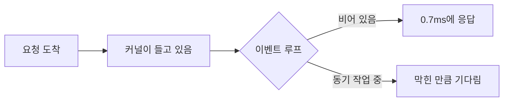
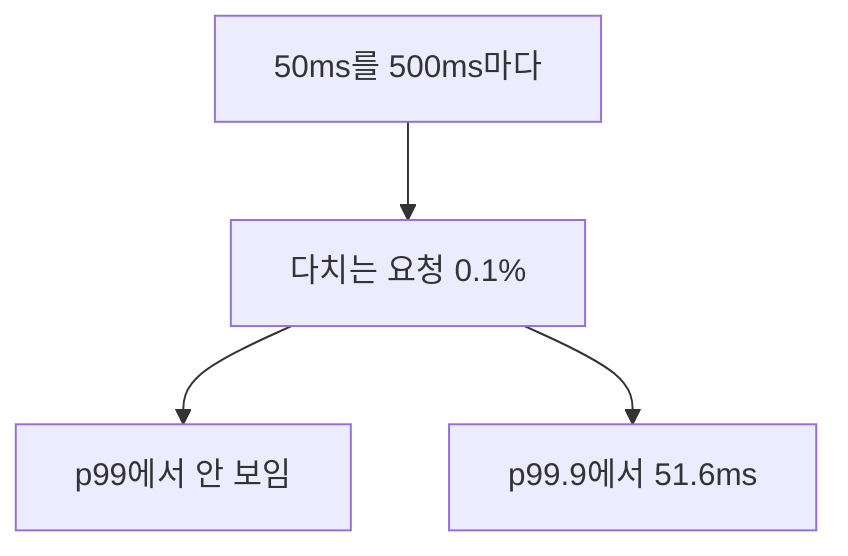

# 500ms마다 50ms씩 막는 코드가 p99에는 안 보였다

## 상황

Node 서버에 동기 코드를 넣으면 안 된다는 말은 신입 때부터 들었다.
그런데 실제로 리뷰에서 마주치는 건 이런 줄이다.

```typescript
const rules = JSON.parse(await redis.get('pricing:rules'))
```

```typescript
if (/^(\w+\s?)+$/.test(name)) { ... }
```

```typescript
const cert = readFileSync('/etc/secrets/jwt.pem')
```

셋 다 한 줄이고, 셋 다 "이 정도는 괜찮지 않나" 싶다.
나도 그렇게 넘긴 적이 있다.

그러다 대시보드를 보면 p50은 멀쩡한데 사용자가 가끔 느리다고 한다.
p99를 봐도 별일 없다. 그런데 문의는 계속 온다.

## 확인하고 싶었던 것

**이벤트 루프를 막는 동기 작업은 몇 ms부터 지연에 보이는가.**

"보인다"를 대시보드 기준으로 두고 싶었다.
코드에서 몇 ms를 잡아먹느냐가 아니라, 내가 보는 그래프에서 언제 티가 나느냐다.

## 재현

할 일이 거의 없는 HTTP 서버를 띄웠다. 응답은 `{"ok":true}` 한 줄이다.
느려진다면 핸들러 때문이 아니라 루프를 막는 다른 무언가 때문이다.



옆에서 `setInterval`로 주기적으로 루프를 막았다.
막는 시간은 바쁜 대기로 직접 정했다. 진짜 작업은 크기에 따라 들쭉날쭉해서
"몇 ms부터"를 물으려면 눈금이 일정한 자가 필요했다.

### 먼저, 이 작업들은 실제로 몇 ms 막는가

| 작업 | 크기 | 막는 시간 |
|---|---|---|
| `JSON.parse` | 10KB | 0.04ms |
| | 102KB | 0.44ms |
| | 1.0MB | **5.71ms** |
| | 10.1MB | 74.76ms |
| `readFileSync` | 1.0MB | 0.35ms |
| | 10.1MB | 4.27ms |
| `/^(a+)+$/.test` | 21B | 5.38ms |
| | 23B | **20.82ms** |
| | 25B | 86.35ms |
| | 27B | 348.89ms |
| | 29B | 1436.01ms |

`readFileSync`가 생각보다 싸다. 10MB를 읽는 데 4.27ms다.
같은 파일을 반복해서 읽어 페이지 캐시에 올라가 있는 조건이라 그렇다.
디스크까지 내려가는 첫 읽기는 이 값이 아니다.

정규식 줄은 단위를 다시 봐야 한다. **바이트다.**
23바이트짜리 입력 하나가 1MB JSON.parse보다 3.6배 오래 막는다.
입력이 두 글자 늘 때마다 시간이 네 배가 된다.

앞의 둘은 크기를 보면 대강 짐작이 간다. 정규식은 크기를 봐도 모른다.
길이 제한을 걸어놨다고 안심할 수 있는 종류가 아니다.

### 막는 시간을 바꿔가며

100ms마다 한 번씩, 정해진 시간만큼 루프를 막았다.
동시 8개를 띄워두고 6초 동안 던졌다.

| 막는 시간 | p50 | p99 | p99.9 | 완료 |
|---|---|---|---|---|
| 안 막을 때 | 0.75ms | 3.0ms | 6.9ms | 53,088건 |
| 1ms | 0.73ms | 2.8ms | 5.1ms | 53,680건 |
| 2ms | 0.75ms | 2.7ms | 5.5ms | 54,712건 |
| 5ms | 0.71ms | 3.1ms | 6.7ms | 56,296건 |
| 10ms | 0.70ms | 3.2ms | **11.8ms** | 54,000건 |
| 20ms | 0.70ms | **10.6ms** | 22.2ms | 47,824건 |
| 50ms | 0.73ms | 51.5ms | 52.9ms | 29,720건 |

p50은 끝까지 안 움직인다. 0.7ms 근처에 그대로 있다.
50ms씩 막는 상황에서도 그렇다. 중앙값으로는 아무것도 못 본다.

p99는 20ms부터 움직였다. p99.9는 10ms부터다.

## 접근

여기서 한 가지가 걸렸다. 왜 하필 그 자리인가.

한 번 막을 때 다치는 요청은 **그 순간 떠 있던 8개**다.
100ms마다 막으니 6초 동안 60번, 다치는 요청은 약 480건이다.
전체 5만 4천 건 중 0.9%다.

0.9%면 p99 컷(상위 1%) 바로 바깥이다.
그래서 5ms든 10ms든 p99 숫자 자체는 안 움직인다.
막는 길이가 짧아서가 아니라 **다친 요청 수가 1%를 못 넘어서**다.

그렇다면 총량이 같으면 같은 그림이 나올까.
CPU 점유를 10%로 고정하고 한 번에 붙잡는 길이만 바꿔봤다.

| | p50 | p99 | p99.9 | 완료 |
|---|---|---|---|---|
| 안 막을 때 | 0.69ms | 1.8ms | 2.9ms | 62,024건 |
| 2ms를 20ms마다 | 0.70ms | 3.2ms | 4.4ms | 54,552건 |
| 10ms를 100ms마다 | 0.71ms | 3.3ms | 11.8ms | 53,920건 |
| 50ms를 500ms마다 | 0.71ms | **1.9ms** | **51.6ms** | 54,232건 |

마지막 줄이 이 모듈의 이유다.

50ms를 500ms마다 막는 쪽은 **p99가 기준보다 낮게 나왔다.**
대시보드만 보면 세 줄 중 가장 건강해 보인다.
그런데 p99.9로 내려가면 51.6ms로 셋 중 제일 나쁘다.



같은 CPU를 쓰고, 같은 시간을 막고, 완료 건수도 비슷하다.
다른 건 **한 번에 얼마나 오래 붙잡느냐**뿐이다.
드물게 오래 붙잡을수록 백분위를 낮게 잡은 그래프에서 사라진다.

세 번 반복해서 이 부분만 다시 쟀다.

- `50ms를 500ms마다`의 p99: 1.9 / 1.9 / 2.1ms. 세 번 다 기준 근처
- 같은 줄의 p99.9: 51.6 / 51.5 / 51.3ms. 세 번 다 막은 길이 그대로
- `10ms를 100ms마다`의 p99: 3.3 / 10.8 / 2.4ms. **재볼 때마다 달랐다**

p99는 믿을 만한 신호가 아니었다. p99.9는 세 번 다 막은 길이를 그대로 뱉었다.

### 진짜 작업으로 다시

바쁜 대기 대신 처음에 본 세 줄을 100ms마다 돌렸다.

| | p50 | p99 | p99.9 | 완료 |
|---|---|---|---|---|
| 안 막을 때 | 0.71ms | 1.9ms | 3.4ms | 59,944건 |
| `JSON.parse` 1MB | 0.71ms | 3.2ms | 8.0ms | 56,528건 |
| `readFileSync` 1MB | 0.70ms | 1.9ms | 3.8ms | 60,640건 |
| `/^(a+)+$/` 23B | 0.72ms | **21.3ms** | 29.4ms | 46,264건 |

`readFileSync` 1MB는 기준과 구분이 안 된다.
가장 자주 지적받는 줄인데, 이 조건에서는 셋 중 제일 안전했다.

`JSON.parse` 1MB는 p99.9에서만 두 배쯤 보인다.

23바이트 정규식은 p99에서 11배다. 코드로는 제일 짧은 줄이다.

### 버린 선택지

처음에는 "초당 200건을 시각표대로 던지는" 열린 부하로 짰다.
바깥에서 들어오는 트래픽에 그쪽이 더 가깝다.

그런데 아무것도 안 막았는데 기준 p99가 26.4ms로 나왔다.
윈도우에서 `setTimeout`의 눈금이 16ms쯤이라 그렇다.
재려는 신호가 1~10ms인데 자가 16ms면 잴 수가 없다.

같은 이유로 `setInterval(20)`의 지연을 재는 루프 랙 측정도 접었다.
이 PC에서는 아무 부하 없이도 p99가 24.5ms였다. 전부 타이머 눈금이다.
**윈도우에서 타이머로 루프 지연을 재면 16ms 아래는 못 본다.**

그래서 동시 실행 수를 8로 고정하고 응답 시간만 재는 쪽으로 바꿨다.
기준 p50이 0.7ms로 내려와서 신호가 보이기 시작했다.

대신 이쪽은 **막히는 동안 새 요청이 안 들어온다.** 실제 트래픽보다 덜 아프게 나온다.
그 대가가 완료 건수에 나타난다. 50ms씩 막을 때 5.3만 건에서 3만 건으로 줄었다.
위 표의 숫자는 실제 서비스에서 받을 값의 아래쪽 경계로 읽어야 한다.

## 결과

| 정한 것 | 왜 |
|---|---|
| 알람은 p99가 아니라 p99.9에 건다 | p99는 세 번 재서 세 번 다른 값이 나왔다 |
| 대시보드에 p50만 있으면 없는 것과 같다 | 50ms씩 막아도 p50은 0.7ms 그대로였다 |
| 동기 작업은 "몇 ms"보다 "한 번에 몇 ms"로 본다 | 총량이 같아도 한 번에 오래 붙잡는 쪽이 꼬리를 만든다 |
| 정규식은 입력 길이 제한으로 못 막는다 | 23바이트가 1MB JSON.parse보다 3.6배 오래 걸렸다 |
| `readFileSync`를 제일 먼저 지적하지 않는다 | 캐시에 올라간 1MB는 0.35ms다. 더 급한 줄이 있다 |

마지막 줄은 내가 틀렸던 부분이다.
동기 파일 읽기를 리뷰에서 먼저 잡곤 했는데, 재보니 `JSON.parse` 쪽이 16배 비쌌다.
다만 이건 **같은 파일을 반복해서 읽은 조건**이라는 걸 잊으면 안 된다.
부팅 때 한 번 읽는 인증서라면 이 표가 아니라 디스크가 답을 정한다.

## 다시 한다면

**열린 부하로 다시 잰다.**
지금은 막히는 동안 새 요청이 안 들어온다. 실제로는 그동안에도 쌓인다.
쌓인 것까지 세려면 부하를 내는 쪽을 별도 프로세스나 워커 스레드로 빼야 한다.
그러면 윈도우 타이머 눈금 문제도 같이 풀린다. 이번에는 거기까지 안 갔다.

**동시 실행 수를 바꿔가며 잰다.**
"다치는 요청이 1%를 넘는가"가 p99에 보이느냐를 갈랐는데,
그 1%는 동시 실행 수와 빈도가 정한다. 지금은 8 하나만 봤다.
16이나 64에서는 같은 5ms도 p99에 보일 수 있다.

**이 모듈이 다루지 않은 것.**
막는 걸 어떻게 없애는지는 안 봤다. `worker_threads`로 빼는 것,
스트리밍 파서를 쓰는 것, 정규식을 선형 시간 엔진으로 바꾸는 것이 있는데
이 모듈은 "언제 보이는가"까지만 답한다.

여러 코어에 프로세스를 띄우는 경우도 안 봤다. 클러스터로 4개를 띄우면
한 프로세스가 막혀도 나머지가 받는다. 그러면 이 표의 저울질이 달라진다.

**갈리는 지점.**
알람을 p99.9로 내리면 잡음도 같이 는다. 기준선 자체가 흔들리는 서비스에서는
p99.9 알람이 계속 울릴 수 있다. 백분위를 내리는 대신
"p50 대비 p99 비율"을 보는 방법도 있는데 어느 쪽이 나은지는 못 정했다.

---

## 직접 실행해보기

Docker가 필요 없습니다. Node만 있으면 됩니다.

### 0. 준비

```bash
git clone https://github.com/xo0449/backend-lab.git
cd backend-lab
npm install
```

### 1. 전부 돌리기

```bash
npm run lab:loop
```

네 가지가 차례로 나옵니다. 재는 데 1분쯤 걸립니다.

### 2. 하나만 돌리기

```bash
ONLY=1 npm run lab:loop
ONLY=2 npm run lab:loop
ONLY=3 npm run lab:loop
ONLY=4 npm run lab:loop
```

3번이 이 모듈의 요지입니다. CPU 점유가 같은 세 줄을 나란히 놓습니다.

### 3. 숫자 바꿔보기

```bash
CONC=64 npm run lab:loop
EVERY=20 npm run lab:loop
WINDOW=20000 npm run lab:loop
EVIL_N=24 npm run lab:loop
```

`CONC`를 올리면 한 번 막을 때 다치는 요청 수가 늘어서
같은 블록이 p99에 보이기 시작합니다.
**"몇 ms부터 보이는가"의 답이 이 값 하나로 바뀝니다.**

`EVIL_N`은 두 올릴 때마다 막는 시간이 네 배가 됩니다. 26 이상은 조심하세요.

### 4. 결론을 뒤집어보기

`bench/run.ts`의 3번 시나리오에서 세 줄의 빈도를 같게 맞춥니다.

```typescript
for (const [ms, every] of [
  [2, 100],
  [10, 100],
  [50, 100],   // 20, 100, 500 이던 자리
] as const) {
```

CPU 점유가 달라지는 대신 p99가 막는 길이를 따라 순서대로 올라갑니다.
직접 돌려본 값은 2.2ms → 11.3ms → 51.4ms 였습니다.

**세 줄의 p99가 뒤집혔던 건 길이 때문이 아니라 빈도 때문이라는 뜻입니다.**

### 5. 막는 시간만 따로 보기

서버 없이 동기 작업의 비용만 보고 싶으면 1번만 돌립니다.

```bash
ONLY=1 npm run lab:loop
```

`/^(a+)+$/`의 입력을 두 글자 늘릴 때마다 시간이 네 배가 되는 걸 볼 수 있습니다.

### 6. 테스트

```bash
npx vitest run modules/event-loop-blocking
```
