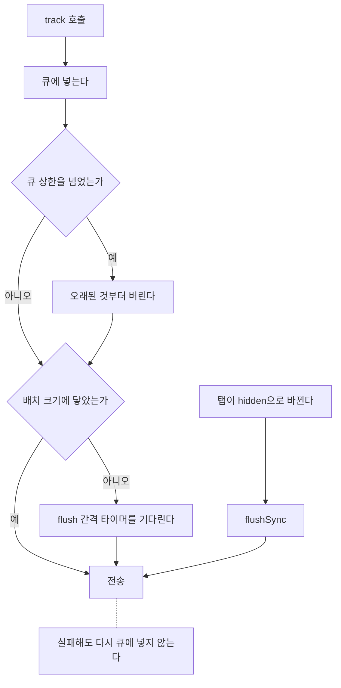
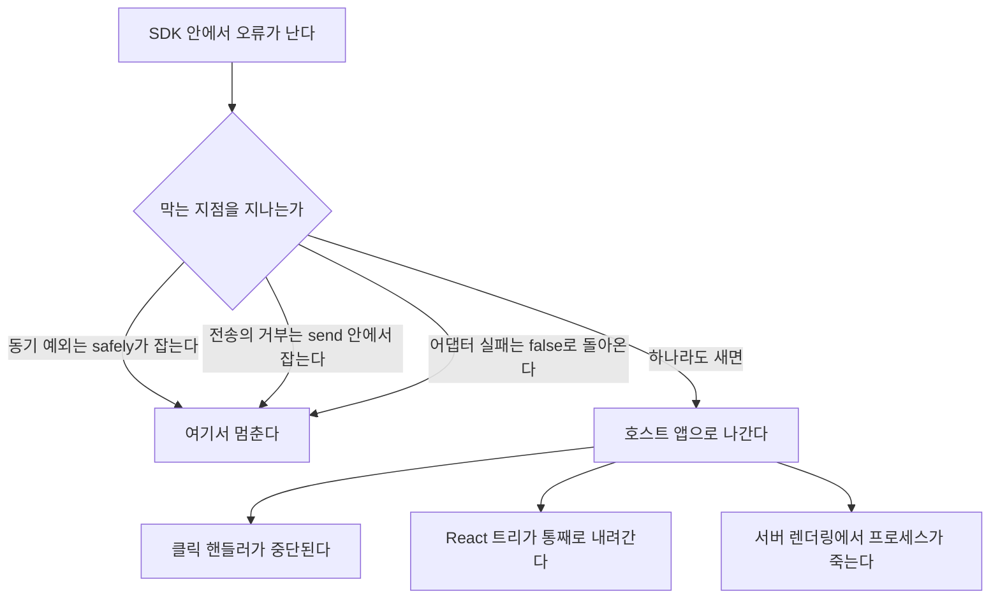

# 이벤트 SDK

[이벤트 수집 파이프라인](../event-collector)의 클라이언트 쪽이다.
같은 파이프라인의 양 끝인데 무엇을 먼저 지키는지가 정반대다.

## 양 끝의 우선순위

수집기는 데이터 정합성을 먼저 지킨다. 받은 것을 잃지 않는 데 힘을 쓴다.
중복을 감수하고 유실을 막는 쪽으로 기울어 있다.

SDK는 호스트 앱을 멈추지 않는 것을 먼저 지킨다. 필요하면 데이터를 버린다.
큐가 넘치면 오래된 것부터 버리고, 전송이 실패하면 조용히 포기한다.

이 대비는 자연스럽다. 수집기는 자기 서버에서 혼자 돈다.
거기서 무리하게 재시도해도 피해를 보는 것은 수집기 자신이다.
SDK는 남의 앱 안에서 돈다. 여기서 무리하면 남의 서비스가 느려진다.

| | 수집기 | SDK |
|---|---|---|
| 먼저 지키는 것 | 데이터 정합성 | 호스트 앱이 멈추지 않는 것 |
| 감수하는 것 | 중복 | 유실 |
| 도는 곳 | 자기 서버 | 남의 앱 안 |
| 무리했을 때 대가를 치르는 쪽 | 수집기 자신 | 남의 서비스 |

**책임의 범위가 다르다.** 같은 데이터를 다루는데 한쪽은 지키려 하고
한쪽은 버리려 한다. 어긋난 것처럼 보이지만 둘 다 같은 질문의 답이다.
내가 욕심을 부리면 누가 대가를 치르는가.

## 실패가 호스트 앱에 닿는 경로

`track`은 보통 클릭 핸들러 안에서 불린다. 결제 버튼을 누르는 자리 같은 곳이다.

```typescript
function onCheckout() {
  sdk.track('checkout_clicked', { cartId })
  submitOrder()
}
```

`track`이 던지면 `submitOrder()`는 실행되지 않는다.
사용자는 버튼을 눌렀는데 아무 일도 일어나지 않는 화면을 본다.
한 번 더 누른다. 여전히 아무 일도 없다. 그러고는 나간다.

그 사람은 분석 코드가 실패했다는 걸 모른다. 알 방법도 없다.
그가 겪은 일은 "이 쇼핑몰은 결제가 안 된다"이다.

React라면 더 커진다. 렌더 경로에서 던진 예외는 트리를 통째로 내린다.
에러 경계가 없으면 화면이 하얗게 된다. 버튼 하나가 아니라 페이지 전체다.

서버 렌더링에서는 프로세스가 걸려 있다. 처리되지 않은 거부가 올라가면
Node는 기본 설정에서 프로세스를 죽인다. 그 인스턴스가 처리하던
다른 요청까지 같이 끊긴다. 이벤트 하나 때문에 무관한 사용자들이 영향을 받는다.

**잃는 것과 지키려던 것의 크기가 맞지 않는다.** 이벤트 하나는 없어도 되는
데이터다. 주문 하나는 그렇지 않다. 분석은 서비스가 돌아간 다음의 일이다.
순서가 뒤집히면 분석의 존재 이유가 사라진다.

## 공개 인터페이스

작게 유지한다. 넓은 인터페이스는 되돌리기 어렵다.

```typescript
export interface EventSdk {
  track(name: string, payload?: Record<string, unknown>): void
  flush(): Promise<void>
  flushSync(): void
}
```

`track` 한 번이 어디까지 가는지는 이렇다.



### track의 반환값

`track`이 `Promise<boolean>`을 반환하는 안을 먼저 두고 봤다.
호출한 쪽이 전송 성공을 알 수 있으니 더 정직해 보였다.
버린 이유는 그 정직함에 쓸모가 없기 때문이다.

전송 결과를 알아도 호출한 쪽이 할 수 있는 일이 없다.
실패했다고 사용자에게 알릴 수도 없고 다시 보낼 수도 없다.
쓸 데 없는 정보를 주면 누군가는 그걸 쓰려고 한다.

더 큰 문제는 반환 타입이 사용법을 유도한다는 점이다.
`Promise`를 반환하면 `await sdk.track(...)`이 자연스러워 보인다.
그 한 줄이 분석 요청을 사용자 대기 시간 안으로 끌어들인다.
네트워크가 나쁜 날 결제 버튼이 멎는 이유가 분석 코드가 된다.

`void`를 반환하면 `await`를 붙일 이유가 없다.
타입이 잘못된 사용법을 미리 막는다.
문서에 "await하지 마세요"라고 적어두는 것보다 확실하다.

## safely()를 통과한 오류

모든 공개 진입점을 `safely()`로 감쌌다. 동기 예외는 여기서 멈춘다고 봤다.

```typescript
function safely(fn: () => void): void {
  try { fn() } catch { /* 의도적으로 삼킨다 */ }
}
```

테스트는 통과했다. `expect(() => sdk.track('clicked')).not.toThrow()`가 초록색이었다.
그런데 테스트를 돌릴 때마다 경고가 같이 나왔다.

```
Unhandled Rejection
Error: network down
 ❯ send modules/event-sdk/src/sdk.ts:71
 ❯ safely modules/event-sdk/src/sdk.ts:40
```

스택에 `safely`가 찍혀 있었다. 감싼 함수 안에서 나온 오류가 밖으로 나갔다는 뜻이다.

### 잡히지 않은 이유

`track` 안에서 전송은 `void send(drain())`으로 시작한다.
`send`는 `Promise`를 돌려주고 즉시 반환한다. `try` 블록은 그 시점에 끝난다.
전송이 실제로 실패하는 것은 그보다 나중이다.
이미 빠져나온 `try`는 아무것도 잡지 못한다.

**동기 예외만 잡는다.** `try/catch`가 하는 일은 거기까지다.
알고는 있던 사실이다. 그런데 `safely()`라는 이름을 붙이고 나서는
그 안이 안전하다고 믿어버렸다. 이름이 실제 보장보다 넓었다.

| | 동기 예외 | 비동기 거부 |
|---|---|---|
| 발생 시점 | `try` 블록 안 | `try`를 빠져나온 뒤 |
| `safely()`가 잡는가 | 잡는다 | 못 잡는다 |
| 실제로 막는 지점 | `safely()` | `send` 안의 `await`와 `catch` |
| 드러나는 단언 | `not.toThrow()` | `unhandledRejection` 수신 |

### 테스트가 놓친 자리

`expect(...).not.toThrow()`는 호출이 동기적으로 던지는지만 확인한다.
`track`은 던지지 않는다. 그러니 이 단언은 고쳐도 고치지 않아도 통과한다.
비동기로 새어 나간 거부는 이 검사의 바깥에 있다.

**테스트가 통과한 것과 안전한 것은 다르다.** 단언이 보는 범위가
지키려던 성질보다 좁으면 그 차이만큼 눈이 먼다.
여기서는 "던지지 않는다"와 "호스트 앱을 멈추지 않는다" 사이가 그 차이였다.

이 발견이 불편했던 이유는 따로 있다.
이 SDK가 막으려던 일을 SDK 자신이 하고 있었다.
분석 코드가 서비스를 내리는 경로는 추상적인 걱정이 아니었다.
안전을 위해 만든 함수 바로 아래에 있었다.

방어 코드는 스스로를 검증하지 않는다.
`safely()`는 무엇을 잡고 무엇을 놓치는지 말하지 않는다.
읽는 사람은 이름을 보고 전부 잡는다고 짐작한다.
그 짐작이 틀렸다고 알려준 것은 리뷰가 아니라 테스트 로그의 경고 한 줄이었다.

### 고친 방식

전송 함수 안에서 `await`한 뒤 잡도록 바꿨다.
이제 `send`는 어떤 경우에도 거부하지 않는다.

```typescript
async function send(batch: QueuedEvent[]): Promise<void> {
  if (batch.length === 0) return
  try {
    await transport.send(endpoint, JSON.stringify(batch))
  } catch {
    // 전송 실패는 호스트 앱의 문제가 아니다.
  }
}
```

회귀를 막는 테스트는 단언을 바꿨다. `unhandledRejection`을 직접 듣는다.

```typescript
it('전송이 거부해도 처리되지 않은 거부가 생기지 않는다', async () => {
  const rejections: unknown[] = []
  process.on('unhandledRejection', (e) => rejections.push(e))
  ...
  expect(rejections).toHaveLength(0)
})
```

전송 계층에도 같은 규칙을 걸었다.
`Transport.send`는 실패하면 `false`를 반환하고 던지지 않는다.
방어를 한 곳에만 두지 않은 이유가 있다.
어댑터를 새로 쓰는 사람은 본체의 규칙을 모른 채 쓴다.

막는 지점을 다 합치면 이렇게 된다.



## 결정과 버린 선택지

### 재시도 없는 실패 처리

지수 백오프 재시도를 넣는 안을 봤다.
실패하면 간격을 늘려가며 몇 번 더 시도한다.
흔한 방식이고 구현도 어렵지 않다.

버린 이유는 실패의 원인에 있다.
전송이 실패하는 상황은 대개 네트워크가 이미 나쁠 때다.
회선이 막혔거나 신호가 약하거나 서버가 버거운 상태다.
그때 재시도를 걸면 이미 좁은 길에 요청을 더 밀어 넣는다.

사용자가 겪는 것은 "이벤트가 안 갔다"가 아니다. "앱이 느리다"가 된다.
분석 요청이 실제 요청과 대역폭을 다툰다.
지키려던 이벤트 때문에 상품 이미지가 늦게 뜬다.

백오프는 이 문제를 늦출 뿐 없애지 못한다.
재시도를 기다리는 배치를 메모리에 들고 있어야 하는 문제도 남는다.
큐 상한과 재시도 큐가 따로 자라면 메모리 한도를 두 군데서 관리하게 된다.

분석 이벤트는 유실을 감당할 수 있는 데이터다. 결제나 정산이면 답이 달라진다.
그 경우 애초에 이런 SDK로 보내면 안 된다.

### 새로고침 너머의 큐

`localStorage`에 큐를 두는 안을 생각했다.
페이지를 새로고침해도 이벤트가 남고, 탭이 죽어도 다음 방문에 보낼 수 있다.

버린 이유가 여럿이다. 우선 쓰기가 동기라서 메인 스레드를 막는다.
`track`은 클릭 핸들러 안에서 불린다.
거기서 직렬화와 저장을 하면 클릭 반응이 그만큼 늦어진다.

용량도 걸린다. `localStorage`는 호스트 앱과 나눠 쓰는 공간이다.
분석 큐가 자리를 차지하면 앱이 저장하려던 값이 밀린다.
할당량을 넘기면 쓰기가 예외를 던진다.
남의 저장소를 분석 데이터로 채우는 것은 SDK가 할 일이 아니다.

사생활 문제도 있다. 디스크에 남은 이벤트는 사용자가 지우기 전까지 남는다.
메모리 큐는 탭이 닫히면 같이 사라진다.
기본값으로는 사라지는 쪽이 맞다.

이탈 시점만 제대로 덮으면 손실의 대부분을 막을 수 있다.
저장소를 쓰지 않고도 그만큼은 된다.

### 이탈 감지 방식

`beforeunload`가 먼저 떠오르는 선택이다. 이름이 하려는 일과 정확히 맞는다.

모바일에서 어긋난다.
탭을 백그라운드로 보내거나 앱을 전환할 때 `beforeunload`를 부르지 않는 경우가 있다.
브라우저가 그 상태에서 탭을 버리면 이벤트는 부를 기회 없이 사라진다.
모바일 사용자의 마지막 이벤트가 통째로 빠진다.

마지막 이벤트가 빠지는 것은 아무 데서나 빠지는 것과 다르다.
이탈 직전의 행동은 분석에서 자주 들여다보는 구간이다.
하필 그 구간만 모바일에서 비어 있는 데이터가 된다.

`visibilitychange`의 `hidden` 상태는 그 상황에서도 불린다.
전송은 `sendBeacon`을 쓴다. 페이지가 사라져도 브라우저가 대신 끝까지 보낸다.
일반 `fetch`는 문서가 없어지면 같이 취소될 수 있다.

`hidden`은 앱을 완전히 떠나지 않아도 불린다. 탭을 잠깐 바꿔도 불린다.
같은 세션에서 여러 번 보내게 된다. 그건 받아들였다.
수집기가 `eventId`로 중복을 거른다. 이쪽이 관대해도 되는 이유가 거기에 있다.

### 환경 감지의 위치

`typeof window !== 'undefined'` 같은 분기를 본체에 두는 안이 더 짧다.
파일 하나로 끝나고 공개 인터페이스도 늘지 않는다.

버린 이유는 그 분기가 한 곳에 머물지 않기 때문이다.
전송에 한 번, 이탈 감지에 한 번, ID 생성에 한 번 필요하다.
흩어진 분기는 테스트에서 켜고 끄기 어렵다.
전역을 통째로 흉내 내야 조합을 다 볼 수 있다.

전송을 인터페이스로 빼두면 가짜를 끼워 넣을 수 있다.
테스트는 `fakeTransport`로 무엇이 나갔는지 그대로 읽는다.
네트워크를 흉내 낼 필요가 없다. 새 환경이 생겨도 어댑터만 추가하면 된다.

서버 환경에서 `document`를 건드려 죽지 않는지 확인하는 테스트를 같이 뒀다.
브라우저 전용 코드가 서버 렌더링에서 터지는 것은 흔한 사고다.
이 SDK에서는 그 사고가 프로세스를 내리는 사고가 된다.

### 큐 상한

상한 없이 두는 안이 단순하다. 어떤 이벤트도 버리지 않는다.
평소에는 배치가 주기적으로 큐를 비우니 자랄 일이 없다.

문제는 평소가 아닐 때다. 전송이 계속 실패하면 큐는 비지 않는다.
페이지를 오래 열어두는 앱이면 이벤트가 몇 시간치 쌓인다.
그 메모리는 호스트 앱의 메모리다. 탭이 무거워지고 느려진다.
분석 큐 때문에 탭이 죽으면 쌓아둔 이벤트도 같이 사라진다. 아무것도 못 지킨다.

상한을 넘으면 오래된 것부터 버린다. 최근 이벤트가 대체로 더 쓸모 있다.
사용자가 방금 한 행동이 지금 보려는 문제와 가깝다.

```typescript
if (queue.length > maxQueueSize) {
  queue = queue.slice(queue.length - maxQueueSize)
}
```

## 번들 크기

| | 크기 |
|---|---:|
| minify | 1,424 bytes |
| minify + gzip | 771 bytes |

```bash
npx esbuild modules/event-sdk/src/sdk.ts --bundle --minify --format=esm --outfile=/tmp/sdk.min.js
```

의존성이 없다. 크기를 작게 유지하는 방법 중 확실한 것은 이것뿐이다.

SDK는 서버에 놓이는 코드가 아니다.
호스트 앱의 번들에 들어가 모든 방문자에게 내려간다.
서버 코드가 무거우면 서버가 감당한다. 그 비용은 한곳에 모인다.
SDK의 비용은 방문자 수만큼 곱해진다. 같은 바이트인데 부담의 모양이 다르다.

의존성을 하나 넣으면 그 라이브러리의 크기만 늘어나지 않는다.
그 라이브러리가 가진 의존성도 같이 들어온다.
트리 셰이킹이 걸러주길 기대하게 되는데 조건이 까다롭다.
부수효과가 있는 모듈이면 번들러가 지우지 못한다.

늘어난 바이트는 다운로드 시간으로 끝나지 않는다.
파싱과 실행 시간도 같이 늘어난다. 느린 기기에서 그 차이가 더 벌어진다.
분석 SDK는 첫 화면에 필요하지 않은데 첫 화면을 늦출 수 있다.
호스트 앱 입장에서는 값을 치르고 아무것도 못 받는 구간이다.

**작은 크기는 제약의 결과다.** 무엇을 넣을지 고르는 대신 아무것도 넣지 않기로 했다.
UUID 생성은 `crypto.randomUUID`가 있으면 쓰고 없으면 시각과 난수로 만든다.
라이브러리를 부르는 대신 몇 줄을 직접 썼다.

```typescript
function newId(): string {
  if (typeof crypto !== 'undefined' && typeof crypto.randomUUID === 'function') {
    return crypto.randomUUID()
  }
  return `${Date.now()}-${Math.random().toString(16).slice(2)}`
}
```

이 대체 경로의 ID는 충돌할 수 있다. 같은 밀리초에 같은 난수가 나오면 겹친다.
겹치면 수집기가 서로 다른 두 이벤트를 하나로 본다.
중복 제거가 `eventId` 기준이기 때문이다.
분석 데이터에서 감당할 수 있는 위험이라 받아들였다.
이 판단도 결제 데이터면 달라진다.

## 다시 한다면

**버전 호환을 실제로 시험해봐야 한다.** 지금은 `schemaVersion`을 1로 고정해 보낸다.
옛 SDK를 쓰는 앱이 남아 있을 때 새 수집기가 어떻게 받을지는
[수집기 모듈의 스키마 실험](../event-collector)에서 절반만 다뤘다.
SDK 쪽에서 버전을 올려보는 실험이 빠져 있다.

**샘플링이 없다.** 트래픽이 커지면 모든 이벤트를 보낼 이유가 없다.
다만 샘플링은 어떤 이벤트를 버려도 되는지 아는 상태에서 넣어야 한다.
지금 넣으면 근거 없는 숫자가 된다.

**큐를 버릴 때 아무도 모른다.** 상한을 넘겨 버린 건수를 세어 가끔 같이 보내면
"데이터가 왜 적지"를 추적할 수 있다. 지금은 조용히 사라진다.
수집기 쪽 교훈과 같은 모양이다. 문제는 오류가 아니라 침묵으로 나타난다.
