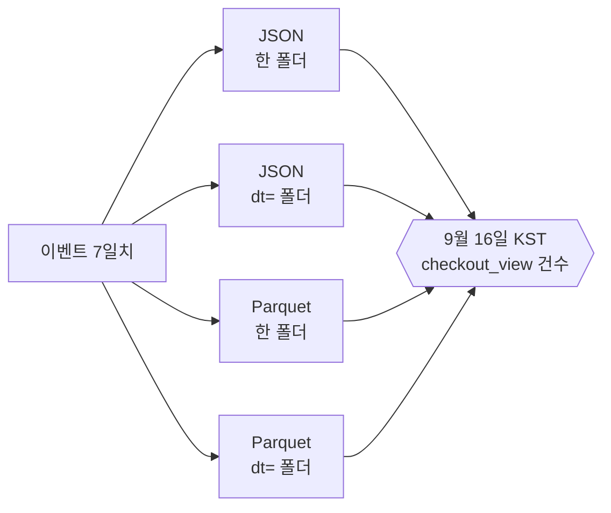
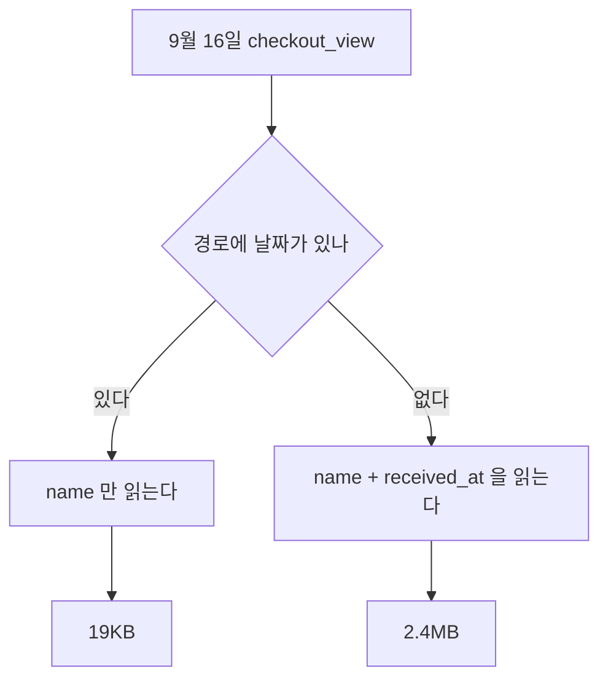

# 같은 이벤트를 어떻게 쌓느냐에 따라 읽는 값이 달라진다

## 상황

이벤트를 객체 저장소에 쌓기로 정했다. 여기까지는 어려운 결정이 아니었다.
서비스가 이미 그 위에 있고, 로그도 백업도 이미 거기로 간다.

그런데 "쌓는다"를 실제로 하려니 정할 게 나왔다.
들어오는 대로 JSON 한 줄씩 쓸 것인가. 폴더를 날짜로 자를 것인가.
자른다면 어느 시간대로. 몇 분 모아서 파일 하나로 쓸 것인가.

넷 다 "나중에 정해도 되는 것"처럼 보였다.
그래서 일단 들어오는 대로 한 폴더에 쌓아두고 넘어가려다가,
이게 나중에 고치기 쉬운 결정인지가 걸렸다.

이미 쌓인 걸 다시 쓰려면 전부 읽어서 다시 써야 한다.
한 번 쌓기 시작하면 그날부터 되돌리는 비용이 붙는다.

## 확인하고 싶었던 것

**같은 이벤트를 다른 모양으로 쌓으면 읽을 때 무엇이 달라지는가.**

말로는 "파티션을 나누면 빠르다"를 안다. 얼마나 빠른지는 몰랐다.
두 배인지 백 배인지에 따라 지금 할 일인지 나중에 할 일인지가 갈린다.

## 재현

7일치 이벤트를 네 가지 모양으로 같은 저장소에 쌓았다.
내용도, 파일 개수도 같다. 다른 건 형식과 경로뿐이다.



같은 질문을 넷에 던졌다. 하루 5만 건씩 7일, 총 35만 건이다.

| 쌓은 모양 | 답 | 걸린 시간 | 읽은 양 |
|---|---|---|---|
| JSON · 한 폴더 | 7,097건 | 79ms | 92.0MB |
| JSON · 날짜 폴더 | 7,097건 | 63ms | 13.1MB |
| Parquet · 한 폴더 | 7,097건 | 3ms | 2.4MB |
| Parquet · 날짜 폴더 | 7,097건 | 1ms | 19KB |

답은 넷 다 같다. 읽은 양은 4,800배 차이가 난다.

읽은 양을 세는 방법은 이렇다.
줄 단위 파일은 통째로 읽으니 객체 크기의 합이다.
열 단위 파일은 쓰는 컬럼의 청크만 읽으니 그 합이다.
관리형 조회 서비스가 청구하는 기준이 이것과 같다.

## 접근

두 가지가 따로 논다는 걸 숫자로 보고 나서야 알았다.

**날짜 폴더는 읽을 파일을 줄인다.** 7일 중 하루만 보면 1/7이다.
92.0MB가 13.1MB가 됐다. 예상한 만큼이다.

**열 단위 파일은 읽을 컬럼을 줄인다.** 이쪽이 컸다.
건수를 세는 데 필요한 건 `name` 하나인데,
줄 단위 파일은 `referrer`도 `session_id`도 같이 읽는다.

그리고 둘을 같이 쓰면 한 가지가 더 붙는다.

**날짜가 경로에 있으면 시각 컬럼을 안 읽는다.**
경로에 날짜가 없으면 파일 안의 `received_at`을 읽어서 걸러야 한다.
컬럼이 하나 더 필요해진다.



파티션이 파일 수만 줄이는 게 아니었다. 읽는 컬럼도 줄인다.

### 버려둔 선택지

**날짜와 시각 둘 다로 자르기.** `dt=/hour=` 로 더 잘게 나누면
한 시간짜리 질문이 싸진다. 그런데 하루치를 보는 질문이 훨씬 많고,
잘게 나눌수록 파일이 작아진다. 그 값이 다음 절에 있다.

**들어오자마자 Parquet으로 쓰기.** 원본을 JSON으로 남기지 않으면
변환이 잘못됐을 때 되돌릴 게 없다. 원본은 손대지 않고 두고
정제본을 따로 쓰는 쪽으로 했다.

## 결과

### 파일을 잘게 쪼개면 무엇을 치르는가

같은 하루치를 파일 개수만 바꿔 쌓았다. 내용은 같다.

| 파일 수 | 답 | 걸린 시간 | 차지하는 양 |
|---|---|---|---|
| 1개 | 7,097건 | 1ms | 1.7MB |
| 24개 | 7,097건 | 3ms | 1.8MB |
| 240개 | 7,097건 | 20ms | 2.4MB |

시간이 20배가 됐다. 읽는 데이터는 같은데 여는 횟수가 240배다.

차지하는 양도 40% 늘었다. 열 단위 파일은 파일마다 스키마와 통계를 들고 있다.
파일이 작아질수록 그 몫의 비중이 커진다.

전송 서비스의 버퍼를 1분으로 잡으면 하루에 1440개가 된다.
"빨리 보이게 하려고" 버퍼를 줄인 값이 여기서 나온다.

### 이벤트 모양이 바뀌면

어느 날 `duration_ms`가 `dwell_ms`로 바뀌었다고 하자.
과거 파일과 같이 읽으면 어떻게 되는가.

| 어떻게 읽었나 | 결과 |
|---|---|
| 그냥 읽음 | **멈춘다.** 파일마다 컬럼이 다르다고 거부한다 |
| 이름으로 맞춤 | 100,000건을 읽는데 평균은 50,000건으로만 계산된다 |

두 번째가 무섭다. **에러가 안 난다.**
읽은 행 수는 멀쩡하고, 평균도 그럴듯한 숫자가 나온다.
그런데 절반은 값이 비어 있어서 평균에서 조용히 빠졌다.

타입이 바뀐 경우는 정반대였다.

| 어떻게 읽었나 | 결과 |
|---|---|
| 그냥 읽음 | 읽힌다. 합계도 진짜 값과 같았다 |
| 이름으로 맞춤 | **멈춘다.** 문자열은 더할 수 없다고 한다 |

고치려고 켠 옵션이 어떤 경우엔 조용한 오답을 만들고,
어떤 경우엔 되던 것을 깨뜨린다.

그래서 이건 읽는 쪽 옵션으로 풀 문제가 아니다.
**쌓는 쪽에서 이름을 안 바꾸는 규칙이 있어야 한다.**
바꿔야 하면 새 컬럼을 추가하고 옛 컬럼을 한동안 같이 채우는 쪽이다.

## 다시 한다면

**파티션 시간대를 폴더 이름에 적는다.**
`dt=2026-09-16` 만 보면 이게 KST인지 UTC인지 알 수 없다.
전송 서비스의 기본값은 UTC라, 아무것도 안 하면 UTC로 잘린다.
그러면 "9월 16일 매출"이 폴더 두 개에 걸치고 아홉 시간이 어긋난다.
`dt_kst=` 처럼 적어두면 나중에 온 사람이 묻지 않는다.

**작은 파일을 합치는 작업을 처음부터 넣는다.**
나중에 넣으려면 이미 쌓인 것부터 합쳐야 한다.
하루 지난 파티션을 하루 한 번 합치는 정도면 충분해 보인다.

**이 모듈이 다루지 않은 것.**
읽는 쪽이 여럿일 때 서로 미는 문제는 안 봤다.
여기서는 질문 하나를 혼자 던졌다.

압축 방식도 안 건드렸다. 기본값으로만 썼다.
Snappy와 Zstd 사이에서 읽는 속도와 크기가 갈린다는데 재보지 않았다.

정렬도 안 했다. 같은 파일 안에서 `name` 으로 정렬해두면
안 맞는 청크를 통째로 건너뛸 수 있다는데, 그 값은 따로 재야 한다.

### 클라우드에서는 이 자리에 무엇이 오는가

| 이 모듈 | AWS |
|---|---|
| MinIO | Amazon S3 |
| 적재 코드 | Amazon Data Firehose |
| 형식 변환 | Firehose 레코드 포맷 변환, AWS Glue ETL |
| `dt=` 폴더 | Firehose Dynamic Partitioning |
| 테이블 정의 | AWS Glue Data Catalog |
| DuckDB | Amazon Athena |
| 읽은 양 | Athena가 청구하는 스캔량 |

Firehose가 만드는 폴더는 기본이 UTC다.
KST로 자르려면 Dynamic Partitioning으로 레코드에서 키를 직접 뽑아야 한다.

---

## 직접 실행해보기

### 0. 준비

```bash
git clone https://github.com/xo0449/backend-lab.git
cd backend-lab
npm install
npm run db:up
```

MinIO만 있으면 됩니다.

```bash
docker compose up -d minio
```

### 1. 전부 돌리기

```bash
npm run lab:layout
```

세 가지가 차례로 나옵니다.
형식과 파티션, 파일 개수, 이벤트 모양이 바뀐 뒤.

### 2. 하나만 돌리기

```bash
ONLY=1 npm run lab:layout
ONLY=2 npm run lab:layout
ONLY=3 npm run lab:layout
```

### 3. 규모 바꿔보기

하루 건수를 바꿉니다. 기본은 5만입니다.

```bash
PER_DAY=200000 npm run lab:layout
```

읽는 양의 배율은 거의 그대로입니다.
비율이 데이터 양이 아니라 모양에서 오기 때문입니다.

### 4. 결론을 뒤집어보기

`src/layout.ts`의 `COLUMNS.parquetPart`를 전체 컬럼으로 바꿉니다.

```typescript
export const COLUMNS = {
  parquetFlat: ['name', 'received_at'],
  parquetPart: ['name', 'received_at', 'event_id', 'user_id', 'device',
                'path', 'referrer', 'session_id', 'duration_ms',
                'amount', 'occurred_at'],
} as const
```

다시 돌리면 19KB가 1.7MB대로 올라갑니다.
열 단위로 쌓아도 전부 읽으면 이점이 거의 사라진다는 뜻입니다.
**컬럼을 적게 쓰는 질문이라야 열 단위 파일이 값을 합니다.**

### 5. 파일을 더 잘게 쪼개보기

`src/smallfiles.ts`의 `FILE_COUNTS`에 1440을 넣습니다.
1분마다 파일을 쓰는 상황입니다.

```typescript
export const FILE_COUNTS = [1, 24, 240, 1440] as const
```

이렇게 나옵니다.

```
파일   1개  1ms   1.7MB
파일 1440개  122ms   5.1MB
```

시간은 122배, 차지하는 양은 3배입니다. 데이터는 같습니다.

### 6. 저장소를 직접 들여다보기

콘솔은 http://localhost:9001 에 있습니다. 아이디와 비밀번호는 `lab` / `labsecret` 입니다.

명령으로 보려면 이렇게 합니다.

```bash
docker exec backend-lab-minio-1 mc alias set local http://localhost:9000 lab labsecret
docker exec backend-lab-minio-1 mc ls --recursive local/lake/parquet-part/
```

### 7. 테스트

```bash
npx vitest run modules/event-storage-layout
```

### 8. 정리

```bash
npm run db:down
```
