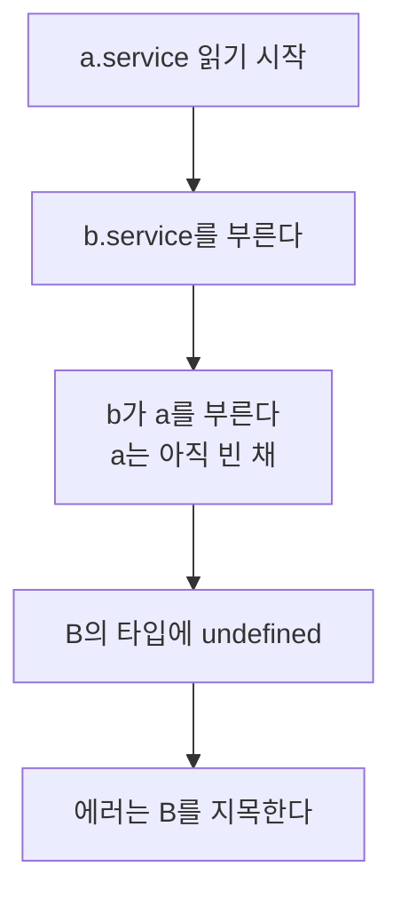

# forwardRef를 붙였더니 에러는 사라졌는데 생성자에서 본 값이 undefined였다

## 상황

주문 서비스가 결제 서비스를 부른다. 결제가 끝나면 결제 서비스가 주문 상태를 바꿔야 해서
주문 서비스를 부른다. 서로가 서로를 주입받는다. 부팅이 안 된다.

```
Nest can't resolve dependencies of the BService (?).
```

검색하면 답이 바로 나온다. `forwardRef`를 붙인다. 뜬다. 넘어간다.
나도 그렇게 넘어갔고, 그 뒤로 이 에러를 만나면 손이 먼저 `forwardRef`를 쳤다.

그런데 이게 정확히 무엇을 풀어주는 건지는 몰랐다. 한쪽에만 붙여도 되는 건지,
붙이고 나면 아무 문제가 없는 건지, 순환이 아닌데 이 에러가 날 수도 있는 건지.

## 확인하고 싶었던 것

**NestJS 모듈이 서로를 import할 때 순환이 생기면 무엇이 언제 깨지는가.
`forwardRef`가 푸는 것과 못 푸는 것.**

"언제"를 세 단계로 나눴다.


뒤에서 깨질수록 나쁘다. import에서 죽으면 배포 전에 안다. call에서 죽으면 그 코드가 불릴 때 안다.

## 재현

서비스 두세 개짜리 Nest 앱을 15개 만들었다. 하나씩 자식 프로세스로 띄워서
어느 단계에서 멈췄는지와 에러 메시지를 받아 적는다.

빌드는 NestJS 프로젝트의 기본값대로 했다. `tsc`, CommonJS, `emitDecoratorMetadata`.
NestJS 12.0.3, TypeScript 5.9.3, Node 24.13.

| | 멈춘 곳 | 메시지가 이름을 댄 클래스 | 순환을 의심하라고 하는가 |
|---|---|---|---|
| 01 순환 없음 | 끝까지 감 | | |
| 02 A와 B가 서로를 주입 | boot | `BService` | **아니오.** `import type`을 의심하라고 한다 |
| 02 같은 코드 · b를 먼저 읽음 | boot | **`AService`** | 아니오 |
| 03 같은 순환을 한 파일에 | **import** | 없음 | 아니오 |
| 04 DI 순환 없음 · 배럴로 import | boot | `AService` | 아니오 |
| 05 모듈끼리 서로를 import | boot | `BModule` | 예. `forwardRef()`를 쓰라고 한다 |

02의 메시지 전문은 이렇다.

```
Nest can't resolve dependencies of the BService (?). Please make sure that the
argument at index [0] is available in the current module.

Potential solutions:
- The dependency at index [0] appears to be undefined at runtime
- This commonly occurs when using 'import type' instead of 'import' for injectable classes
...
```

순환이라는 말이 없다. `import type`을 의심하라고 한다. 이 코드에는 `import type`이 없다.

### 에러가 이름을 대는 건 범인이 아니다

02의 두 줄은 같은 코드다. `app.ts`에서 import 두 줄의 순서만 다르다.

```typescript
import { AService } from './a.service'   // 이 둘의
import { BService } from './b.service'   // 순서를 바꾸면
```

에러가 지목하는 클래스가 `BService`에서 `AService`로 바뀐다. 고친 코드는 없다.

빌드된 파일을 열어보면 이유가 보인다.

```javascript
// dist/02-provider-cycle/b.service.js
__metadata("design:paramtypes", [a_service_1.AService])
```

생성자의 타입이 **파일을 읽는 순간에** 평가된다. a를 먼저 읽으면 a가 b를 부르고,
b가 다시 a를 부르는데 a는 아직 읽는 중이라 `a_service_1.AService`가 비어 있다.
그래서 b의 타입 자리에 `undefined`가 박힌다. 나중에 읽힌 쪽이 피해자가 된다.



### DI에 순환이 없어도 같은 에러가 난다

04는 A가 B를 쓸 뿐이다. B는 A를 모른다. DI 그래프에 순환이 없다.
다른 건 A가 B를 같은 폴더의 `index.ts`에서 가져온다는 것 하나다.

```typescript
import { BService } from './index'   // './b.service'가 아니라
```

`index.ts`가 a를 먼저 내보내니, a를 읽다가 index로 돌아가면 B가 아직 없다.
**에러 메시지가 02와 한 글자도 다르지 않다.** 테스트로 고정해 뒀다.

여기서 알았다. 이 에러는 "의존성이 순환한다"가 아니라 "파일을 읽는 시점에 그 클래스가 없었다"다.
순환은 둘이다. **DI 그래프의 순환과 파일 import의 순환.** 메시지는 둘을 구분하지 않는다.

03이 그 반대편이다. A와 B를 한 파일에 두면 파일 순환은 없다.
그러면 Nest까지 가지도 못하고 import에서 `Cannot access 'BService' before initialization`으로 죽는다.

## 접근

### forwardRef는 두 가지 일을 한다

| | a를 먼저 읽음 | b를 먼저 읽음 |
|---|---|---|
| 06 A에만 `forwardRef` | **boot에서 죽음** | 뜸 |
| 07 양쪽에 `forwardRef` | 뜸 | 뜸 |
| 08 모듈 순환 · 양쪽에 `forwardRef` | 뜸 | |

한쪽에만 붙이면 읽는 순서에 따라 뜨기도 하고 안 뜨기도 한다.

`forwardRef(() => BService)`는 함수다. 파일을 읽는 순간이 아니라 Nest가 필요할 때 부른다.
그때는 파일이 다 읽혀 있다. 이게 첫 번째 일이다. **파일 순환을 넘긴다.**
06에서 A에만 붙이면 A 쪽 타입은 나중에 풀리지만 B 쪽은 여전히 읽는 순간에 박힌다.
b를 먼저 읽으면 B의 타입이 박힐 때 A가 이미 있어서 뜬다.

두 번째 일은 **DI 순환을 허락하는 것**이다. 이건 다음 표에서 드러난다.

06이 무서운 건 뜰 때가 있다는 점이다. 한쪽에만 붙인 코드가 지금 돌고 있다면
그건 import 순서가 우연히 맞아서다. 누가 `app.module.ts`의 import를 정렬하면 죽는다.

### forwardRef가 못 푸는 것

양쪽에 붙이고, 생성자에서 상대를 바로 써봤다. 설정을 읽거나 캐시를 데울 때 흔히 이렇게 짠다.

| | 결과 |
|---|---|
| 09 생성자에서 상대의 **메서드**를 부른다 | 뜸. 값도 맞다 |
| 10 생성자에서 상대의 **필드**를 읽는다 | 뜸. **A가 본 `b.limit`은 `undefined`.** B가 본 `a.limit`은 100 |
| 11 같은 코드 · `providers: [B, A]` | 뜸. A가 본 값은 100. **B가 본 값이 `undefined`** |
| 15 생성자에서는 아무것도 안 함 · 필드가 `#private` | 뜸. **부팅이 끝난 뒤에 불러도 던진다** |

10이 이 모듈의 이유다. 에러가 없다. 부팅도 된다.
그런데 A의 생성자가 도는 그 순간 `this.b.limit`은 `undefined`였다.

부팅이 끝난 뒤에 다시 보면 `a.b.limit`은 100이다. `a.b`는 컨테이너의 B와 같은 객체다.
**나중에 확인하면 멀쩡해서 안 보인다.** 생성자에서 그 값으로 계산해 둔 것만 조용히 틀려 있다.

어느 쪽이 `undefined`를 보는지는 `providers` 배열의 순서가 정했다(10과 11).
먼저 만들어지는 쪽이 아직 생성자가 안 돈 상대를 받는다.

Nest 소스에서 확인했다.

```javascript
// node_modules/@nestjs/core/injector/injector.js
93:   targetWrapper.instance = Object.create(metatype.prototype);
452:  ? Object.assign(instanceHost.instance, new metatype(...instances))
```

순환을 만나면 프로토타입만 있는 빈 객체를 먼저 넣어준다.
그래서 09처럼 메서드는 불린다. 메서드는 프로토타입에 있으니까.
나중에 진짜 인스턴스를 만들어 그 필드를 빈 객체에 복사한다.

15는 그 복사가 못 옮기는 것이다. `Object.assign`은 `#private` 필드를 안 옮긴다.

```
a.limit()   Cannot read private member #limit from an object whose class did not declare it
```

생성자에서 아무것도 안 했다. 부팅이 다 끝난 뒤에 자기 자신의 메서드를 불렀다. 던진다.
같은 앱 안에서 순환에 안 낀 `CService`는 같은 `#limit`으로 100을 돌려줬다.
**`forwardRef`로 묶인 서비스에는 `#` 필드를 쓸 수 없다.** 이건 돌려보기 전에는 몰랐다.

### forwardRef 말고

읽는 순서를 바꿔도 뜨는지를 기준으로 봤다. 위에서 본 대로 그게 갈리는 해법은 우연에 기대는 것이다.

| | a를 먼저 읽음 | b를 먼저 읽음 |
|---|---|---|
| 07 양쪽 `forwardRef` | 뜸 | 뜸 |
| 12 `ModuleRef`로 부를 때 꺼냄 | **boot에서 죽음** | 뜸 |
| 13 이벤트로 끊음 | 뜸 | 뜸 |
| 14 같이 쓰는 부분을 셋째로 뺌 | 뜸 | 뜸 |

12는 예상과 달랐다. A가 생성자에서 B를 안 받고 부를 때 `moduleRef.get(BService)`로 꺼낸다.
DI 순환은 끊겼다. 그런데 B가 여전히 `a.service`를 import하고 A도 `b.service`를 import한다.
**파일 순환이 그대로 남아서** 02와 같은 에러로 죽는다. ModuleRef는 두 순환 중 하나만 끊는다.

13은 B가 A를 부르는 대신 "끝났다"는 이벤트를 낸다. B는 A를 모른다.
14는 둘이 서로에게서 필요했던 것을 셋째 서비스로 옮겼다. 둘 다 순환 자체가 없어진다.

### 버린 선택지

**tsx로 돌리기.** 이 저장소의 벤치는 전부 tsx로 돈다. 처음에는 여기서도 그러려고 했다.
안 됐다. 같은 케이스를 tsx로 돌리면 이렇게 나온다.

| | tsc · CommonJS | tsx · ESM |
|---|---|---|
| 01 순환 없음 | 끝까지 감 | **call에서 죽음** |
| 02 프로바이더 순환 | boot에서 죽음 | call에서 죽음 |
| 05 모듈 순환 | boot에서 죽음 | import에서 죽음 |
| 07 양쪽 `forwardRef` | 끝까지 감 | 끝까지 감 |

순환이 없는 01이 죽는다. 02와 같은 자리에서 같은 말로
(`Cannot read properties of undefined (reading 'name')`) 죽는다.
esbuild는 `emitDecoratorMetadata`를 안 내보내서 Nest가 생성자에 인자가 없다고 본다.
에러 없이 `undefined`를 넣는다. `@Inject()`를 명시한 07만 뜬다.

이 상태로는 순환이 있는 것과 없는 것을 구분할 수 없다. 자가 고장 난 것이다.
그래서 fixtures만 tsc로 따로 빌드해서 자식 프로세스로 띄우는 구조로 바꿨다.
vitest도 esbuild라 같은 일이 생긴다. **Nest 코드를 tsx나 vitest로 돌릴 때는
주입이 조용히 비는지부터 확인해야 한다.**

**케이스마다 import 순서를 바꾼 폴더를 따로 두기.** 처음에 그렇게 했다가 폴더가 18개가 됐다.
러너가 "이 파일을 먼저 읽어라"를 인자로 받게 바꿨다. 모듈 캐시에 먼저 올라가니
`app.ts`의 import 순서를 바꾼 것과 같다. 폴더를 따로 뒀을 때와 결과가 같은 걸 확인하고 지웠다.

## 결과

| 정한 것 | 왜 |
|---|---|
| 이 에러를 보면 DI 순환보다 파일 순환을 먼저 찾는다 | DI 순환이 없는 04가 02와 같은 메시지로 죽었다. 메시지는 `import type`을 의심하라고만 한다 |
| 에러가 지목한 클래스부터 고치지 않는다 | import 두 줄의 순서를 바꾸니 지목이 `BService`에서 `AService`로 바뀌었다 |
| 같은 폴더 안에서는 배럴(`./index`)로 import하지 않는다 | 04. DI에 순환이 없는데 import 한 줄 때문에 부팅이 안 됐다 |
| `forwardRef`는 붙인다면 양쪽에 붙인다 | 한쪽만 붙인 06은 읽는 순서에 따라 뜨기도 하고 죽기도 했다 |
| `forwardRef`로 묶인 서비스는 생성자에서 상대의 상태를 읽지 않는다 | 10. 에러 없이 `undefined`였고 부팅 뒤에는 100이라 나중에 봐서는 모른다 |
| `forwardRef`로 묶인 서비스에 `#` 필드를 쓰지 않는다 | 15. 부팅이 끝난 뒤에 자기 메서드를 불러도 던졌다 |
| 고를 수 있으면 `forwardRef`보다 순환을 없앤다 | 13과 14는 순환이 없어서 위의 조건이 하나도 안 붙는다. 읽는 순서를 바꿔도 떴다 |

마지막 줄이 결론이다. `forwardRef`는 에러를 없애지만 조건 세 개를 남긴다.
양쪽에 붙일 것, 생성자에서 상대의 상태를 읽지 말 것, `#` 필드를 쓰지 말 것.
셋 다 에러 메시지에는 안 나오고, 뒤의 둘은 어겨도 부팅이 된다.

## 다시 한다면

**요청 스코프를 본다.** `Scope.REQUEST`인 프로바이더가 순환에 끼면 어떻게 되는지 안 봤다.
요청마다 인스턴스를 새로 만드니 10의 빈 객체 문제가 요청마다 생길 수 있는데, 짐작이다.

**고리가 셋 이상일 때.** A → B → C → A에서 `forwardRef`를 어디에 몇 개 붙여야 하는지 안 봤다.
둘일 때 "양쪽에"였으니 셋일 때 "전부에"일 것 같은데 짐작이다.

**ESM으로 빌드한 Nest.** tsx 표에서 05가 boot가 아니라 import에서 죽었다.
ESM은 빈 값 대신 `before initialization`을 던진다. 메타데이터를 내보내면서 ESM으로 빌드하면
02도 import에서 죽을 것 같다. 그러면 더 일찍 알게 되니 오히려 낫다. 안 재봤다.

**이 모듈이 다루지 않은 것.** 순환을 찾아주는 도구(madge, eslint의 `import/no-cycle`)를 안 돌려봤다.
04 같은 파일 순환은 린트로 잡는 게 맞아 보이는데, 실제로 잡는지는 확인하지 않았다.

이벤트로 끊는 13은 공짜가 아니다. 호출이 이벤트가 되면 반환값을 못 받고,
누가 듣고 있는지 코드에서 안 보인다. 그 비용은 여기서 안 쟀다.

**갈리는 지점.** 이미 `forwardRef`로 묶여 돌고 있는 코드를 지금 뜯을 것인가.
조건 세 개를 지키고 있으면 당장은 문제가 없다. 다만 그 조건을 지키고 있는지
확인할 방법이 코드 리뷰밖에 없다. 급한지 아닌지 못 정했다.

---

## 직접 실행해보기

Docker가 필요 없습니다. Node만 있으면 됩니다.

### 0. 준비

```bash
git clone https://github.com/xo0449/backend-lab.git
cd backend-lab
npm install
```

### 1. 전부 돌리기

```bash
npm run lab:circular
```

`fixtures/`를 tsc로 빌드한 뒤 다섯 가지를 차례로 보여줍니다. 12초쯤 걸립니다.

### 2. 하나만 돌리기

```bash
ONLY=1 npm run lab:circular   # 어디서 어떤 말로 깨지는가
ONLY=2 npm run lab:circular   # forwardRef를 붙이면
ONLY=3 npm run lab:circular   # 생성자에서 상대를 바로 쓰면
ONLY=4 npm run lab:circular   # forwardRef 말고
ONLY=5 npm run lab:circular   # 같은 케이스를 tsx로
```

3번이 이 모듈의 요지입니다.

### 3. 케이스 하나를 직접 띄워보기

벤치를 한 번 돌리면 `modules/nest-circular/dist/`에 빌드 결과가 남습니다.

```bash
cd modules/nest-circular/dist
node runner.js 02-provider-cycle
node runner.js 02-provider-cycle b.service
```

둘째 줄은 `b.service`를 먼저 읽힙니다. 메시지 속 클래스 이름이 `BService`에서 `AService`로 바뀝니다.

tsx로 띄우려면 이렇게 합니다.

```bash
cd modules/nest-circular/fixtures
node ../../../node_modules/tsx/dist/cli.mjs runner.ts 01-no-cycle
```

순환이 없는 케이스인데 `call`에서 죽습니다.

### 4. 결론을 뒤집어보기

`fixtures/10-forwardref-field-in-constructor/app.ts`에서 `providers`의 순서를 바꿉니다.

```typescript
@Module({ providers: [BService, AService] })   // [AService, BService] 이던 자리
```

```bash
ONLY=3 npm run lab:circular
```

`undefined`를 보는 쪽이 A에서 B로 옮겨갑니다. 서비스 코드는 한 줄도 안 바꿨습니다.
**값이 비는 건 서비스의 잘못이 아니라 만들어지는 순서 때문이라는 뜻입니다.**

하나 더. `fixtures/07-forwardref-both/b.service.ts`에서 `forwardRef`를 뗍니다.

```typescript
constructor(readonly a: AService) {}
//          @Inject(forwardRef(() => AService)) 가 있던 자리
```

```bash
ONLY=2 npm run lab:circular
```

07의 "a 먼저 읽음"만 죽고 "b 먼저 읽음"은 그대로 뜹니다. 06과 같은 상태가 됩니다.

### 5. 타입이 언제 박히는지 직접 보기

```bash
grep -n "design:paramtypes" modules/nest-circular/dist/02-provider-cycle/b.service.js
```

`[a_service_1.AService]`가 함수 안이 아니라 파일 최상위에 있습니다. 파일을 읽는 순간에 평가됩니다.

Nest가 빈 객체를 넣고 나중에 채우는 자리는 여기입니다.

```bash
grep -n "Object.create(metatype.prototype)\|Object.assign(instanceHost" \
  node_modules/@nestjs/core/injector/injector.js
```

### 6. 테스트

```bash
npx vitest run modules/nest-circular
```
