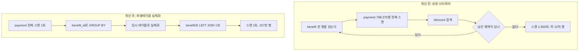
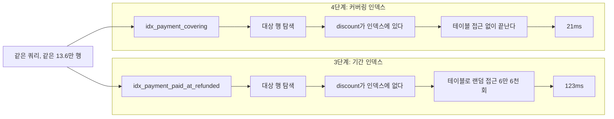
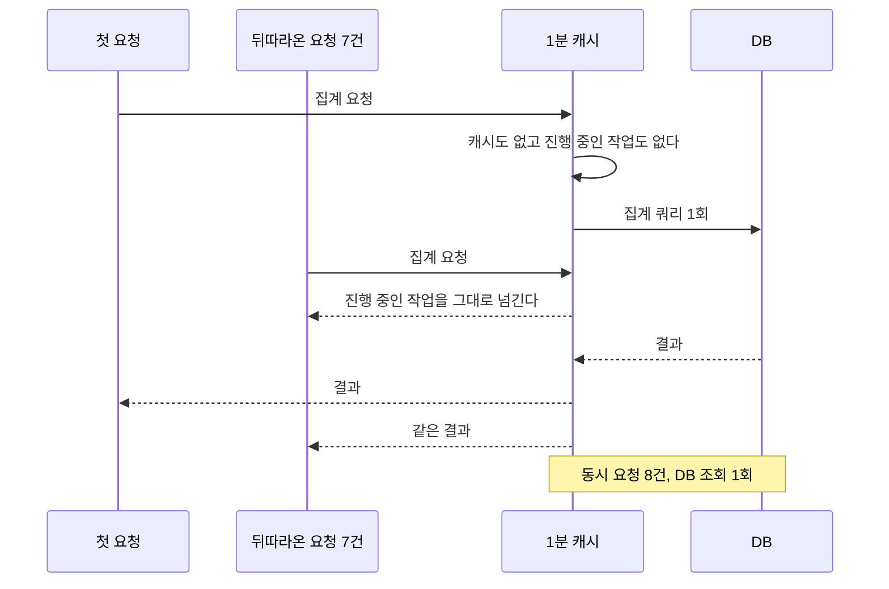

# 현황 화면 집계가 12억 행을 읽던 문제

## 상황

혜택별 소진액을 보여주는 현황 화면이 있다. 운영자가 매일 아침 열어서
어느 혜택이 예산을 얼마나 썼는지 확인한다.

소진액은 결제 내역을 합친 값이다. 이런 값을 다루는 방법은 둘뿐이다.
미리 계산해두거나, 볼 때마다 집계하거나.

**볼 때마다 집계하는 쪽을 골랐다고 하자.** 이게 나쁜 선택이 아니다.
정합성 문제가 없다. 결제가 들어오든 환불이 나든 다음 조회에 바로 반영된다.
집계 테이블을 만들면 언제 갱신할지, 갱신이 실패하면 어떻게 할지,
누락된 건 어떻게 메울지를 전부 정해야 한다. 그 복잡도를 안 져도 된다.

혜택이 서른 건일 때는 아무 문제가 없다. 화면은 즉시 뜬다.

문제는 서른 건이 1,500건이 되는 동안 아무도 이 쿼리를 다시 보지 않았다는
것이다. 결제도 같이 늘었다. 어느 시점부터 화면이 느려졌고, 더 지나서는
아예 못 쓰게 됐다.

## 확인하고 싶었던 것

이 실험을 시작할 때 궁금했던 건 따로 있었다.

**읽는 행을 줄이면 항상 빨라지는가.**

느린 쿼리를 고칠 때 흔히 보는 지표가 읽은 행 수다. 줄어들면 개선한 것
같고, 보고하기도 쉽다. 그게 정말 실행 시간과 같이 가는지 확인하고 싶었다.

결론부터 말하면 아니었다.

## 재현

```bash
npm run db:up
npx tsx modules/nested-loop-aggregation/bench/seed.ts
npx tsx modules/nested-loop-aggregation/bench/measure.ts
```

혜택 1,500건, 결제 80만 건을 넣는다. MySQL 8.0.39를 Docker로 띄우고
버퍼 풀을 128MB로 잡았다. 결제 테이블이 메모리에 다 올라가지 않아야
디스크 읽기가 관찰된다.

개선 전 쿼리는 상관 서브쿼리다.

```sql
SELECT b.id, b.name, b.budget,
  (SELECT COALESCE(SUM(p.discount), 0)
     FROM payment p
    WHERE p.benefit_id = b.id AND p.refunded = 0) AS consumed
FROM benefit b
```

읽기 쉽다. 혜택마다 소진액을 붙인다는 의도가 그대로 보인다.
이게 이 형태가 살아남는 이유다. 리뷰에서 걸리지 않는다.

## 실행 계획을 읽는다

```
-> Table scan on b  (cost=152 rows=1500)
-> Select #2 (subquery in projection; dependent)
    -> Aggregate: sum(p.discount)
        -> Filter: ((p.refunded = 0) and (p.benefit_id = b.id))
            -> Table scan on p  (cost=73189 rows=798375)
```

`dependent`가 전부를 설명한다. 이 서브쿼리는 바깥 행에 의존하므로
한 번만 돌 수 없다. 혜택 한 건마다 결제 테이블 전체를 훑는다.

1,500 곱하기 798,375이면 약 12억이다. 실제로 12억 6행을 읽었고
118초가 걸렸다. 화면을 여러 번 열면 그만큼 쌓인다.

## 다섯 단계로 나눠 고쳤다

한 번에 다 바꾸면 무엇이 효과가 있었는지 알 수 없다.
하나씩 적용하고 매번 측정했다.

### 1. 파생테이블 실체화

집계를 서브쿼리에서 꺼내 파생테이블로 만들었다.

```sql
LEFT JOIN (
  SELECT benefit_id, SUM(discount) AS consumed
    FROM payment WHERE refunded = 0
   GROUP BY benefit_id
) c ON c.benefit_id = b.id
```

바뀐 건 하나다. 이 서브쿼리는 바깥 행을 참조하지 않는다.
그래서 한 번만 돌고 결과가 임시 테이블로 남는다.
결제 테이블을 1,500번이 아니라 한 번 훑는다.



12억 행에서 157만 행으로 줄었다. 118초가 164ms가 됐다.
**이 한 단계가 전체 개선의 대부분이다.**

나머지 네 단계를 다 합쳐도 여기만 못하다. 순서를 이렇게 잡은 이유이기도
하다. 구조가 틀렸을 때 인덱스부터 손대면 노력 대비 얻는 게 적다.

### 2. 기간 필터

현황 화면은 특정 월만 본다. 전 기간을 집계할 이유가 없었다.
조회월 조건을 파생테이블 안에 넣었다.

87만 행, 116ms. 데이터가 쌓일수록 이 단계의 가치가 커진다.
1단계만 해두면 3년 뒤에 다시 느려진다.

### 3. 기간 인덱스에서 예상이 빗나갔다

다음 순서는 당연히 인덱스라고 생각했다.

```sql
CREATE INDEX idx_payment_paid_at_refunded ON payment (paid_at, refunded)
```

읽은 행이 87만에서 13.6만으로 줄었다. 6분의 1이다.
그런데 실행 시간은 116ms에서 123ms가 됐다.
반복 측정하면 더 느려지는 경우도 있었다.

처음에는 측정이 잘못됐다고 생각했다. 캐시 상태가 달랐거나 다른 프로세스가
끼어들었겠거니 했다. 몇 번 더 돌려도 같았다.

실행 계획을 보니 이유가 있었다.

```
-> Index range scan on payment using idx_payment_paid_at_refunded
   (cost=62055 rows=137900) (actual time=0.0321..107 rows=66667)
```

인덱스로 대상 행을 찾는 것까지는 잘 된다.
문제는 그다음이다. `SUM(discount)`를 계산하려면 `discount` 값이 필요한데
인덱스에는 `paid_at`과 `refunded`밖에 없다. 그래서 찾은 행마다 테이블로
다시 간다. 6만 6천 번의 랜덤 접근이 생긴다.

**87만 행을 순차로 읽는 것보다 13만 행을 흩어서 읽는 게 더 비쌌다.**

순차 읽기는 페이지 하나에 여러 행이 같이 온다. 랜덤 접근은 행 하나마다
페이지를 찾아간다. 읽은 행 수는 같은 단위로 셀 수 없는 두 가지를
같은 숫자로 합쳐놓은 지표였다.

### 4. 커버링 인덱스

쿼리가 쓰는 컬럼을 전부 인덱스에 넣었다.

```sql
CREATE INDEX idx_payment_covering
  ON payment (paid_at, refunded, benefit_id, discount)
```

인덱스만 읽고 끝나므로 테이블 접근이 사라진다.
읽은 행은 3단계와 똑같은 13.6만인데 실행 시간이 21ms가 됐다.

**3단계와 4단계의 차이가 랜덤 접근 비용 그 자체다.**
같은 행 수, 같은 쿼리, 인덱스 구성만 다르다.



공짜는 아니다. 인덱스가 커지고 쓰기가 느려진다.
결제는 읽기보다 쓰기가 잦은 테이블이라 이건 실제 비용이다.
읽기 한 화면을 위해 쓰기 전체를 느리게 만드는 게 맞는지는
트래픽 비율을 보고 정할 문제다. 이 실험에서는 거기까지 재지 않았다.

### 5. 짧은 캐시와 진행 중 요청 공유

여기까지 와도 남는 문제가 있다.
아침에 운영자 여럿이 동시에 화면을 열면 같은 집계가 동시에 여러 번 돈다.

TTL 캐시만 두면 부족하다. 캐시가 비는 순간 몰려든 요청이 전부 DB로 간다.
평소에는 괜찮다가 캐시가 만료되는 그 한 순간에 부하가 몰린다.

그래서 진행 중인 작업을 들고 있다가 뒤따라온 요청에 같은 것을 준다.

```typescript
async get(load: () => Promise<T>): Promise<T> {
  const now = Date.now()
  if (this.value && this.value.expiresAt > now) return this.value.data
  if (this.inFlight) return this.inFlight   // 진행 중이면 그것을 공유한다
  ...
}
```

동시 요청 8건에 DB 조회는 1회다.



1분이라는 값은 타협이다. 이 화면은 예산 소진을 보는 용도라 1분 전 숫자로도
판단이 바뀌지 않는다. 실시간이어야 하는 화면이었다면 이 단계를 못 넣는다.
캐시를 넣을 수 있는지는 기술이 아니라 그 화면의 용도가 정한다.

## 결과

| 단계 | 읽은 행 | 실행 시간 |
|---|---:|---:|
| 개선 전 (상관 서브쿼리) | 1,200,006,003 | 118,888ms |
| 1. 파생테이블 실체화 | 1,565,857 | 164ms |
| 2. 기간 필터 | 869,924 | 116ms |
| 3. 기간 인덱스 | 136,589 | 123ms |
| 4. 커버링 인덱스 | 136,589 | 21ms |
| 5. 캐시 (동시 8건) | 136,589 | 20ms |

읽은 행 8,800배 감소, 실행 시간 5,600배 감소.

숫자는 로컬 Docker MySQL 8.0.39, 버퍼 풀 128MB 기준이다.
시드와 측정 스크립트가 저장소에 있으므로 직접 확인할 수 있다.

## 다시 한다면

### 실행시간 가드를 가장 먼저 넣는다

이 쿼리는 2분 가까이 DB를 붙잡는다. 화면을 여러 번 열면 그만큼 쌓이고,
그 상태가 길어지면 다른 기능까지 느려진다.

쿼리를 고치는 데는 시간이 걸린다. `MAX_EXECUTION_TIME`을 거는 데는
1분이 걸린다. 최악을 막고 나서 고치는 순서가 맞다.
`src/queries.ts`의 `DERIVED_PERIOD_GUARDED`가 그 형태다.

실제로 이 순서를 지키지 않았다. 구조를 먼저 고치고 가드를 3단계에 넣었다.
운영 중이었다면 반대로 했어야 한다.

### 실시간 집계가 틀린 선택은 아니다

대상이 수십 건이고 조회가 드물면 미리 계산해두는 쪽이 오히려 나쁘다.
갱신 시점을 관리해야 하고 정합성이 깨질 여지가 생긴다.

경계는 데이터 증가 속도에 있다. 처음부터 집계 테이블을 만들었다면
아마 과했을 것이다. 문제는 대상이 50배로 느는 동안 이 쿼리를
다시 보지 않은 것이다.

이런 쿼리에는 만들 때 한계를 적어두는 게 낫다.
"혜택 100건, 결제 10만 건까지를 가정한다" 한 줄이면
넘었을 때 누군가 알아챌 가능성이 생긴다.

### 지표를 하나만 보면 3단계에서 멈춘다

읽은 행이 6분의 1이 됐으니 개선했다고 쓰고 넘어갔을 것이다.
실제로는 아무것도 나아지지 않았는데도.

시간을 같이 재지 않았다면 몰랐다.
지표 하나는 대개 무엇을 재는지 알기 쉬워서 고르게 되는데,
바로 그래서 놓치는 것도 생긴다.

---

## 직접 실행해보기

```bash
git clone https://github.com/xo0449/backend-lab.git
cd backend-lab && npm install
npm run db:up
```

### 1. 데이터 만들기

혜택 1,500건, 결제 80만 건을 넣는다. 몇 초 걸린다.

```bash
npm run lab:aggregation:seed
```

건수를 바꾸려면 이렇게 한다.

```bash
BENEFITS=3000 PAYMENTS=1600000 npm run lab:aggregation:seed
```

### 2. 단계별로 측정하기

다섯 단계를 순서대로 적용하며 매번 잰다.

```bash
npm run lab:aggregation
```

개선 전 쿼리는 2분 가까이 걸린다. 건너뛰려면 이렇게 한다.

```bash
SKIP_NAIVE=1 npm run lab:aggregation
```

### 3. 실행 계획 직접 보기

```bash
docker exec backend-lab-mysql-1 mysql -h127.0.0.1 -uroot -plab lab -e "
EXPLAIN FORMAT=TREE
SELECT b.id, b.name, b.budget,
  (SELECT COALESCE(SUM(p.discount),0) FROM payment p
    WHERE p.benefit_id = b.id AND p.refunded = 0) AS consumed
FROM benefit b\G"
```

`dependent`가 보이면 혜택마다 결제 테이블을 다시 훑고 있다는 뜻이다.

### 4. 테스트

```bash
npx vitest run modules/nested-loop-aggregation
```

### 정리

```bash
npm run db:down
```
