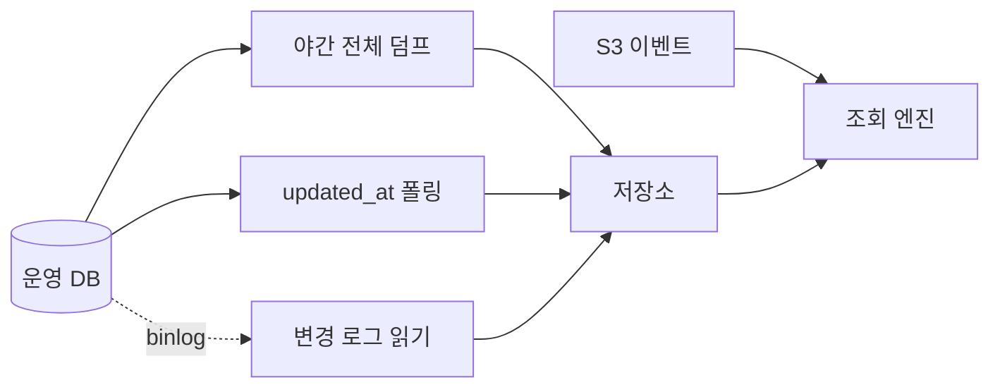

# 어제 밤 스냅샷으로 오늘 아침에 답하면 매출이 14.5% 높게 나온다

## 상황

저장소에 이벤트가 쌓여 있고 조회 창구도 열었다.
([앞](../event-storage-layout/) [모듈들](../query-without-loading/)에서 만든 것이다.)

그런데 답이 안 나오는 질문이 들어왔다.

"어제 결제 화면 본 사람들 매출이 얼마야."

화면을 봤다는 사실은 저장소에 있다. 그 결제가 아직 살아있는지는 운영 DB에 있다.
둘을 붙여야 답이 나온다.

제일 쉬운 건 운영 DB에 직접 묻는 것이다.
그런데 그러면 안 된다고 배웠다. 분석 쿼리가 서비스를 민다고.

그래서 운영 DB 쪽을 저장소로 데려오기로 했다.
가져오는 방법이 여럿인데 뭐가 다른지는 몰랐다.

## 확인하고 싶었던 것

**가져오는 방법마다 무엇을 놓치는가. 그리고 늦으면 답이 얼마나 틀리는가.**

## 재현

세 가지를 만들어 같은 순간에 돌렸다.



그 사이에 세 가지 일이 일어나게 했다.
취소 12,000건, 한 주문이 두 번 바뀜, 한 주문이 지워짐.

| 방법 | 가져온 행 | 지워진 걸 아나 | 중간 상태를 보나 |
|---|---|---|---|
| 야간 전체 덤프 | 119,999 | 없어진 걸로 앎 | 못 봄 |
| `updated_at` 폴링 | 12,001 | **모름** | 못 봄 |
| 변경 로그 읽기 | 12,003 | 지웠다고 알려줌 | **다 봄** |

세 가지가 다 다른 걸 본다.

**전체 덤프**는 그 순간의 사진이다. 지워진 행은 그냥 없다.
없어진 건 알 수 있는데 언제 왜 없어졌는지는 모른다.

**`updated_at` 폴링**은 바뀐 것만 가져오니 자주 돌릴 수 있다.
그런데 지워진 행은 `SELECT`에 안 걸린다. **영영 못 본다.**
지워진 주문이 분석 쪽에는 계속 살아있게 된다.

**변경 로그 읽기**는 7번 주문이 두 번 나온다.
`PAID → CANCELED → PAID`를 다 본다. 폴링은 마지막 모습만 가져온다.
그리고 지워진 행을 `deleted` 표시와 함께 준다.

폴링은 결과를 보고, 변경 로그는 과정을 본다.

## 접근

### 늦으면 얼마나 틀리는가

어제 자정에 전체 덤프를 찍었다. 그때는 전부 살아있는 결제였다.
새벽에 취소 50,000건이 들어왔다.
오늘 아침에 "어제 결제 화면 본 사람들 매출"을 물었다.

| 무엇으로 답했나 | 본 사람 | 살아있는 주문 | 금액 |
|---|---|---|---|
| 어제 밤 스냅샷만 | 5,968 | 119,045 | 1,202,631만원 |
| 스냅샷 + 변경 로그 | 5,968 | 104,026 | 1,050,638만원 |
| 운영 DB에 직접 (진짜 값) | 5,968 | 104,026 | 1,050,638만원 |

**15억원, 14.5% 높게 나온다.**

여기서 중요한 건 이게 **틀린 값이 아니라는 것**이다.
어제 자정에는 실제로 저 금액이었다. 스냅샷은 제 일을 했다.

틀린 건 그걸 오늘 아침 회의에 가져간 쪽이다.
그런데 화면에는 그냥 숫자가 떠 있고, 언제 기준인지는 안 적혀 있다.

변경 로그를 얹은 쪽은 운영 DB와 **정확히 같은 답**을 냈다.
104,026건, 1,050,638만원. 이게 맞는지 확인하려고 테스트로 박아뒀다.

### 건수가 아니라 금액을 물은 이유

처음에는 "본 사람 중 산 사람 비율"로 쟀다. 99.77%가 나왔다.
취소를 반영해도 99.46%였다. 0.3%p 차이다.

사람 수는 잘 안 움직인다. 주문 하나가 취소돼도
그 사람이 다른 주문을 갖고 있으면 여전히 "산 사람"이기 때문이다.

**취소가 바로 드러나는 건 금액이다.**
어떤 지표를 보느냐에 따라 같은 문제가 보이기도 하고 안 보이기도 한다.

## 결과

### 재현하지 못한 것

이 모듈을 시작할 때 "운영 DB에 직접 조인하면 서비스가 밀린다"를
숫자로 보여주려고 했다. 못 했다.

| | 집계 시간 | 주문 조회 p50 | p95 |
|---|---|---|---|
| 아무것도 안 돌릴 때 | 4,000ms | 1.4ms | 2.8ms |
| 재구매 분석을 운영 DB에서 | 5,057ms | 0.6ms | 1.0ms |
| 같은 걸 4개 동시에 | 6,033ms | 0.6ms | 1.6ms |
| 같은 걸 저장소에서 | 341ms | 6.0ms | 9.0ms |

안 밀렸다. 5초 걸리는 자기 조인을 넷 동시에 던져도
주문 조회는 평소와 같았다. 오히려 더 빨랐는데 그건 측정 노이즈다.

마지막 줄이 제일 느린 건 더 웃긴다.
같은 노트북에서 조회 엔진이 CPU를 쓰니까 측정하는 쪽이 느려진 것이다.
실제로는 저기가 다른 기계다. 이건 재는 방법의 한계다.

**그래서 "부하 때문에 가져온다"는 여기서 확인 못 했다.**
주문 40만 행에 조회 하나가 도는 정도로는 이 DB가 흔들리지 않는다.

안 재본 것들이 있다. 아마 이쪽일 것이다.

- 실제 테이블은 40만이 아니라 훨씬 컸다
- 여기서는 읽기만 했다. 실제로는 같은 순간에 쓰기가 계속 들어온다
- 커넥션 풀이 서비스와 공유였고 한도가 훨씬 낮았다

### 그런데도 가져오기로 한 이유

부하가 재현 안 됐다고 결정이 바뀌지는 않았다.
다만 **이유가 바뀌었다.**

| 이유 | |
|---|---|
| 이벤트와 주문을 한 엔진에서 조인해야 한다 | 나눠 있으면 한쪽 목록을 통째로 넘겨야 한다. 사용자 6,000명이면 파라미터가 6,000개다 |
| 운영 DB 스키마가 바뀌면 분석 쿼리가 깨진다 | 가져오는 자리를 한 겹 두면 거기서 흡수한다 |
| 분석가에게 운영 DB 권한을 안 줘도 된다 | 이게 실제로는 제일 크다 |
| 과거를 볼 수 있다 | 운영 DB에는 지금 상태만 있다. 지워진 주문은 조회할 방법이 없다 |

마지막 줄이 이 모듈에서 새로 알게 된 것이다.
운영 DB는 "지금"만 안다. 분석은 "그때"를 물어본다.

### 그래서 정한 것

| 정한 것 | 왜 |
|---|---|
| 하루 한 번 전체 덤프로 시작한다 | 만들기 제일 쉽고 되돌리기도 쉽다 |
| 금액을 묻는 질문이 생기면 변경 로그를 얹는다 | 취소를 모르면 14.5% 틀린다 |
| `updated_at` 폴링은 안 쓴다 | 지워진 행을 영영 못 본다. 만들기 쉬운 값을 여기서 치른다 |
| 화면에 "언제 기준"을 같이 띄운다 | 늦은 게 문제가 아니라 늦은 줄 모르는 게 문제다 |
| 읽기 전용 복제본에서 뜬다 | 부하를 재현 못 했어도 원본을 건드릴 이유는 없다 |

## 다시 한다면

**변경 로그 리더가 어디까지 읽었는지를 저장한다.**
지금은 시작할 때마다 끝에서 읽는다. 재시작하면 그 사이가 빈다.
위치를 저장하지 않으면 이 방식의 이점이 사라진다.

**같은 주문이 여러 번 나오는 걸 읽는 쪽에서 푼다.**
지금은 조회할 때마다 마지막 것을 고른다.
파일이 쌓이면 이게 무거워진다. 하루 한 번 정리하는 게 맞을 것 같다.

**이 모듈이 다루지 않은 것.**
스키마가 바뀌었을 때 변경 로그 리더가 어떻게 되는지 안 봤다.
컬럼이 추가되면 위치 기반으로 읽는 쪽이 어긋날 수 있다.

시간대도 안 건드렸다. 이벤트 파티션은 KST로 잘랐는데
주문의 `created_at`은 UTC다. 하루 경계에서 또 어긋날 자리다.

### 클라우드에서는 이 자리에 무엇이 오는가

| 이 모듈 | AWS |
|---|---|
| MySQL | Amazon Aurora MySQL |
| 읽기 전용 복제본 | Aurora Replica |
| 야간 전체 덤프 | AWS DMS Full Load, S3 타깃 |
| `updated_at` 폴링 | AWS Glue JDBC 잡 |
| 변경 로그 읽기 | AWS DMS CDC 모드, 또는 Debezium on MSK |
| 저장소 | Amazon S3 |
| 조인 | Amazon Athena |
| 마지막 모습만 고르기 | Apache Iceberg 의 MERGE |

변경 로그를 계속 쌓으면 같은 주문이 수십 번 나온다.
읽을 때마다 마지막 것을 고르는 대신 테이블에 반영해두려면
갱신을 지원하는 형식이 필요하고 그게 Iceberg다.
대신 작은 파일을 합치는 작업이 따라붙는다.

---

## 직접 실행해보기

### 0. 준비

```bash
git clone https://github.com/xo0449/backend-lab.git
cd backend-lab
npm install
npm run db:up
```

MySQL과 MinIO가 둘 다 필요합니다.
`repl` 계정은 컨테이너를 처음 만들 때 자동으로 생깁니다.

### 1. 전부 돌리기

```bash
npm run lab:orders
```

### 2. 하나만 돌리기

```bash
ONLY=1 npm run lab:orders
ONLY=2 npm run lab:orders
ONLY=3 npm run lab:orders
```

3번은 재현에 실패한 시나리오입니다. 실패한 결과를 그대로 출력합니다.

### 3. 규모 바꿔보기

```bash
ORDERS=1000000 npm run lab:orders
PER_DAY=100000 npm run lab:orders
```

주문을 100만으로 올려도 3번 시나리오는 여전히 안 밀립니다.
**밀리는 걸 보려면 무엇이 더 있어야 하는지가 다음 질문입니다.**

### 4. 결론을 뒤집어보기

`bench/run.ts`의 2번 시나리오에서 변경 로그를 빼봅니다.

```typescript
const withChanges = await revenueFromLake(
  conn, DAY, [snapshotGlob('midnight')],     // changesGlob('dawn') 제거
)
```

앞의 두 줄이 같아지고 운영 DB 줄만 다릅니다.

```
어제 밤 스냅샷만          1,202,631만원
스냅샷 + 변경 로그        1,202,631만원
운영 DB에 직접 (진짜 값)   1,050,638만원
```

**가져온 것만 보면 틀린 걸 알아낼 방법이 없다**는 뜻입니다.
둘을 견줘볼 대상이 운영 DB밖에 없는데, 그걸 안 보려고 가져온 것이니까요.
그래서 가져오는 쪽이 무엇을 놓치는지를 미리 알고 있어야 합니다.

### 5. 지워진 행을 직접 확인하기

```bash
docker exec backend-lab-mysql-1 mysql -uroot -plab lab \
  -e "SELECT status, count(*) FROM lab_order GROUP BY status"
```

변경 로그가 무엇을 봤는지는 저장소에서 봅니다.

```bash
docker exec backend-lab-minio-1 mc alias set local http://localhost:9000 lab labsecret
docker exec backend-lab-minio-1 mc cat local/lake/orders/changes-dawn/part-0.jsonl | head -3
```

### 6. 테스트

```bash
npx vitest run modules/order-join-freshness
```

### 7. 정리

```bash
npm run db:down
```
