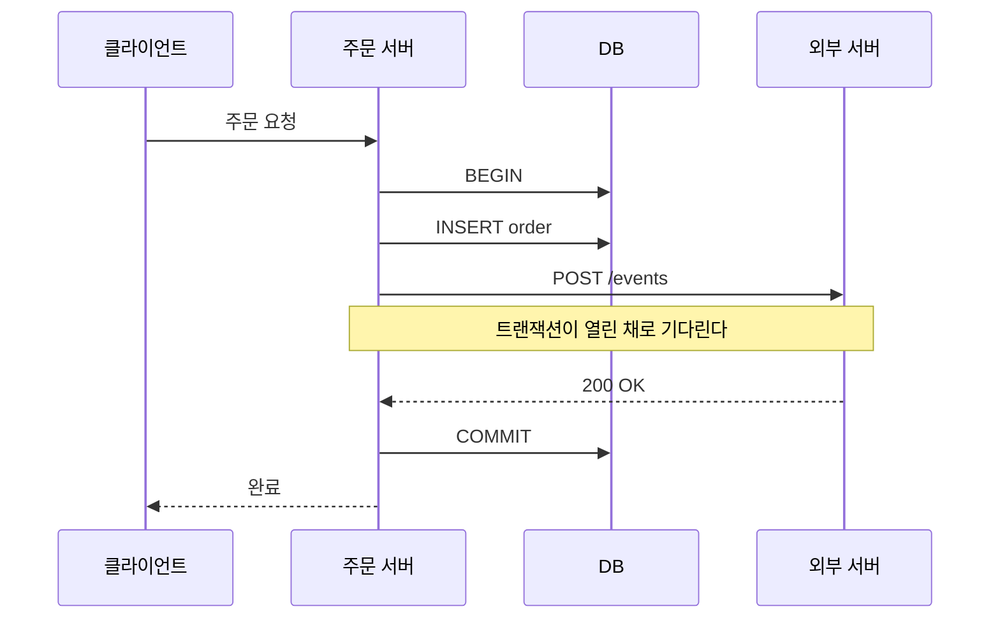
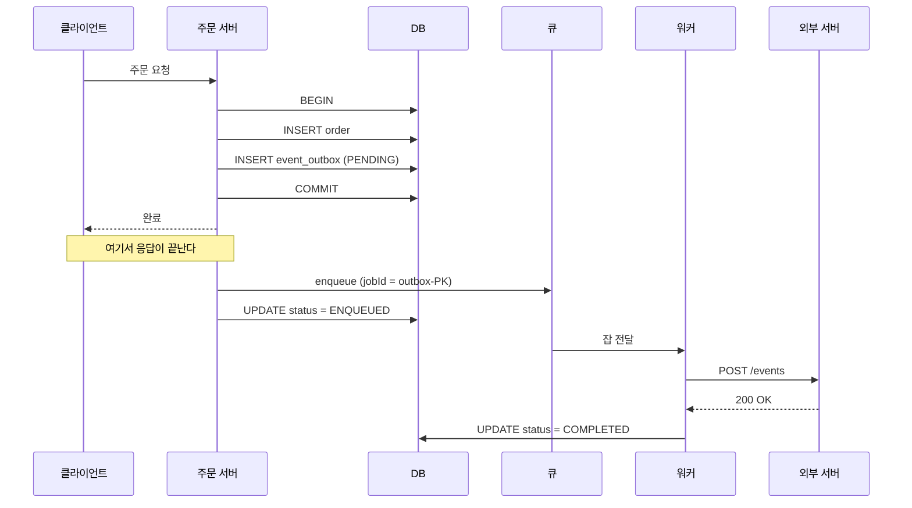
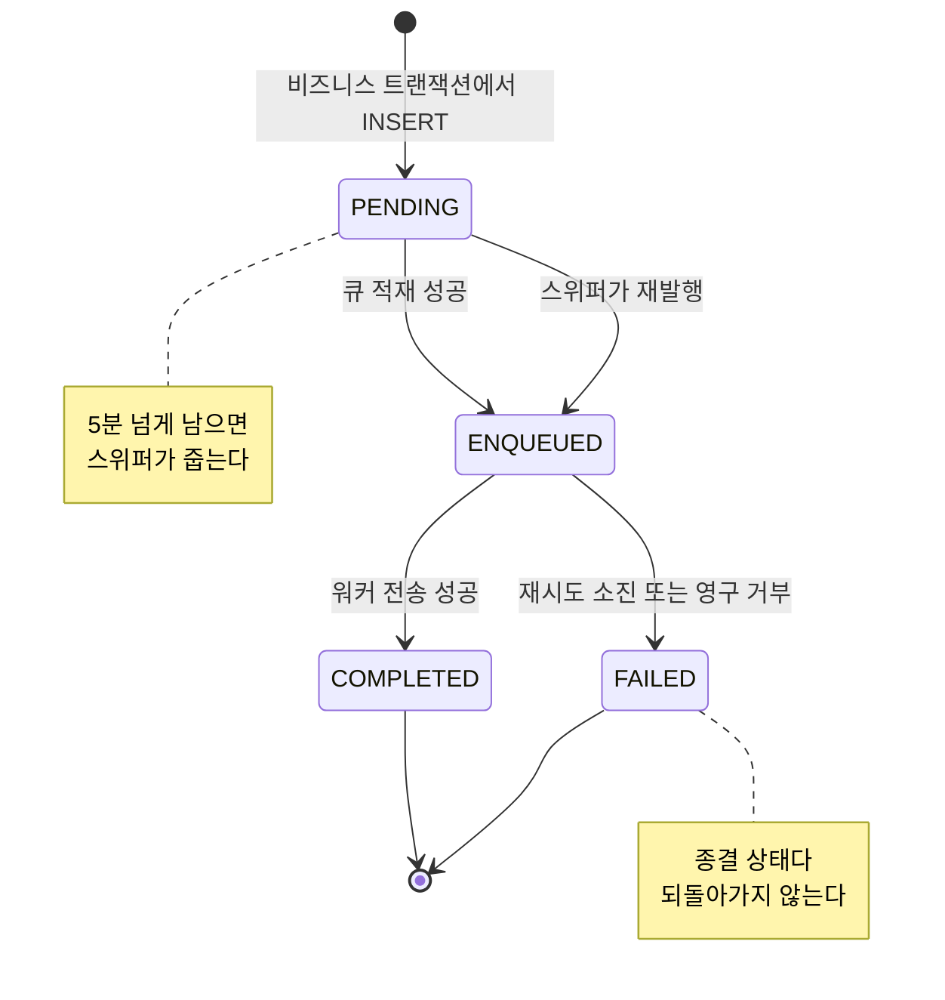
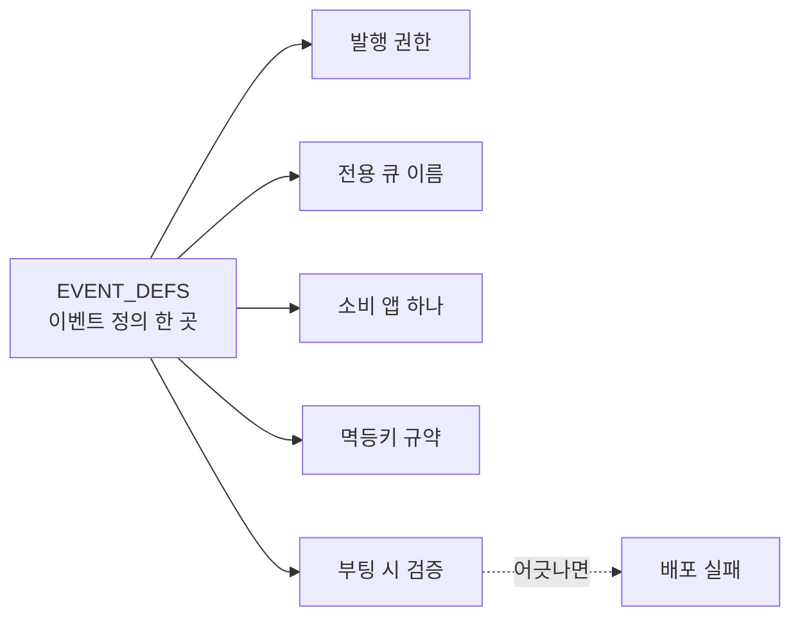
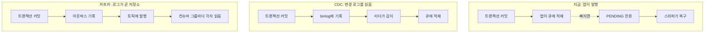

# 트랜잭션 안에서 외부 서버를 부르면 생기는 일

## 상황

주문이 들어오면 다른 서버에 알려야 한다. 배송 대행사일 수도 있고,
정산 시스템일 수도 있다. 우리 쪽에서 끝나는 일이 아니다.

가장 먼저 떠오르는 코드는 이렇다.

```typescript
await conn.beginTransaction()
const orderId = await insertOrder(amount)
await fetch(ENDPOINT, { method: 'POST', body: JSON.stringify({ orderId }) })
await conn.commit()
```

읽기 쉽다. 순서도 맞다. 주문을 넣고 알린다.
단위 테스트도 통과한다. 수신자가 살아 있고 빠르면 아무 문제가 없다.



문제는 수신자가 항상 살아 있지는 않다는 것이다.
그리고 우리 트랜잭션은 그동안 열려 있다.

## 확인하고 싶었던 것

아웃박스 패턴은 널리 알려져 있다. 설명도 어렵지 않다.
그런데 "왜 굳이" 부분은 대개 추상적으로 넘어간다.

**직접 호출이 실제로 어떻게 망가지는지 손으로 만져보고 싶었다.**
그리고 아웃박스로 옮기면 무엇을 떠안게 되는지도 같이 보고 싶었다.
공짜인 전환은 없다.

### 비교를 최소 쌍으로 좁힌 이유

이 실험은 "직접 호출 대 아웃박스" 두 구현만 놓고 비교한다.
범위를 좁힌 것은 측정 때문이다. 부품이 늘면 어느 변화가 어느 결과를
만들었는지 말할 수 없다.

대신 좁힌 만큼 빠지는 것이 있다. 아웃박스를 한 번 쓰는 것과
여러 도메인이 함께 쓰는 기반으로 세우는 것은 다른 일이다.
그 부분은 아래 "한 번 쓰는 것과 기반으로 세우는 것"에서 따로 다룬다.

## 구성

외부 서버 대역을 하나 띄운다. 모드를 바꿔 장애를 만든다.

- `ok` 정상 응답
- `down` 연결을 끊는다. 서버가 죽은 상황
- `slow` 3초 뒤 응답한다. 살아 있지만 느린 상황

비교 대상은 둘이다.

- `direct.ts` 트랜잭션 안에서 직접 호출
- `outbox.ts` 같은 트랜잭션에 아웃박스 기록, 커밋 후 큐 적재

```bash
npm run db:up
npx tsx modules/outbox-vs-direct/bench/run.ts
```

MySQL, Redis, 가짜 수신자가 전부 로컬에서 돈다.

## 시나리오 1. 커밋이 실패했는데 통보는 이미 나갔다

주문을 넣고 외부에 알린 뒤, 재고 차감 같은 후속 단계가 실패하는 상황이다.

| | 주문 저장 | 통보 발송 |
|---|---|---|
| 직접 호출 | 안 됨 | **나감** |
| 아웃박스 | 안 됨 | 안 나감 |

직접 호출은 없던 주문에 대한 통보를 내보낸다. 롤백은 우리 DB만 되돌린다.
이미 나간 HTTP 요청은 되돌릴 방법이 없다.

수신자 입장에서는 주문이 들어왔다. 우리 쪽에는 그 주문이 없다.
이 불일치는 조회해봐야 드러나고, 대개 한참 뒤에 드러난다.

아웃박스는 이런 상태가 만들어지지 않는다. 주문과 이벤트 기록이
같은 트랜잭션에 있다. 같이 커밋되거나 같이 사라진다.



## 시나리오 2. 수신자가 죽어 있는 동안 주문이 들어왔다

이게 가장 예상 밖이었다.

| | 주문 저장 | 이벤트 최종 도달 |
|---|---|---|
| 직접 호출 | **안 됨** | 유실 |
| 아웃박스 | 됨 | 도달 |

직접 호출에서는 **주문 접수 자체가 실패한다.** 통보가 유실되는 게 아니라
주문을 못 받는다. 외부 서버가 죽었다는 이유로 우리 서비스가 주문을
거부하는 셈이다.

생각해보면 당연하다. `fetch`가 던지면 `catch`로 가고 트랜잭션이 롤백된다.
외부 호출이 비즈니스 트랜잭션 안에 있으니 그 실패가 비즈니스 실패가 된다.

**결합이 여기서 드러난다.** 코드에는 "주문을 받는다"와 "알린다"가
나란히 있을 뿐인데, 실제로는 두 번째가 첫 번째의 성공 조건이 되어 있다.
아무도 그렇게 설계하지 않았고, 아무도 그렇게 적지 않았다.

아웃박스에서는 주문이 들어온다. 이벤트는 아웃박스에 남고, 수신자가
돌아오면 워커가 재시도해서 보낸다. 실행 결과를 보면 최종 상태가
`COMPLETED`다.

## 시나리오 3. 수신자가 느릴 때 호출자가 얼마나 붙잡히는가

| | 응답 시간 |
|---|---:|
| 직접 호출 | 3,016ms |
| 아웃박스 | 16ms |

수신자 지연을 3초로 뒀다. 직접 호출은 그 3초를 그대로 떠안는다.
사용자가 결제 버튼을 누르고 3초를 기다린다.

더 나쁜 것은 트랜잭션이 그동안 열려 있다는 점이다.
주문 행에 잠금이 걸린 채로 3초가 흐른다. 동시 주문이 많으면
커넥션 풀이 먼저 마른다. 외부 서버 한 곳이 느려졌을 뿐인데
우리 DB가 병목이 된다.

아웃박스는 커밋하고 끝낸다. 전송은 워커가 나중에 한다.

## 시나리오 4. 큐 적재가 빠지면 어떻게 되는가

아웃박스가 공짜가 아닌 지점이 여기다.

커밋과 큐 적재는 하나의 원자적 동작이 아니다. 커밋은 됐는데
그 직후 Redis가 죽거나 프로세스가 내려가면 적재가 빠진다.
그러면 이벤트는 아웃박스에 `PENDING`으로 남고 아무도 안 보낸다.

| 시점 | 도달 |
|---|---:|
| 스위퍼 전 | 0 |
| 스위퍼 재발행 | 1건 |
| 스위퍼 후 | 1 |

그래서 스위퍼가 필요하다. `PENDING`으로 오래 남은 행을 주기적으로
찾아 다시 올린다. **아웃박스 패턴에서 이 부분을 빼면 패턴이 아니다.**
큐 적재 실패를 복구할 경로가 사라진다.

재적재가 안전한 이유는 `jobId`를 아웃박스 PK로 고정했기 때문이다.

```typescript
await queue.add(row.event_type, payload, { jobId: `outbox-${outboxId}` })
```

같은 행을 두 번 올려도 큐에 잡은 하나다. 테스트로 고정했다.

## 설계에서 걸렸던 것들

### 적재 실패를 삼킨다

커밋 후 `queue.add`가 실패하면 어떻게 할 것인가.
호출자에게 실패를 돌려줄 수는 없다. 주문은 이미 커밋됐다.
"주문은 됐지만 알림이 안 갔습니다"는 사용자에게 의미 없는 말이다.

그래서 삼킨다. 아웃박스가 `PENDING`으로 남아 스위퍼가 복구한다.

```typescript
await enqueue(pool, queue, outboxId).catch(() => {
  // 삼킨다. PENDING으로 남아 스위퍼가 복구한다.
})
```

반대로 아웃박스 INSERT 실패는 삼키면 안 된다. 그건 복구 근거 자체가
없다는 뜻이라 비즈니스 트랜잭션째 실패해야 한다.

### 상태 갱신을 조건부로 한다

적재 성공 후 상태를 `ENQUEUED`로 바꾸는데, 그 사이 워커가 이미 처리를
끝냈을 수 있다. 무조건 덮으면 `COMPLETED`가 `ENQUEUED`로 되돌아간다.

```sql
UPDATE event_outbox SET status = 'ENQUEUED'
 WHERE id = ? AND status = 'PENDING'
```

완료와 실패는 종결 상태로 두고 다시 바뀌지 않게 했다.



스위퍼가 줍는 것은 `PENDING`뿐이다. `ENQUEUED`에서 멈춘 행은
자동 복구 경로가 없다. 그래서 그 개수를 따로 봐야 한다.

### 재시도를 한 곳만 갖는다

HTTP 클라이언트에도 재시도가 있고 큐에도 재시도가 있으면
실제 시도 횟수가 곱해진다. 3회 곱하기 5회는 15회다.
이미 힘든 수신자를 더 때린다.

재시도 소유자를 큐 하나로 정했다. 워커의 `fetch`는 재시도하지 않는다.

### 400대는 재시도하지 않는다

다시 보내도 같은 답이 온다. 다섯 번 시도해서 다섯 번 거절당하는 동안
지수 백오프로 시간만 쓴다.

```typescript
if (res.status >= 400 && res.status < 500) {
  throw new UnrecoverableError(`영구 거부 ${res.status}`)
}
```

바로 실패로 보내고 실패 목록에 남긴다. 실패한 잡을 지우지 않는 이유가
여기 있다. 그게 곧 죽은 편지함이다. 지우면 무엇이 안 갔는지 알 수 없다.

## 결과

| 항목 | 직접 호출 | 아웃박스 |
|---|---|---|
| 롤백된 주문의 통보 | 나감 | 안 나감 |
| 수신자 다운 중 주문 접수 | 실패 | 성공 |
| 수신자 다운 중 발생한 이벤트 | 유실 | 복구 후 도달 |
| 수신자 3초 지연 시 응답 | 3,016ms | 16ms |

## 무엇을 떠안게 되는가

아웃박스는 문제를 없애지 않고 옮긴다. 옮긴 자리에 새 일이 생긴다.

**부품이 늘었다.** 아웃박스 테이블, 큐, 워커, 스위퍼가 생겼다.
각각이 고장 날 수 있고, 각각을 봐야 한다.

**즉시성을 포기했다.** 직접 호출은 응답을 받고 다음 줄로 간다.
이제는 언제 갈지 모른다. 사용자에게 바로 결과를 보여줘야 하는 일에는
쓸 수 없다.

**볼 것이 늘었다.** 아웃박스에 `PENDING`이 쌓이는지, `ENQUEUED`에서
멈춘 행이 있는지, 실패 목록이 늘어나는지를 봐야 한다.
이 실험에는 그 감시가 없다. 지표와 알람 없이 운영하면
조용히 안 나가고 있는 상태를 몇 주 동안 모를 수 있다.

**되돌리기 어렵다.** 한 번 이벤트로 나눠놓으면 호출 관계가 코드에서
사라진다. 누가 무엇을 소비하는지 따로 관리해야 한다.

## 한 번 쓰는 것과 기반으로 세우는 것

여기까지는 이벤트가 하나다. 주문 하나에 통보 하나다.
그 상태에서는 아웃박스 테이블과 워커 하나면 끝난다.

이벤트가 여덟 개가 되고 발행하는 앱이 세 개가 되면 문제의 성격이 바뀐다.
**각 이벤트를 잘 만드는 문제가 아니라, 여덟 개가 서로 어긋나지 않게
하는 문제가 된다.** 어긋남은 대개 운영 중에만 드러난다.

### 계약을 한곳에 둔다

누가 무엇을 발행하고 누가 소비하는지를 코드 한곳에 적었다.

```typescript
export const EVENT_DEFS = {
  OrderPlaced: {
    publishers: ['order-api'],
    consumer: 'partner-api',
    queue: 'order-placed',
    dedupKey: (p) => buildDedupKey('OrderPlaced', p.orderId),
  },
  ...
}
```

새 이벤트를 추가할 때 고치는 곳이 이 표 하나다.
발행 쪽과 소비 쪽에 각각 상수를 두면 둘이 갈라진다.
갈라진 것을 발견하는 시점은 대개 잡이 엉뚱한 큐에 쌓인 뒤다.



### 소비 앱을 하나로 강제한다

큐는 작업 큐다. 두 앱이 같은 큐를 보면 잡을 나눠 가진다.
복제가 아니다. 절반은 A가, 절반은 B가 처리한다.

이걸 모르고 "두 팀이 같은 이벤트를 받으면 되겠네"라고 생각하면
양쪽 다 절반만 처리된 상태가 된다. 그래서 정의에 소비 앱을
하나만 적게 하고, 둘에 보내야 하면 이벤트를 나누도록 했다.

### 부팅 시점에 검증한다

```typescript
export function validateEventPolicy(): void {
  const queues = new Map<string, string>()
  for (const [type, def] of Object.entries(EVENT_DEFS)) {
    if (def.publishers.length === 0) throw new Error(`[${type}] 발행 앱이 없다`)
    const owner = queues.get(def.queue)
    if (owner) throw new Error(`[${type}] 큐 '${def.queue}'를 ${owner}와 공유한다`)
    queues.set(def.queue, type)
  }
}
```

어긋난 정의는 배포 전에 잡는다. 운영 중에 드러나면
이미 잡이 잘못된 큐에 쌓인 뒤라 되돌리기가 훨씬 비싸다.

### 멱등키 규약을 공통으로 만든다

`dedupKey`를 이벤트마다 자유롭게 만들면 반드시 한 곳에서 실수한다.
가장 흔한 실수는 구분자가 값 안에 섞이는 것이다.

`E:a:b`는 `('a:b')`로도 나오고 `('a', 'b')`로도 나온다.
둘이 같은 키가 되면 서로 다른 발행 중 하나가 조용히 사라진다.
각 조각을 이스케이프해서 막았고, 그 동작을 테스트로 고정했다.

길이 상한도 조립 시점에 건다. DB의 유니크 인덱스에서 잘리면
서로 다른 키가 같아진다. 그때는 이미 늦다.

### 발행 권한을 정의에 적는다

어느 앱이 어느 이벤트를 발행할 수 있는지 적어두면,
권한 없는 발행이 부팅이나 호출 시점에 걸린다.
적어두지 않으면 시간이 지나면서 아무 앱이나 아무 이벤트를 쏘게 된다.
그 상태가 되면 이벤트 하나를 고칠 때 영향 범위를 알 수 없다.

### 여기까지가 기반이다

이 다섯 가지는 이벤트가 하나일 때는 과하다. 셋을 넘어가면 없으면 곤란하다.
넘어가는 시점을 미리 정해두는 편이 낫다.
대개는 "두 번째 도메인이 아웃박스를 쓰겠다고 할 때"가 그 선이다.

## 다음 단계로 무엇이 있는가

지금 구조는 애플리케이션이 아웃박스에 쓰고, 같은 애플리케이션이
큐에 올린다. 스위퍼가 빠진 것을 줍는다.
이 방식의 한계와 대안을 정리해둔다.

### 지금 방식의 한계

**발행 코드가 애플리케이션에 있다.** 이벤트를 남기는 일을 개발자가
매번 기억해야 한다. 잊으면 아무 일도 안 일어나고, 아무도 모른다.

**스위퍼가 폴링이다.** 5분마다 테이블을 훑는다. 평소에는 헛일이고,
장애 직후에는 복구가 최대 5분 늦는다.

**아웃박스 테이블이 계속 커진다.** 정리 배치를 따로 만들어야 한다.

### CDC로 아웃박스를 읽는 방법

애플리케이션이 큐에 올리는 대신, DB 변경 로그를 읽는 프로세스가
아웃박스 행을 감지해 발행한다. MySQL이면 binlog를 읽는다.

**얻는 것.** 커밋과 발행 사이의 틈이 구조적으로 사라진다.
행이 커밋됐다면 로그에 있고, 로그에 있으면 읽힌다.
스위퍼가 필요 없다. 발행 실패를 삼키는 코드도 필요 없다.

**떠안는 것.** binlog 리더가 새 인프라다. 오프셋을 관리해야 하고,
그 프로세스가 죽으면 이벤트가 밀린다. binlog 보존 기간을 넘겨
멈춰 있으면 그 구간은 영영 못 읽는다. 스키마 변경 대응도 필요하다.

**언제 갈아탈 만한가.** 아웃박스를 쓰는 도메인이 여럿이 되고,
스위퍼의 5분 지연이 실제로 문제가 될 때다. 하나일 때는 과하다.

### DB 트리거는 왜 권하지 않는가

"아웃박스 INSERT를 개발자가 잊으면 어떡하나"에 대한 답으로
트리거가 나온다. 주문 테이블에 트리거를 걸어 자동으로
아웃박스 행을 만드는 것이다.

동작은 한다. 그런데 세 가지가 걸린다.

**보이지 않는다.** 주문 코드를 읽어도 이벤트가 나간다는 사실이 안 보인다.
디버깅할 때 DB 스키마를 뒤져야 알 수 있다.

**테스트가 어렵다.** 단위 테스트에서는 트리거가 안 돈다.
통합 테스트를 붙여야 하고, 그 테스트는 느리다.

**변경 이력이 갈라진다.** 애플리케이션 코드는 저장소에 있고
트리거는 마이그레이션에 있다. 둘이 다른 속도로 움직인다.

트리거는 이벤트를 만드는 조건이 단순할 때만 쓸 만하다.
"어떤 상태 전이일 때만 발행한다" 같은 조건이 들어오면
SQL 안에 비즈니스 규칙이 들어앉는다. 그때부터는 손해다.

### 카프카로 옮긴다면

지금은 BullMQ를 쓴다. 작업 큐다. 잡을 꺼내면 사라진다.
카프카는 로그다. 읽어도 남는다. 이 차이가 대부분을 설명한다.

**얻는 것.** 파티션 키로 순서를 보장할 수 있다. 같은 주문의 이벤트를
같은 파티션에 넣으면 순서대로 처리된다. 지금 구조에서는
순서를 포기하고 상태를 다시 읽는 방식으로 우회하고 있다.

컨슈머 그룹으로 팬아웃이 된다. 한 이벤트를 여러 팀이 각자 읽는다.
앞서 "소비 앱을 하나로 강제한다"고 한 제약이 사라진다.

보존 기간 안에서는 다시 읽을 수 있다. 소비자 버그를 고친 뒤
오프셋을 되돌려 재처리하면 된다. 작업 큐에서는 이미 사라진 잡이다.

**떠안는 것.** 운영 부담이 다른 차원이다. 브로커, 파티션 수,
컨슈머 리밸런싱, 오프셋 관리가 전부 새 주제다.
Redis 하나 띄우는 것과 비교할 일이 아니다.

재시도와 죽은 편지함도 직접 만들어야 한다. BullMQ는 그게 내장이다.

**언제 갈아탈 만한가.** 순서 보장이 실제로 필요해졌을 때,
또는 한 이벤트를 여러 소비자가 각자 읽어야 할 때다.
"카프카가 더 좋으니까"는 이유가 아니다.

### 세 방식이 다른 지점



**앱이 발행할 때 적재가 빠지는 구간이, CDC에서는 구조적으로 사라진다.**
행이 커밋됐다면 로그에 있고, 로그에 있으면 읽힌다.
카프카는 발행 이후의 이야기라 커밋과 발행 사이의 틈은 그대로 남는다.

### 정리

| | 지금 (앱 발행 + 큐) | CDC + 큐 | 카프카 |
|---|---|---|---|
| 커밋과 발행 사이 틈 | 스위퍼로 메움 | 구조적으로 없음 | 발행 방식에 따라 다름 |
| 순서 보장 | 없음 | 없음 | 파티션 단위로 가능 |
| 팬아웃 | 이벤트를 나눠야 함 | 같음 | 컨슈머 그룹 |
| 재처리 | 실패 목록에서 수동 | 같음 | 오프셋 되감기 |
| 새로 지는 운영 부담 | 큐, 워커, 스위퍼 | binlog 리더, 오프셋 | 브로커 전반 |

세 단계는 순서가 있다. 지금 구조 없이 카프카부터 가면
트랜잭션과 발행 사이의 틈은 그대로 남는다.
그 틈을 메우는 것이 아웃박스이지 브로커가 아니다.

## 다시 한다면

### 감시부터 만든다

이 실험에서 빠진 것 중 가장 중요하다.
`PENDING`이 5분 넘게 남아 있는 행의 개수, `ENQUEUED`에서 멈춘 행의 개수,
실패 목록 크기. 이 세 가지에 알람이 없으면 아웃박스는 조용히 고장 난다.

스위퍼가 재발행한 건수도 지표로 둘 만하다. 평소 0이어야 하고,
0이 아니면 적재 구간에 문제가 있다는 신호다.

### 순서 보장을 기대하지 않는다

이 실험은 이벤트가 하나뿐이라 순서 문제가 없다.
실제로는 같은 주문에 여러 이벤트가 생기고, 큐가 나뉘면 순서가 깨진다.

순서를 지키려 하기보다 순서에 의존하지 않게 만드는 편이 낫다.
페이로드에 상태를 싣지 않고 식별자만 실으면, 소비자가 처리 시점에
다시 읽어 최신 상태로 판단한다.

### 모든 호출을 옮길 필요는 없다

응답이 당장 필요한 호출은 직접 부르는 게 맞다.
재고 확인이나 결제 승인이 그렇다. 결과를 모르면 다음 단계로 갈 수 없다.

아웃박스가 맞는 것은 "알리기만 하면 되는" 호출이다.
이 구분을 안 하고 전부 옮기면 응답을 기다리는 코드가
큐를 폴링하는 기괴한 모양이 된다.

---

## 직접 실행해보기

```bash
git clone https://github.com/xo0449/backend-lab.git
cd backend-lab && npm install
npm run db:up
```

MySQL과 Redis가 뜬다. 가짜 수신자는 스크립트가 직접 띄운다.

### 1. 네 시나리오 전부 돌리기

```bash
npm run lab:outbox
```

### 2. 시나리오 하나만 돌리기

```bash
ONLY=1 npm run lab:outbox   # 트랜잭션 롤백
ONLY=2 npm run lab:outbox   # 수신자 다운
ONLY=3 npm run lab:outbox   # 수신자 지연
ONLY=4 npm run lab:outbox   # 큐 적재 누락
```

### 3. 아웃박스 상태를 직접 보기

```bash
docker exec backend-lab-mysql-1 mysql -h127.0.0.1 -uroot -plab lab -e "
SELECT status, COUNT(*) AS n FROM event_outbox GROUP BY status;"
```

시나리오 4를 스위퍼 없이 돌리면 `PENDING`이 남아 있는 것을 볼 수 있다.

### 4. 스위퍼를 빼면 어떻게 되는지 보기

`modules/outbox-vs-direct/bench/run.ts`의 시나리오 4에서
`sweepOnce` 호출을 주석 처리한다.

```bash
ONLY=4 npm run lab:outbox
```

"스위퍼 후 도달"이 0으로 남는다. 아웃박스만 있고 스위퍼가 없으면
적재가 빠진 이벤트는 영영 안 나간다.

### 5. 테스트

```bash
npx vitest run modules/outbox-vs-direct
```

### 정리

```bash
npm run db:down
```
