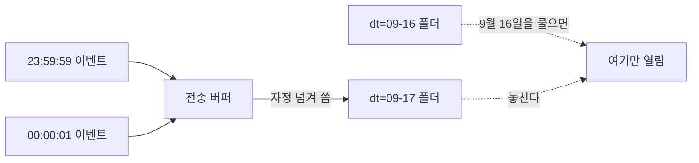

# 적재하지 않고 물어볼 때, 어떻게 묻느냐가 값을 정한다

## 상황

이벤트를 날짜 폴더에 열 단위 형식으로 쌓아뒀다.
([앞 모듈](../event-storage-layout/)에서 그 모양을 정했다.)

이제 분석가에게 조회 창구를 열어주면 된다.
웨어하우스는 아직 안 들인다. 파일을 옮기지 않고 그 자리에서 읽는다.

그런데 창구를 열어주고 나면 쿼리는 내가 안 쓴다.
쌓는 모양은 내가 정했는데, 읽는 방법은 남이 정한다.

잘 쌓아두면 알아서 싸게 읽힐 거라고 생각했다.
그게 맞는지 확인하고 싶었다.

## 확인하고 싶었던 것

**잘 쌓아둔 것만으로 충분한가. 아니면 묻는 방법도 정해줘야 하는가.**

## 재현

같은 질문을 일곱 가지 방법으로 던졌다.
7일치, 하루 5만 건이다.

질문은 하나다. "2026년 9월 16일 KST 하루에 이벤트가 몇 건인가."

| 어떻게 물었나 | 답 | 연 파일 |
|---|---|---|
| 경로의 날짜로 콕 집어 | 50,000건 | 1개 |
| 경로의 날짜를 범위로 | 50,000건 | 1개 |
| 경로의 날짜를 함수로 감싸 | 50,000건 | 1개 |
| 파일 안의 시각으로 | 50,001건 | **7개** |
| 시각을 날짜로 바꿔서 | 50,001건 | **7개** |
| 하루만 열고 시각으로 마무리 | 49,999건 | 1개 |
| 앞뒤로 하루씩 열고 마무리 | 50,001건 | 3개 |

두 가지가 한꺼번에 나왔다.

**여는 파일 수가 갈렸다.** 이건 예상한 것이다.
경로에 있는 날짜로 거르면 하루치 파일만 연다.
파일 안의 시각으로 거르면 열어보기 전에는 알 수 없으니 전부 연다.

**답도 갈렸다.** 이건 예상하지 못했다.

## 접근

답이 세 가지로 나온 이유부터 찾았다.

```
2026-09-15 폴더에 들어있는 KST 2026-09-16 이벤트  2건
2026-09-16 폴더에 들어있는 KST 2026-09-17 이벤트  1건
```

파티션은 파일이 만들어진 시점으로 갈린다.
자정 직전에 들어온 이벤트가 자정 직후 파일에 실린다.
그래서 `dt=2026-09-16` 폴더와 "KST 9월 16일"이 완전히 같지 않다.



그러면 셋 중 무엇이 맞는가. **질문이 정한다.**

| 세고 있는 것 | 맞는 경우 |
|---|---|
| 50,000 · 경로만 | "어제 파일에 뭐가 들어왔나". 적재를 점검할 때 |
| 50,001 · 시각만 | "9월 16일에 실제로 일어난 일". 지표를 낼 때 |
| 49,999 · 경로로 좁히고 시각으로 | 둘 다 아니다. 좁게 열어서 다른 폴더 것을 놓쳤다 |

세 번째가 함정이다.
경로로 거르고 시각으로도 걸렀으니 제일 꼼꼼해 보이는데, 실제로는 빠뜨린다.
파일을 하루치만 열었으니 옆 폴더에 있는 2건은 애초에 후보에 없다.

그래서 **앞뒤로 하루씩 넓게 열고, 시각으로 정확히 거른다.**
파일은 3개만 열고 답은 정확하다. 7개를 다 열 필요가 없다.

### 함수로 감싸면 프루닝이 깨진다던데

`strftime(dt, '%Y-%m-%d') = '2026-09-16'` 처럼 파티션 컬럼을 함수로 감싸봤다.
이 엔진은 풀어내서 1개만 열었다.

**엔진마다 다르다.** 여기서 됐다고 어디서나 된다고 쓰면 안 된다.
확실한 경계는 함수가 아니라 이쪽이다.
**파티션 컬럼으로 거르면 걸러지고, 아니면 안 걸러진다.**

## 결과

### 무엇을 꺼내느냐

조건은 그대로 두고 SELECT만 바꿨다. 파일은 셋 다 1개다.

| 무엇을 꺼냈나 | 읽은 양 |
|---|---|
| `SELECT *` | 1.7MB |
| 세 컬럼만 | 317KB |
| 건수만 | 19KB |

같은 하루, 같은 파일 한 개인데 93배 차이가 난다.

분석가가 탐색할 때 `SELECT *`로 시작하는 건 자연스럽다.
무엇이 있는지부터 봐야 하니까.
그게 나쁘다는 게 아니라, **탐색과 정기 조회를 같은 자리에 두면 안 된다**는 뜻이다.

### 같은 질문을 계속 던지면

"어제 결제 화면 조회수"를 매일 여러 번 묻는다고 하자.
원본을 매번 읽을 것인가, 하루 한 번 세어두고 그걸 읽을 것인가.

| | 한 번 물을 때 | 미리 치르는 값 |
|---|---|---|
| 원본을 매번 | 19KB | 없음 |
| 요약본을 만들어두고 | 491B | 590KB |

| 물어본 횟수 | 원본 누적 | 요약본 누적 | 싼 쪽 |
|---|---|---|---|
| 1번 | 19KB | 590KB | 원본 |
| 10번 | 187KB | 595KB | 원본 |
| 30번 | 561KB | 604KB | 원본 |
| **33번** | 617KB | 606KB | **요약본** |

33번째부터 뒤집힌다.

여기서 요약본은 웨어하우스가 아니다.
같은 저장소에 작은 파일 하나를 더 쓴 것뿐이다.
3편에서 "자주 보는 것만 안으로 넣는다"라고 적었던 것의 제일 싼 형태다.

그리고 이 숫자는 **질문이 얼마나 자주 오는지 세어봐야 정해진다.**
하루 세 번이면 요약본을 만드는 게 손해다.

## 다시 한다면

**조회 창구를 열 때 예시 쿼리를 같이 준다.**
"날짜는 `dt`로 거르세요"를 문서 첫 줄에 적는 것만으로
7개 파일이 1개가 된다. 이건 엔진이 대신 해주지 않는다.

**뷰를 미리 만들어 둔다.**
앞뒤로 하루씩 열고 시각으로 거르는 조건을 매번 쓰게 하면 아무도 안 쓴다.
`event_kst_day` 같은 이름으로 감싸두고 그걸 쓰게 하는 편이 낫다.

**이 모듈이 다루지 않은 것.**
읽는 사람이 여럿일 때 서로 미는 문제는 안 봤다. 질문 하나를 혼자 던졌다.
그리고 쿼리에 한도를 거는 것도 안 해봤다.
실수로 전체를 훑는 쿼리가 들어왔을 때 막는 장치가 필요해 보인다.

### 클라우드에서는 이 자리에 무엇이 오는가

| 이 모듈 | AWS |
|---|---|
| MinIO | Amazon S3 |
| DuckDB | Amazon Athena |
| `read_parquet` 의 경로 | AWS Glue Data Catalog 의 테이블 |
| `EXPLAIN ANALYZE` 의 파일 수 | Athena 콘솔의 스캔량 |
| 요약본 파일 | Athena CTAS 결과 테이블 |
| 쿼리 한도 | Athena Workgroup 의 쿼리별 스캔 한도 |

읽은 양을 재는 방법이 여기서는 두 가지다.
파일 수는 엔진이 직접 알려주고(`EXPLAIN ANALYZE`),
컬럼별 바이트는 파일 메타데이터에서 되짚는다.
Athena는 둘을 합친 값을 스캔량으로 청구한다.

---

## 직접 실행해보기

### 0. 준비

```bash
git clone https://github.com/xo0449/backend-lab.git
cd backend-lab
npm install
docker compose up -d minio
```

### 1. 전부 돌리기

```bash
npm run lab:query
```

앞 모듈과 같은 모양으로 먼저 쌓고, 세 가지를 차례로 봅니다.

### 2. 하나만 돌리기

```bash
ONLY=1 npm run lab:query
ONLY=2 npm run lab:query
ONLY=3 npm run lab:query
```

### 3. 숫자 바꿔보기

```bash
PER_DAY=200000 npm run lab:query
ASKS=100 npm run lab:query
```

`PER_DAY`를 5,000까지 내리면 경계를 넘어간 행이 사라집니다.
자정 3초 전에 들어온 이벤트가 있어야 생기는 일이라 그렇습니다.
**적게 쌓아두고 확인하면 이 문제를 못 본다**는 뜻이기도 합니다.

### 4. 결론을 뒤집어보기

`src/query.ts`의 `FORMS`에서 `both-wide`의 앞뒤 하루를 지웁니다.

```typescript
where: `dt = DATE '${TARGET_DAY}'
        AND CAST(received_at + INTERVAL 9 HOUR AS DATE) = DATE '${TARGET_DAY}'`,
```

다시 돌리면 답이 50,001에서 49,999로 내려갑니다.
파일 하나를 덜 여는 대신 2건을 놓칩니다.

### 5. 어긋난 행을 직접 보기

```bash
ONLY=1 npm run lab:query
```

맨 아래에 어느 폴더에 무엇이 잘못 들어갔는지 나옵니다.

### 6. 테스트

```bash
npx vitest run modules/query-without-loading
```

### 7. 정리

```bash
docker compose down -v
```
