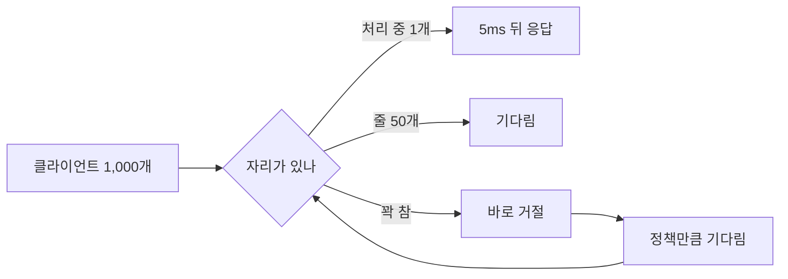
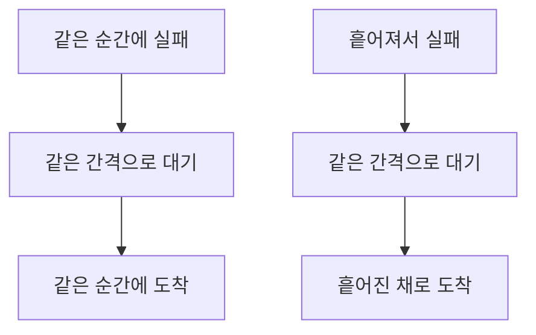

# 서버는 14%만 일했는데 1,000개 중 635개가 포기했다

## 상황

서버가 재시작한다. 물려 있던 연결 1,000개가 같은 순간에 끊긴다.
클라이언트는 전부 같은 SDK를 쓰고, SDK에는 이런 코드가 있다.

```typescript
await sleep(100 * 2 ** attempt)   // 100ms, 200ms, 400ms ...
```

지수 백오프다. 재시도 간격을 두 배씩 늘리니까 서버를 배려한 코드처럼 보인다.
나도 이렇게 짰고, 리뷰에서 이걸 보고 넘어갔다.

"여기에 지터를 넣어야 한다"는 말은 여러 번 들었다. 그래프도 본 적이 있다.
그런데 안 넣으면 정확히 무엇이 얼마나 나빠지는지 내 숫자로 본 적은 없었다.
1초 ± 100ms 정도로 살짝 흔드는 코드도 자주 보는데, 그 정도로 되는지도 몰랐다.

## 확인하고 싶었던 것

**재시도에 지터를 넣는 것과 안 넣는 것은 동시 재시도 폭주에서 얼마나 다른가.**

"다르다"를 세 가지로 쟀다. 끝까지 성공하지 못하고 포기한 클라이언트 수,
10ms 안에 가장 많이 몰린 재시도 수, 그리고 그동안 서버가 실제로 일한 시간의 비율.

## 재현

받을 수 있는 양이 정해진 서버를 인메모리로 만들었다.

- 요청 하나에 5ms. 한 번에 하나씩. 초당 200건
- 줄은 50개까지 세운다. 넘치면 바로 거절한다
- 클라이언트는 첫 시도를 합쳐 8번 해보고 포기한다. 첫 대기는 100ms, 상한은 10초



시간은 가상 시계로 돌렸다. 타이머를 시각 순으로 꺼내 바로 실행한다.
13초짜리 폭주가 수십 ms에 끝나고 몇 번을 돌려도 같은 숫자가 나온다.
가상 시계가 거짓말을 하는지는 맨 끝에서 진짜 `setTimeout`으로 대조했다.

1,000개가 같은 순간에 보냈다. 지터는 없다.

| 정책 | 성공 | 포기 | 서버가 받은 요청 | 10ms 최대 | 끝 | 서버 가동 |
|---|---|---|---|---|---|---|
| 고정 1000ms | 408 | 592 | 6,572 | 949 | 7.3초 | 28% |
| 지수 | 365 | **635** | 6,819 | 949 | 13.0초 | **14%** |

지수 쪽이 고정보다 나쁘다. 그리고 가동률이 이상하다.
13초 동안 서버는 2,600건을 처리할 수 있었다. 실제로 처리한 건 365건이다.
**서버가 못 받은 게 아니다. 받을 수 있을 때 아무도 안 왔다.**

물결 하나씩 뜯어봤다.

| 물결 | 시각 | 도착 | 들어감 |
|---|---|---|---|
| 1 | 0.0초 | 1,000 | 51 |
| 2 | 0.1초 | 949 | 19 |
| 3 | 0.3초 | 930 | 40 |
| 4 | 0.7초 | 890 | 51 |
| 5 | 1.5초 | 839 | 51 |
| 6 | 3.1초 | 788 | 51 |
| 7 | 6.3초 | 737 | 51 |
| 8 | 12.7초 | 686 | 51 |

거절당한 949개가 정확히 같은 시각에 다시 온다. 그중 들어가는 건 51개다.
처리 중 1개와 줄 50개. 나머지는 또 같은 시각에 거절당하고 또 같은 시각에 온다.

물결 7과 8 사이는 6.4초다. 서버는 그중 0.26초 일하고 나머지는 논다.
간격을 두 배로 늘릴수록 서버는 더 오래 놀고, 물결 하나에 들어가는 수는 그대로다.
**지터가 없으면 처리량을 정하는 건 서버 용량이 아니라 줄 길이 곱하기 물결 수다.**

## 접근

같은 조건에서 정책 네 개를 더 돌렸다.

| 정책 | 대기 시간 | 성공 | 포기 | 서버가 받은 요청 | 10ms 최대 | 끝 | 서버 가동 |
|---|---|---|---|---|---|---|---|
| 지수 | `d` | 365 | 635 | 6,819 | 949 | 13.0초 | 14% |
| 지수 ±10% | `d × (0.9 ~ 1.1)` | 990 | 10 | 6,199 | 491 | 13.8초 | 36% |
| 지수 + 절반 지터 | `d/2 + rand(0, d/2)` | **1,000** | **0** | 5,670 | 210 | 11.7초 | 43% |
| 지수 + 전체 지터 | `rand(0, d)` | 995 | 5 | 5,991 | 161 | 8.6초 | 58% |
| 직전 값 기준 지터 | `rand(base, 직전 × 3)` | 937 | 63 | 5,159 | **77** | 7.5초 | 62% |

`d`는 `min(10초, 100ms × 2^시도)`다.

±10%에서 먼저 놀랐다. 그 정도로는 안 될 줄 알았는데 포기가 635에서 10으로 내려갔다.
다만 첫 재시도는 여전히 몰린다. 100ms의 ±10%는 20ms 폭이라 949개가 그 안에 다 들어온다.
10ms 최대가 491인 게 그 자리다. 뒤로 갈수록 6.4초의 ±10%는 1.28초 폭이 되어 저절로 풀린다.

지터가 들어간 줄은 씨앗에 따라 움직인다. 씨앗 다섯 개로 다시 돌린 포기 수다.

| 정책 | 씨앗 1 ~ 5의 포기 수 |
|---|---|
| 지수 ±10% | 10 / 33 / 11 / 19 / 33 |
| 지수 + 절반 지터 | 0 / 0 / 0 / 0 / 0 |
| 지수 + 전체 지터 | 5 / 9 / 12 / 11 / 14 |
| 직전 값 기준 지터 | 63 / 65 / 64 / 53 / 73 |

가장 잘 퍼뜨리는 쪽(직전 값 기준, 10ms 최대 77)이 포기는 제일 많다.
이게 왜 그런지는 다음 실험에서 드러났다.

### 실패한 시각이 흩어져 있었다면

여기서 질문을 바꿨다. 몰리는 게 재시도 때문인가, 같은 순간에 실패했기 때문인가.

서버를 3초 동안 죽여두고 그동안 600개를 보냈다.
한 번은 3초에 걸쳐 흩어서, 한 번은 같은 순간에.

| 정책 | 흩어져서 · 포기 | 흩어져서 · 10ms 최대 | 같은 순간 · 포기 | 같은 순간 · 10ms 최대 |
|---|---|---|---|---|
| 고정 1000ms | 0 | 15 | 345 | 600 |
| 지수 | **0** | **19** | 447 | 600 |
| 지수 ±10% | 0 | 14 | 0 | 27 |
| 지수 + 절반 지터 | 0 | 18 | 0 | 10 |
| 지수 + 전체 지터 | **10** | 15 | 38 | 8 |
| 직전 값 기준 지터 | **69** | 21 | 150 | 9 |

흩어져서 실패한 쪽은 지터가 없어도 안 몰린다. 10ms 최대가 19다.
각자 실패한 시각이 다르니 각자 다른 시각에 돌아온다. 아무도 포기하지 않았다.



**지터가 푸는 건 재시도가 아니라 같은 출발 시각이다.**
서버가 재시작하며 연결을 한꺼번에 끊을 때, 정각에 도는 크론, 배포 직후의 캐시 만료.
이런 게 없으면 지터가 없어도 폭주가 안 난다. 있으면 난다.

그리고 예상과 반대인 것이 하나 나왔다. **지터를 세게 넣은 쪽에서 포기가 나온다.**
지수는 포기 0인데 전체 지터는 10, 직전 값 기준은 69다.

전체 지터는 평균 대기가 지수의 절반이다. 8번을 다 쓰는 데 걸리는 시간도 절반이다.
지수는 12.7초를 버티는데 전체 지터는 평균 6.35초를 버틴다.
서버가 3초 죽어 있으면 그 차이로 시도 횟수가 먼저 바닥난다.

맞는지 시도 횟수를 10으로 올려봤다. 전체 지터의 포기가 10에서 0으로, 38에서 0으로 내려갔다.
직전 값 기준은 69에서 29, 150에서 67로 줄었지만 남았다.
이쪽은 대기 시간이 다시 짧아질 수 있어서 횟수를 더 빨리 쓰는 것으로 보이는데, 거기까지는 안 쟀다.

### 몇 개부터 차이가 나는가

| 클라이언트 | 지터 없음 · 성공 | 지터 없음 · 가동 | 전체 지터 · 성공 | 전체 지터 · 가동 |
|---|---|---|---|---|
| 50 | 50 | 100% | 50 | 100% |
| 100 | 100 | 100% | 100 | 100% |
| 200 | 200 | 59% | 200 | 53% |
| 500 | **365** | 14% | 500 | 34% |
| 1,000 | **365** | 14% | 995 | 58% |
| 5,000 | **365** | 14% | 2,195 | 95% |

200개까지는 차이가 없다. 둘 다 전원 성공한다. 로컬에서 몇십 개로 돌려보면 아무것도 안 보인다.

500개부터 지터 없는 쪽의 성공 수가 365에서 멈춘다. 5,000개를 보내도 365다.
앞의 물결 표 그대로다. 줄 길이 곱하기 물결 수가 천장이다.

5,000개에서는 전체 지터도 2,805개가 포기한다. 서버 가동률이 95%다.
이건 몰려서가 아니라 진짜 모자란 것이다. **지터는 용량을 만들어주지 않는다.**

### 버린 선택지

**진짜 HTTP 서버.** 앞 모듈(`event-loop-blocking`)에서 부하를 내는 쪽과 받는 쪽이
같은 이벤트 루프를 쓰면 재려는 것보다 자가 더 흔들린다는 걸 겪었다.
여기서 보려는 건 "언제 도착하는가"라서 소켓이 필요 없었다.
대신 같은 코드를 진짜 `setTimeout` 위에서 돌려 대조했다. 아래 표다.

**`Math.random`.** 처음에 그냥 썼다가 표를 적을 수가 없었다. 돌릴 때마다 포기 수가 달랐다.
씨앗을 받는 난수로 바꾸고, 씨앗 다섯 개의 값을 같이 적었다.

**순간 최대를 시각으로 자르기.** "0초 이후에 도착한 것"을 재시도로 셌더니
가상 시계에서는 맞고 진짜 시계에서는 틀렸다. 진짜 시계의 첫 시도는 0초가 아니라 그 직후에
도착해서 1,000개가 전부 재시도로 세어졌다. 시도 번호로 세도록 바꿨다.

**직전 값 기준 지터의 첫 대기.** 처음 짠 코드는 직전 값이 0이라 첫 재시도가 전원 100ms였다.
10ms 최대가 949로 나와서 알았다. 첫 값을 base로 두니 77이 됐다.
이 정책을 직접 짜면 같은 자리에서 틀리기 쉽다.

## 결과

| 정한 것 | 왜 |
|---|---|
| 재시도에는 지터를 넣는다. 기본은 절반 지터 | 같은 순간에 실패한 1,000개에서 포기 635 대 0. 씨앗 다섯 개 전부 0 |
| 전체 지터는 시도 횟수를 같이 본다 | 평균 대기가 절반이라 8번을 6.35초에 쓴다. 3초 장애에서 포기가 나왔고 10번으로 올리니 0이 됐다 |
| ±10%는 없는 것보다 훨씬 낫지만 첫 재시도는 못 푼다 | 포기 635 → 10. 그런데 10ms 최대가 491이다 |
| 지터가 필요한지는 "같이 출발하는 일이 있는가"로 본다 | 흩어져서 실패한 600개는 지터 없이도 10ms 최대 19, 포기 0 |
| 로컬에서 몇십 개로 확인하고 괜찮다고 하지 않는다 | 200개까지는 지터가 있든 없든 전원 성공이다 |

절반 지터를 기본으로 고른 건 이 조건에서의 결과다. 최대 8번, 첫 대기 100ms, 줄 50개.
시도 횟수에 제한이 없으면 전체 지터가 더 빨리 끝난다(8.6초 대 11.7초).

### 줄을 늘리면 되지 않나

물결 하나에 줄 길이만큼만 들어간다면 줄을 늘리면 된다. 그래서 50개를 1,000개로 늘렸다.

| | 성공 | 포기 | 서버가 받은 요청 | 끝 | 서버 가동 | 헛일 |
|---|---|---|---|---|---|---|
| 줄 50 · 지터 없음 | 365 | 635 | 6,819 | 13.0초 | 14% | 0 |
| 줄 50 · 전체 지터 | 995 | 5 | 5,991 | 8.6초 | 58% | 0 |
| 줄 1000 · 지터 없음 | **1,000** | 0 | **1,000** | **5.0초** | 100% | 0 |
| 줄 1000 · 전체 지터 | 1,000 | 0 | 1,000 | 5.0초 | 100% | 0 |

제일 좋은 결과다. 재시도가 한 번도 없다. 1,000개를 받아서 5초에 다 처리했다.
지터보다 줄이 답인 것처럼 보인다.

그런데 이 표에는 빠진 게 있다. 1,000번째 요청은 5초를 기다렸다.
그동안 기다려주는 클라이언트는 없다. 1초 타임아웃을 걸었다.

| | 성공 | 포기 | 서버가 받은 요청 | 끝 | 서버 가동 | 헛일 |
|---|---|---|---|---|---|---|
| 줄 1000 · 1초 타임아웃 · 지터 없음 | 634 | 366 | 6,607 | 19.9초 | 94% | **3,127** |
| 줄 1000 · 1초 타임아웃 · 전체 지터 | **213** | **787** | 6,607 | 16.9초 | 92% | **2,919** |

헛일은 서버가 끝까지 처리했는데 클라이언트가 이미 떠난 요청이다.
서버는 90% 넘게 바쁜데 그 일의 대부분을 받아줄 사람이 없다.


**여기서는 지터를 넣은 쪽이 더 나쁘다.** 213 대 634다. 씨앗을 바꿔도 207 ~ 213이었다.

지터 없는 쪽의 성공은 절반 넘게 뒤쪽 물결에서 나왔다. 성공까지 걸린 시간의 중앙값이 17.7초다.
물결 사이가 6.4초로 벌어진 뒤에야 줄이 비고, 빈 줄에 도착한 앞쪽 200개가 1초 안에 응답을 받는다.
전체 지터는 재시도가 끊이지 않고 들어와서 줄이 빌 틈이 없는 것으로 보인다.
줄이 비는 시점을 직접 재지는 않았다. 성공 시각의 분포로 짐작한 것이다.

어느 쪽이든 셋 중 하나 이상이 포기했다. **줄이 길고 클라이언트가 먼저 포기하는
구조에서는 재시도 정책으로 풀 수 있는 게 없다.** 줄을 짧게 두고 빨리 거절하는 쪽이
(위 표의 줄 50 · 전체 지터, 포기 5) 훨씬 낫다.

### 가상 시계가 거짓말을 하지 않는가

같은 코드를 진짜 `setTimeout` 위에서 돌렸다. 이 표만 머신에 따라 달라진다.
리눅스, Node 24.13에서 쟀다.

| | 성공 | 포기 | 서버가 받은 요청 | 10ms 최대 | 끝 | 서버 가동 |
|---|---|---|---|---|---|---|
| 가상 · 지수 | 365 | 635 | 6,819 | 949 | 13.0초 | 14% |
| 진짜 · 지수 | 370 | 630 | 6,811 | 949 | 13.0초 | 14% |
| 가상 · 전체 지터 | 995 | 5 | 5,991 | 161 | 8.6초 | 58% |
| 진짜 · 전체 지터 | 991 | 9 | 6,034 | 162 | 9.1초 | 54% |

성공 수 차이가 5개 이하다. 모양은 같다.

## 다시 한다면

**거절에 값을 매긴다.** 이 서버는 거절이 공짜다. 949개를 거절하는 데 0ms가 든다.
실제로는 연결을 받고 503을 쓰는 데도 CPU가 든다. 그걸 넣으면 지터 없는 쪽은
물결이 올 때마다 처리 중이던 요청까지 느려질 것이다. 지금 숫자는 지터 없는 쪽에 유리하다.

**클라이언트가 계속 새로 온다.** 지금은 1,000개가 한 번 오고 끝이다.
실제로는 재시도하는 동안에도 새 요청이 들어온다. 그러면 5,000개 줄처럼
용량이 진짜 모자란 구간이 길어지고, 재시도가 새 요청의 자리를 뺏는다.
재시도 예산(전체 요청의 몇 %까지만 재시도)을 넣어야 하는 자리인데 이 모듈은 안 다뤘다.

**서버가 기다릴 시간을 알려준다.** `Retry-After`를 주면 클라이언트가 지터를 고를 필요가 없다.
서버가 흩어서 부르면 된다. 어느 쪽이 나은지는 안 쟀다.

**이 모듈이 다루지 않은 것.** 워커가 하나다. 네트워크 지연이 0이다.
클라이언트 전원이 같은 정책을 쓴다. 절반은 지터가 있고 절반은 없는 SDK 버전이
섞여 있을 때 어떻게 되는지는 안 봤다. 실제 장애에서는 이 경우가 더 흔할 것 같다.

**갈리는 지점.** 절반 지터와 전체 지터 중 무엇을 기본으로 둘지.
시도 횟수가 정해져 있으면 절반 지터가 안전했고, 빨리 끝나는 건 전체 지터였다.
타임아웃이 있는 긴 줄 앞에서는 둘 다 소용없었다. 그 경우 클라이언트가 아니라
서버의 줄 길이를 고쳐야 하는데, 그건 SDK를 짜는 사람이 정할 수 있는 게 아니다.

---

## 직접 실행해보기

Docker가 필요 없습니다. Node만 있으면 됩니다.

### 0. 준비

```bash
git clone https://github.com/xo0449/backend-lab.git
cd backend-lab
npm install
```

### 1. 전부 돌리기

```bash
npm run lab:jitter
```

다섯 가지가 차례로 나옵니다. 앞의 넷은 가상 시계라 1초 안에 끝나고,
5번이 진짜 타이머를 써서 20초쯤 걸립니다.

### 2. 하나만 돌리기

```bash
ONLY=1 npm run lab:jitter   # 같은 순간에 실패한 1,000개
ONLY=2 npm run lab:jitter   # 흩어져서 실패했다면
ONLY=3 npm run lab:jitter   # 클라이언트 수를 바꿔가며
ONLY=4 npm run lab:jitter   # 줄을 늘리면
ONLY=5 npm run lab:jitter   # 진짜 setTimeout으로 대조
```

1번과 2번을 나란히 보는 게 이 모듈의 요지입니다.

### 3. 숫자 바꿔보기

```bash
QUEUE=200 ONLY=1 npm run lab:jitter
ATTEMPTS=12 ONLY=1 npm run lab:jitter
ATTEMPTS=10 ONLY=2 npm run lab:jitter
BASE=1000 ONLY=1 npm run lab:jitter
CLIENTS=300 ONLY=1 npm run lab:jitter
SEED=2 ONLY=1 npm run lab:jitter
```

`QUEUE`가 제일 중요한 손잡이입니다. 200으로 올리면 지터 없는 지수도 1,000개 전원이 성공합니다.
대신 끝나는 데 13.2초가 걸리고 서버 가동률은 38%입니다. 전원 성공과 빨리 끝나는 건 다른 얘기입니다.

`ATTEMPTS=12`로 올려도 지터 없는 지수는 431개가 포기합니다. 끝나는 데 53초가 걸립니다.
**횟수를 늘려서는 못 풉니다.** 물결이 네 번 늘 뿐입니다.

`ATTEMPTS=10 ONLY=2`는 본문에서 전체 지터의 포기가 0이 된다고 한 그 실행입니다.

### 4. 결론을 뒤집어보기

`src/policies.ts`의 `fullJitter`에서 난수를 상수로 바꿉니다.

```typescript
return { name: '지수 + 전체 지터', next: (attempt, _prev, rand) => 0.5 * expo(o, attempt) }
//                                                                  rand() 이던 자리
```

```bash
ONLY=1 npm run lab:jitter
```

평균 대기는 그대로인데 전체 지터 줄이 성공 995에서 324로, 10ms 최대가 161에서 949로 돌아갑니다.
**효과를 낸 건 대기 시간의 길이가 아니라 서로 다르다는 것뿐이라는 뜻입니다.**

### 5. 물결을 직접 보기

지터 없는 지수가 왜 365에서 멈추는지는 시도 횟수를 하나씩 올려보면 보입니다.

```bash
ATTEMPTS=1 ONLY=1 npm run lab:jitter
ATTEMPTS=2 ONLY=1 npm run lab:jitter
ATTEMPTS=3 ONLY=1 npm run lab:jitter
```

`지수` 줄의 성공이 51, 70, 110으로 올라갑니다. 물결 하나에 들어간 수가 그 차이입니다.

### 6. 테스트

```bash
npx vitest run modules/retry-jitter
```
