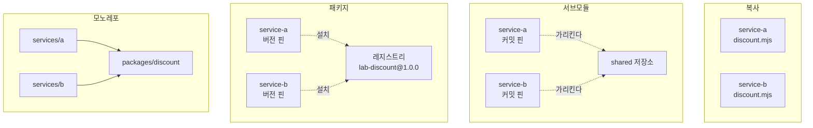

# 같은 로직을 여러 서비스에 담는 네 가지 방법

## 상황

서비스가 둘이 됐다. 둘 다 할인을 계산한다. 계산식이 같다.

처음에는 아무도 이걸 문제로 보지 않는다. 함수 하나를 양쪽에 두면 된다.
열 줄이고, 바뀔 일도 별로 없어 보인다.

그러다 계산에 상한이 생긴다. 한쪽만 고치고 다른 쪽을 잊는다.
그때부터 같은 주문이 서비스에 따라 다른 금액을 보여준다.
버그는 계산식에 있지 않다. **같은 것이 두 벌 있다는 사실에 있다.**

그래서 공유 장치를 도입한다. 서브모듈을 쓰거나, 사내 패키지를 만들거나,
저장소를 합친다. 각각이 무엇을 해결하고 무엇을 새로 만드는지 재봤다.

## 확인하고 싶었던 것

이 선택은 대개 "무엇이 깔끔한가"로 이야기된다.
그런데 실제로 갈리는 지점은 다른 데 있다고 생각했다.

**버전을 고정할 수 있다는 것은 장점인가 부채인가.**

서브모듈과 패키지는 서비스가 특정 버전을 가리킨다. 공통이 바뀌어도
서비스는 그대로다. 이게 안전장치처럼 들린다.
그런데 같은 성질이 "한쪽만 옛 버전에 남아 있는 상태"도 만든다.
처음에 문제였던 그 상태다.

## 비교 대상



네 방식 모두 실제 git 저장소와 npm 패키지로 만들어 돌렸다.
임시 디렉터리에 서비스 두 개와 공통 로직을 세우고, 명령을 하나씩 세면서
공통을 고쳤을 때 무엇이 필요한지 측정했다.

## 시나리오 1. 버그 수정이 두 서비스에 반영되기까지

할인에 상한을 넣는 수정이다. 시그니처는 그대로고 동작만 바뀐다.

| 방식 | 명령 수 | 수정 전 | A 반영 | B 반영 |
|---|---:|---:|---:|---:|
| 복사 | 6 | 10000 | 5000 | 5000 |
| 서브모듈 | 9 | 10000 | 5000 | 5000 |
| 패키지 | 9 | 10000 | 5000 | 5000 |
| 모노레포 | 3 | 10000 | 5000 | 5000 |

**공유 장치를 도입했는데 명령이 늘었다.** 복사보다 서브모듈이 더 많다.

이유는 단계가 하나 더 생겨서다. 복사는 서비스마다 파일을 고치고 커밋하면
끝이다. 서브모듈은 공통 저장소에 커밋하고, 서비스마다 당기고,
가리키는 커밋을 옮기는 커밋을 또 만든다.

**이게 공유 장치의 첫 번째 비용이다.** 중복을 없애는 대신 조정이 생긴다.
서비스가 둘일 때는 손해처럼 보인다. 열 개가 되면 복사는 열 군데를 고쳐야
하고 하나를 잊으면 그때부터 불일치가 시작된다.

모노레포가 3인 이유는 서비스 쪽에서 할 일이 없기 때문이다.
소스가 하나라 고치는 순간 둘 다 새 동작을 갖는다.

## 시나리오 2. 공통만 고치고 서비스는 아무것도 안 했을 때

| 방식 | 서비스 출력 | 반영됐는가 |
|---|---:|---|
| 서브모듈 | 10000 | 그대로 |
| 패키지 | 10000 | 그대로 |
| 모노레포 | 5000 | 즉시 반영 |

서브모듈과 패키지는 서비스가 움직이지 않으면 아무 일도 안 일어난다.
**공통 저장소에 고쳤다는 사실만으로는 아무것도 고쳐지지 않는다.**

이걸 안전장치로 볼 수도 있고 함정으로 볼 수도 있다.
보안 패치를 넣었는데 서비스가 안 받으면 패치를 안 한 것이다.

모노레포는 반대다. 고치면 바로 반영된다. 받을지 말지를 고를 수 없다.

## 시나리오 3. 한 서비스만 새 버전을 받는다

| 방식 | 부분 채택 | A (채택함) | B (안 함) |
|---|---|---:|---:|
| 서브모듈 | 가능 | 5000 | 10000 |
| 패키지 | 가능 | 5000 | 10000 |
| 모노레포 | 불가 | 5000 | 5000 |

**서브모듈과 패키지에서는 두 서비스가 다른 답을 낸다.**
같은 주문에 A는 5,000원, B는 10,000원을 할인한다.

이게 처음에 없애려던 그 상태다. 공유 장치를 도입했는데
불일치가 여전히 가능하다. 다른 점은 불일치가 "잊어버려서" 생기는 게 아니라
"버전이 달라서" 생긴다는 것이고, 그건 확인할 수 있는 상태라는 것이다.
`git submodule status`나 `package.json`을 보면 어느 버전인지 나온다.

모노레포는 이 상태를 만들 수 없다. 좋기도 하고 나쁘기도 하다.
서비스 하나가 아직 준비가 안 됐을 때 빠져나갈 구멍이 없다.

## 시나리오 4. 호환을 깨는 변경이 들어왔을 때

인자가 하나 늘어난 변경이다. 호출부는 그대로 두고 공통만 고쳤다.

| 방식 | 서비스 출력 | 언제 겪는가 |
|---|---:|---|
| 서브모듈 | 10000 | 버전을 올릴 때 |
| 패키지 | 10000 | 버전을 올릴 때 |
| 모노레포 | NaN | 공통 커밋 즉시 |

모노레포는 공통을 고친 그 커밋에서 바로 깨진다. CI가 빨간불이 된다.
**고치는 사람이 자기 커밋에서 문제를 본다.**

서브모듈과 패키지는 안 깨진다. 대신 미뤄진다.
포인터를 옮기는 사람이 몇 주 뒤에 겪는다. 그때는 공통을 고친 사람이
그 맥락을 잊었거나 팀을 옮겼을 수 있다.

**미룬 것이지 피한 것이 아니다.** 테스트로 확인했다.
서브모듈에서 포인터를 옮기는 순간 같은 값이 나온다.

## 네 방식의 성질

| | 복사 | 서브모듈 | 패키지 | 모노레포 |
|---|---|---|---|---|
| 전파 단계 | 서비스 수만큼 | 공통 + 서비스마다 | 공통 + 배포 + 서비스마다 | 하나 |
| 버전 고정 | 자동으로 됨 | 커밋 핀 | 버전 핀 | 없음 |
| 부분 채택 | 개념 없음 | 가능 | 가능 | 불가 |
| 깨짐을 겪는 시점 | 해당 없음 | 채택할 때 | 채택할 때 | 즉시 |
| 새 저장소 | 없음 | 1개 | 1개 + 레지스트리 | 없음 |
| 클론 절차 | 단순 | `--recursive` 필요 | 설치 필요 | 단순 |
| 서비스별 배포 | 독립 | 독립 | 독립 | 조정 필요 |

## 서브모듈과 패키지의 차이

둘은 고정한다는 점에서 같다. 다른 점은 무엇을 공유하느냐다.

**서브모듈은 소스를 공유한다.** 서비스가 공통 저장소의 파일을 그대로 갖는다.
빌드 도구가 그 소스를 같이 컴파일한다.

**패키지는 산출물을 공유한다.** 빌드된 결과와 타입 선언이 넘어간다.

이 차이가 만드는 것들이 있다.

### 배포 절차

패키지는 배포가 한 단계 더 있다. 버전을 올리고 레지스트리에 올려야 한다.
사내 레지스트리를 세우거나 GitHub Packages 같은 것을 쓴다.
서브모듈은 공통 저장소에 푸시하면 끝이다.

측정에서 둘 다 9단계가 나온 이유는 tarball로 대신했기 때문이다.
실제 레지스트리를 쓰면 인증과 배포가 더 붙는다.

### 클론 절차

서브모듈은 `git clone --recursive`를 잊으면 빈 디렉터리가 된다.
CI 설정에 그게 빠져 있으면 빌드가 이상하게 실패한다.
신규 입사자가 처음 겪는 문제가 대개 이것이다.

패키지는 `npm install`에 포함되므로 별도 절차가 없다.
대신 사내 레지스트리 인증이 필요하면 그게 같은 자리의 문제가 된다.

### 타입과 경계

패키지는 공개 인터페이스를 정할 수 있다. `files`나 `exports`로
내보낼 것만 내보낸다. 서비스가 내부 구현에 손을 못 댄다.

서브모듈은 소스가 통째로 있어서 경계가 약하다. 급할 때 내부 파일을
직접 import하게 되고, 그게 쌓이면 공통을 고칠 수 없게 된다.

### 고칠 때의 마찰

서브모듈은 공통 코드를 그 자리에서 고칠 수 있다. 서비스 작업 중에
공통 버그를 발견하면 바로 고치고 커밋한다.

패키지는 그럴 수 없다. `node_modules`를 고치는 건 사라지는 변경이다.
공통 저장소로 가서 고치고, 버전을 올리고, 돌아와서 설치해야 한다.
`npm link`로 우회할 수 있지만 그것도 잊으면 문제가 된다.

**이 마찰은 양날이다.** 고치기 어렵다는 것은 함부로 못 고친다는 뜻이기도 하다.
공통 코드는 여러 서비스가 쓰므로 함부로 고치면 안 된다.

## 무엇을 고를 것인가

**서비스가 둘이고 팀이 하나라면 모노레포가 낫다.**
조정 비용이 가장 낮고 깨짐을 즉시 본다. 부분 채택이 안 되는 것도
팀이 하나면 문제가 아니다.

**서비스마다 배포 주기가 다르면 고정이 필요하다.**
그때 서브모듈과 패키지 중에 고른다.

**공통 코드를 자주 고친다면 서브모듈이 편하다.**
배포 단계가 없어서 왕복이 짧다.

**공통 코드가 안정됐고 경계를 지키고 싶다면 패키지가 낫다.**
내보낼 것만 내보내고, 타입으로 계약을 강제하고,
버전으로 호환을 표현할 수 있다.

**복사는 한 가지 경우에만 맞다.** 앞으로 따로 진화할 것이 확실할 때다.
지금 같아 보이지만 도메인이 다르면 곧 갈라진다. 그때 공유 장치가 있으면
억지로 한 코드에 두 요구를 밀어 넣게 된다. 그게 더 나쁘다.

## 다시 한다면

### 타입 경계를 실제로 시험해본다

이 실험은 자바스크립트로 했다. 그래서 호환 깨는 변경이 실행 시점에
`NaN`으로 나타났다. 타입이 있으면 빌드 시점에 잡힌다.

패키지는 `.d.ts`를 함께 배포하므로 설치한 서비스가 컴파일에서 잡는다.
서브모듈은 소스가 같이 컴파일되므로 같은 시점에 잡힌다.
차이가 있는지 확인하지 않았다.

### 서비스를 열 개로 늘려본다

둘일 때는 복사가 가장 적은 명령으로 끝났다. 열 개면 뒤집힌다.
어디서 뒤집히는지가 실제 판단 기준인데 재보지 않았다.

### 공통 저장소를 여러 팀이 고치는 상황을 만들어본다

이 실험에는 사람이 하나다. 실제 문제는 여러 팀이 같은 공통 코드를
고치면서 생긴다. 누가 호환을 책임지는가, 리뷰는 누가 하는가.
그건 도구가 아니라 소유권의 문제이고, 도구 선택이 그걸 대신해주지 않는다.

### 캐시와 CI 시간을 잰다

서브모듈은 클론이 무거워진다. 패키지는 설치 캐시가 듣는다.
모노레포는 저장소 전체를 받는다. CI 시간에 차이가 날 텐데 재지 않았다.

---

## 직접 실행해보기

Docker가 필요 없다. git과 npm만 있으면 된다.
임시 디렉터리에 저장소를 만들고 끝나면 지운다.

```bash
git clone https://github.com/xo0449/backend-lab.git
cd backend-lab && npm install
```

### 1. 네 시나리오 전부 돌리기

```bash
npm run lab:sharing
```

### 2. 시나리오 하나만 돌리기

```bash
ONLY=1 npm run lab:sharing   # 버그 수정 전파에 드는 명령 수
ONLY=2 npm run lab:sharing   # 공통만 고쳤을 때
ONLY=3 npm run lab:sharing   # 한 서비스만 채택
ONLY=4 npm run lab:sharing   # 호환 깨는 변경
```

### 3. 실행된 명령을 직접 보기

`src/workspace.ts`의 `run`에 로그를 한 줄 넣으면
각 방식이 실제로 무슨 명령을 도는지 볼 수 있다.

```typescript
run(cwd: string, cmd: string, args: string[]): string {
  if (this.counting) {
    this.steps.push({ cwd, cmd: `${cmd} ${args.join(' ')}` })
    console.log('  ', cmd, args.join(' '))   // 이 줄을 추가
  }
  ...
}
```

```bash
ONLY=1 npm run lab:sharing
```

서브모듈이 왜 9단계인지, 모노레포가 왜 3단계인지 명령 목록으로 보인다.

### 4. 결론을 뒤집어보기

`src/strategies.ts`에서 `monorepo.adoptOne`이 `true`를 반환하도록 바꾼다.

```bash
ONLY=3 npm run lab:sharing
npx vitest run modules/shared-code-strategies -t "부분 채택이 불가능하다"
```

테스트가 실패한다. 모노레포에서 두 서비스가 다른 버전을 보게 만들 방법이
없다는 것을 코드로 고정해뒀기 때문이다.

### 5. 서비스를 늘려보기

`src/strategies.ts`의 `['service-a', 'service-b']`를 다섯 개로 늘린다.

```bash
ONLY=1 npm run lab:sharing
```

복사와 서브모듈의 명령 수가 서비스 수에 비례해 늘어나는 반면
모노레포는 그대로인 것을 볼 수 있다. 뒤집히는 지점이 어디인지 찾아본다.

### 6. 만들어진 저장소를 직접 들여다보기

정리를 건너뛰면 임시 디렉터리가 남는다.
`bench/run.ts`에서 `ws.cleanup()`을 주석 처리하고 돌린 뒤
출력된 경로로 들어가 본다.

```bash
ONLY=1 npm run lab:sharing
cd /tmp/lab-서브모듈-xxxx/service-a
git submodule status
cat .gitmodules
```

서브모듈이 어느 커밋을 가리키는지, 그 포인터가 서비스 저장소의
커밋으로 관리된다는 것을 확인할 수 있다.

### 7. 테스트

```bash
npx vitest run modules/shared-code-strategies
```
