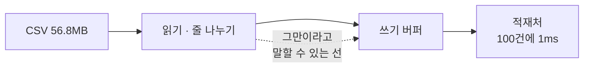
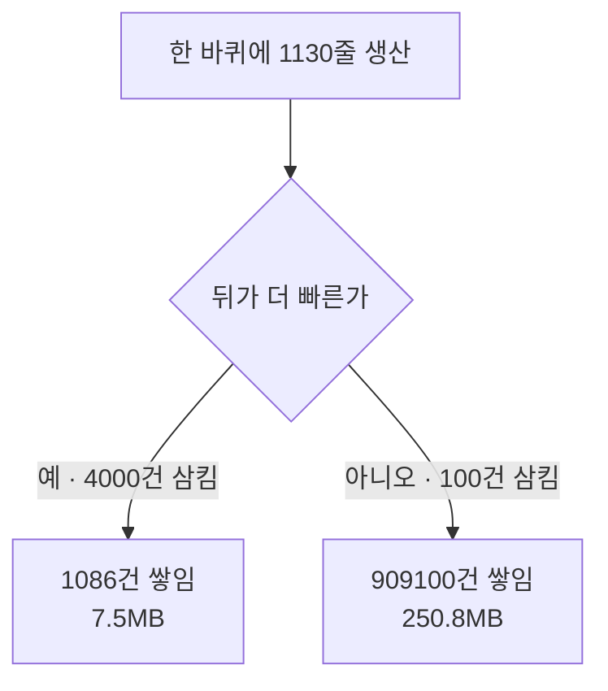
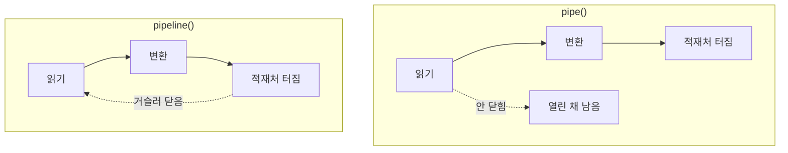

# 56MB 파일을 읽는데 힙이 250MB까지 갔다

## 상황

정산 파일을 받아 DB에 넣는 배치가 있다. 코드는 대충 이렇게 생겼다.

```typescript
const rl = createInterface({ input: createReadStream(path) })
for await (const line of rl) {
  sink.write(parse(line))
}
```

스테이징에서 10만 건으로 돌렸다. 잘 됐다. 빨랐다.
운영에 올렸더니 100만 건짜리가 들어왔고 프로세스가 내려갔다.

로그에는 `JavaScript heap out of memory` 한 줄만 있다.
파일은 56MB다. 컨테이너 메모리는 512MB다. 계산이 안 맞는다.

나도 이 코드를 썼고, 리뷰에서 통과시킨 적도 있다.
`for await`을 쓰고 있으니 한 줄씩 읽는 거라고 생각했다.
읽는 건 한 줄씩 맞았다. 문제는 쓰는 쪽이었다.

## 확인하고 싶었던 것

**backpressure를 무시하면 메모리가 언제 터지는가.**

"언제"를 파일 크기로 답하고 싶었다. 몇 건부터 위험한지 알면 방어할 수 있으니까.
결론부터 적으면 파일 크기로는 답이 안 나온다.

## 재현

100만 건짜리 CSV를 만들었다. 56.8MB다.
적재처는 100건 모을 때마다 1ms를 쓰고, 그 사이 이벤트 루프를 한 번 돌려준다.
DB 왕복 한 번이라고 보면 된다.

같은 파일을 같은 적재처에 세 가지로 넣었다.



| | 살아있는 힙 최대 | 버퍼에 쌓인 최대 | 걸린 시간 |
|---|---|---|---|
| `write()` 반환값을 안 본다 | **250.8MB** | 909,100건 | 14.5초 |
| 반환값이 false면 `drain`을 기다린다 | 7.5MB | 999건 | 11.4초 |
| `pipeline()`으로 잇는다 | 7.6MB | 999건 | 11.7초 |

33배다. 코드에서 다른 건 이 한 줄뿐이다.

```typescript
if (!sink.write(row)) await once(sink, 'drain')
```

세 번 반복해서 다시 쟀다. 힙은 세 번 다 250.8 / 7.5 / 7.6MB로 같았고,
쌓인 건수도 세 번 다 909,100건이었다. 시간은 14.3~14.8초와 11.4~11.7초였다.
앞 모듈에서 p99가 재볼 때마다 달랐던 것과 달리 이쪽은 흔들리지 않았다.

**안 본 쪽이 빠르지도 않았다.** 250MB짜리 힙을 들고 다니느라 GC가 더 일한다.

### 힙을 재는 데 한 번 걸렸다

처음에는 `process.memoryUsage().heapUsed`를 그냥 찍었다.
세 방식이 전부 74MB로 똑같이 나왔다.

셋 다 100만 개의 객체를 만든다. 다른 건 그중 몇 개가 **아직 필요하냐**다.
`heapUsed`는 아직 안 치운 쓰레기까지 같이 센다.
그래서 `--expose-gc`로 돌리고 재기 직전에 치우도록 바꿨다.
그 뒤에야 250.8 대 7.5가 나왔다.

치우는 데 드는 시간은 재는 시간에서 뺐다. 안 빼면 힙이 큰 쪽이
느린 것처럼 보인다. 250MB를 억지로 치우는 비용이 3초쯤 된다.

## 접근

### 파일이 56MB인데 왜 힙이 250MB인가

줄을 객체로 바꾸면 커진다. `id,user_id,sku,...` 57바이트짜리 한 줄이
필드 일곱 개짜리 객체가 되면서 문자열 헤더와 객체 헤더가 붙는다.
쌓인 909,100건으로 나누면 한 건에 276바이트다. 원문의 4.8배다.

**파일 크기를 보고 메모리를 가늠하면 안 된다.**

### 그래서 몇 건부터 터지는가

힙 상한을 192MB로 걸고 자식 프로세스로 돌렸다.
터지는 것을 직접 보려면 이 방법밖에 없다.

| 건수 | 반환값을 안 본다 | `pipeline()` |
|---|---|---|
| 10만 | 살아남음 · 힙 31.2MB · 버퍼 91,000건 | 살아남음 · 힙 7.4MB · 버퍼 999건 |
| 25만 | 살아남음 · 힙 65.1MB · 버퍼 227,400건 | 살아남음 · 힙 7.5MB · 버퍼 999건 |
| 50만 | 살아남음 · 힙 128.4MB · 버퍼 454,600건 | 살아남음 · 힙 7.5MB · 버퍼 999건 |
| 100만 | **죽음** · 힙 부족으로 프로세스가 내려감 | 살아남음 · 힙 7.5MB · 버퍼 999건 |

여기까지는 "50만과 100만 사이"라는 답이 나온 것 같다.
그런데 이 표는 **이 적재처일 때만** 맞다.

### 쌓이는 양을 정하는 것은 파일이 아니다

적재처가 한 번에 삼키는 건수만 바꿔봤다. 파일도 코드도 그대로다.

| 적재처가 한 번에 | 살아있는 힙 최대 | 버퍼에 쌓인 최대 |
|---|---|---|
| 100건씩 | 251.1MB | 909,100건 |
| 500건씩 | 152.2MB | 545,500건 |
| 1000건씩 | 31.7MB | 91,364건 |
| 4000건씩 | **7.5MB** | **1,086건** |

맨 아랫줄에서는 반환값을 안 봐도 아무 일이 없다.
`pipeline()`으로 바꿔도 7.5MB로 똑같다. 차이가 사라진다.

읽는 쪽은 64KB를 한 번에 가져와서 약 1,130줄을 내놓는다.
적재처가 한 번에 4,000건을 삼키면 뒤가 더 빠르니 쌓일 틈이 없다.
100건이면 한 바퀴에 1,030건씩 뒤처진다. 그 뒤처짐에 상한이 없다.



**개발 환경에서 안 걸리는 이유가 여기 있다.**
로컬 DB는 빠르다. 뒤가 앞보다 빠르면 버그가 안 보인다.
운영에서 DB가 느려지거나 네트워크가 끼는 순간에만 나타난다.
그때는 파일도 같이 커져 있다.

### highWaterMark를 올리면

`pipeline()`으로 이어놓고 쓰기 버퍼의 `highWaterMark`만 바꿔봤다.

| highWaterMark | 살아있는 힙 최대 | 버퍼에 쌓인 최대 |
|---|---|---|
| 16 | 6.9MB | 15건 |
| 1,000 | 7.2MB | 999건 |
| 50,000 | 19.9MB | 49,999건 |
| 500,000 | 137.5MB | 499,999건 |

맨 아랫줄은 반환값을 안 본 쪽과 같은 모양이다.
**backpressure를 무시하는 것은 `highWaterMark`를 무한대로 둔 것과 같다.**
"몇 건까지 뒤처져도 되는가"를 정하지 않은 것이다.

### 버린 선택지

처음에는 적재처를 `_writev`로 짰다. 배치 적재라면 그게 자연스럽다.
그런데 `_writev`는 버퍼에 쌓인 것을 **한 번에 전부** 넘겨받는다.
그래서 아무리 뒤처져도 다음 호출 한 번에 다 빠진다. 쌓였다는 사실이
측정에서 사라졌다. `_writev`를 켜고 200만 건(114.6MB)을 반환값을 안 보고
넣었더니 버퍼 최대가 1,170건, 힙이 7.4MB로 나왔다. `pipeline()`과 구분이 안 된다.

실제 드라이버가 `_writev`를 쓰면 이 모듈의 숫자보다 덜 아프다.
대신 그때는 한 번에 90만 건짜리 INSERT를 만들려 든다. 아픈 자리가 옮겨갈 뿐이다.
이번에는 `_write`만 두고 한 건씩 받게 했다.

부하를 타이머로 조절하는 것도 안 했다. 윈도우에서 `setTimeout(1)`은
16ms쯤 잔다. 앞 모듈(`event-loop-blocking`)에서 같은 데 걸렸다.
적재처의 1ms는 바쁜 대기로 준다.

## 결과

### pipe와 pipeline의 차이는 메모리가 아니었다

둘 다 backpressure는 똑같이 전달한다. 재보니 힙도 같았다.
다른 건 **뒤가 터졌을 때**다.

적재처가 500건째에서 에러를 내게 하고 200판을 돌렸다.



| | 에러를 받았나 | 안 닫힌 읽기 스트림 | 안 닫힌 변환 스트림 | 힙+버퍼 |
|---|---|---|---|---|
| 시작 | | | | 9.8MB |
| `pipe()` | 200/200 | **200개** | **400개** | **41.9MB** |
| 손으로 전부 `destroy()` 한 뒤 | | | | 21.6MB |
| `pipeline()` | 200/200 | 0개 | 0개 | 10.1MB |

힙+버퍼 값은 앞 시나리오가 남긴 것에 따라 조금 달라진다. `ONLY=4`로 따로
돌렸을 때는 9.0 / 42.1 / 22.0 / 10.4MB가 나왔다. **스트림 개수는 어떻게 돌려도
200 / 400 / 0 / 0으로 같았다.** 결론은 개수 쪽에 걸었다.

`pipe()`는 뒤가 터져도 앞을 안 닫는다. 200판에 600개가 열린 채 남았다.
손으로 `destroy()`를 불러야 정리된다. 그러고도 힙은 21.6MB까지만 내려온다.

에러를 받은 것도 적재처에 핸들러를 직접 달았기 때문이다.
`pipe()`는 에러를 사슬 옆으로 넘기지 않는다. 스트림마다 따로 달아야 하고,
하나라도 빠뜨리면 프로세스가 내려간다.
`pipeline()`은 한 군데서 받고 사슬 전체를 닫는다.

열린 파일 디스크립터 개수를 프로세스 안에서 직접 세는 방법은 못 찾았다.
`process.getActiveResourcesInfo()`는 종류만 알려주고 개수를 안 나눠준다.
**여기서 확인한 건 스트림 객체가 안 닫혔다는 것까지다.** fd가 실제로 몇 개
남았는지는 재지 못했다.

### 정한 것

| 정한 것 | 왜 |
|---|---|
| `write()`를 직접 부르는 자리는 리뷰에서 반환값을 본다 | 그 한 줄이 250.8MB와 7.5MB를 갈랐다 |
| 스트림을 이을 때는 `pipeline()`을 쓴다 | 메모리는 같지만 터졌을 때 600개가 남느냐 0개가 남느냐가 다르다 |
| 배치 규모를 "몇 건"이 아니라 "앞뒤 처리량 비"로 본다 | 같은 100만 건이 적재처 속도에 따라 1,086건과 909,100건으로 갈렸다 |
| 스테이징에서 통과한 배치를 믿지 않는다 | 로컬 DB가 빠르면 이 버그는 안 나타난다 |
| 메모리 한도는 파일 크기로 잡지 않는다 | 56.8MB 파일이 힙 250.8MB가 됐다. 4.4배다 |

세 번째 줄이 처음 생각과 제일 달랐던 부분이다.
"몇 건부터 위험한가"를 답으로 얻으려고 시작했는데, 그 질문 자체가 틀렸다.
건수는 뒤처짐의 **상한**을 정할 뿐이고, 실제로 얼마나 뒤처지는지는
적재처가 정한다.

## 다시 한다면

**적재처를 진짜 DB로 바꿔서 잰다.**
이 모듈의 적재처는 1ms를 바쁜 대기로 태우는 가짜다. 실제 MySQL은
왕복 대기 중에 이벤트 루프를 놓아주므로 앞쪽이 그동안 더 많이 읽는다.
그러면 뒤처짐이 지금 숫자보다 커질 수 있다. 이 저장소에 MySQL 컨테이너가
있으니 할 수 있었는데, 그러면 드라이버의 큐까지 같이 재게 돼서
무엇이 정한 숫자인지 흐려질 것 같아 이번에는 안 갔다.

**Transform 사슬이 길 때를 안 봤다.**
지금은 읽기 · 줄 나누기 · 파싱 · 적재처 네 개다. 각 단계가 자기 버퍼를
따로 갖는다. 사슬이 열 개가 되면 `highWaterMark`도 열 벌이다.
합쳐서 얼마가 되는지는 재지 않았다.

**터진 뒤의 복구를 안 봤다.**
100만 건짜리가 50만 건째에서 죽으면 어디부터 다시 하는가.
그건 멱등성 쪽 질문이라 이 모듈에서는 건드리지 않았다.

**갈리는 지점.**
`highWaterMark`를 얼마로 둘지는 못 정했다. 16으로 두면 힙은 6.9MB인데
드나드는 횟수가 늘어 이벤트 루프를 더 자주 돈다. 50,000으로 두면
19.9MB를 쓰는 대신 덜 돈다. 이 모듈에서는 둘의 처리 시간 차이가
11.7초와 11.6초로 구분이 안 됐다. 적재처가 병목이라 그렇다.
적재처가 빨라지면 이 저울질이 의미를 갖는데, 거기까지는 안 갔다.

또 하나. `pipe()`를 쓰는 기존 코드를 전부 `pipeline()`으로 바꿀 것인가.
에러가 안 나는 경로에서는 차이가 없으니 급하지 않다는 의견도 있고,
어차피 언젠가 난다는 의견도 있다. 정하지 못했다.

---

## 직접 실행해보기

Docker가 필요 없습니다. Node만 있으면 됩니다.
100만 건 CSV(56.8MB)를 임시 폴더에 한 번 만들고 그 뒤로는 재사용합니다.

### 0. 준비

```bash
git clone https://github.com/xo0449/backend-lab.git
cd backend-lab
npm install
```

### 1. 전부 돌리기

```bash
npm run lab:stream
```

다섯 가지가 차례로 나옵니다. CSV가 없는 상태에서 처음부터 돌리면 3분쯤 걸립니다.

`--expose-gc` 없이 돌리면 힙 숫자가 안 치운 쓰레기까지 셉니다.
`npm run lab:stream`이 그 플래그를 붙여줍니다. 붙지 않았으면 경고가 나옵니다.

### 2. 하나만 돌리기

```bash
ONLY=1 npm run lab:stream
ONLY=2 npm run lab:stream
ONLY=3 npm run lab:stream
ONLY=4 npm run lab:stream
ONLY=5 npm run lab:stream
```

2번이 이 모듈의 요지입니다. 파일은 그대로 두고 적재처 속도만 바꿉니다.
3번은 자식 프로세스를 힙 상한을 걸어 띄워서 실제로 죽이는 쪽입니다.

### 3. 숫자 바꿔보기

```bash
ROWS=2000000 ONLY=1 npm run lab:stream
BATCH=4000 ONLY=1 npm run lab:stream
MS_PER_BATCH=5 ONLY=1 npm run lab:stream
HEAP=96 ONLY=3 npm run lab:stream
```

`BATCH`가 이 모듈에서 제일 중요한 손잡이입니다.
`BATCH=4000`으로 두면 반환값을 안 봐도 힙이 7.2MB로 `pipeline()`과 같아집니다.
**"몇 건부터 터지는가"의 답이 이 값 하나로 바뀝니다.**

`HEAP`을 96으로 내리면 죽는 자리가 100만 건에서 50만 건으로 옮겨갑니다.
`ROWS`를 올릴 때는 디스크를 보세요. 200만 건이면 114.6MB입니다.

### 4. 결론을 뒤집어보기

`src/load.ts`에서 drain을 기다리는 줄을 지웁니다.

```typescript
const ok = sink.write(row)
// if (!ok && mode === 'drain') await once(sink, 'drain')
```

그러면 `drain` 쪽이 `ignore` 쪽과 같아집니다.

```bash
ONLY=1 npm run lab:stream
```

직접 지우고 돌려본 값은 세 줄이 250.8MB · 250.8MB · 7.6MB 였습니다.
가운데 줄만 7.5MB에서 250.8MB로 올라가고, 쌓인 건수도 999건에서 909,100건이 됩니다.
**그 한 줄이 33배를 만든다는 뜻입니다.** 확인했으면 주석을 되돌립니다.

### 5. 만들어둔 CSV 보기

```bash
node -e "const{readdirSync,statSync}=require('fs'),{join}=require('path'),d=join(require('os').tmpdir(),'backend-lab-stream');for(const f of readdirSync(d))console.log(f,(statSync(join(d,f)).size/1048576).toFixed(1)+'MB')"
```

지우고 다시 만들고 싶으면 이 폴더를 통째로 지우면 됩니다.

```bash
node -e "require('fs').rmSync(require('path').join(require('os').tmpdir(),'backend-lab-stream'),{recursive:true,force:true})"
```

### 6. 테스트

```bash
npx vitest run modules/stream-backpressure
```

테스트는 힙을 안 봅니다. vitest는 `--expose-gc` 없이 돌아서
힙 숫자를 믿을 수 없습니다. 대신 버퍼에 쌓인 건수와
스트림이 닫혔는지를 봅니다. 둘 다 GC와 상관이 없습니다.
