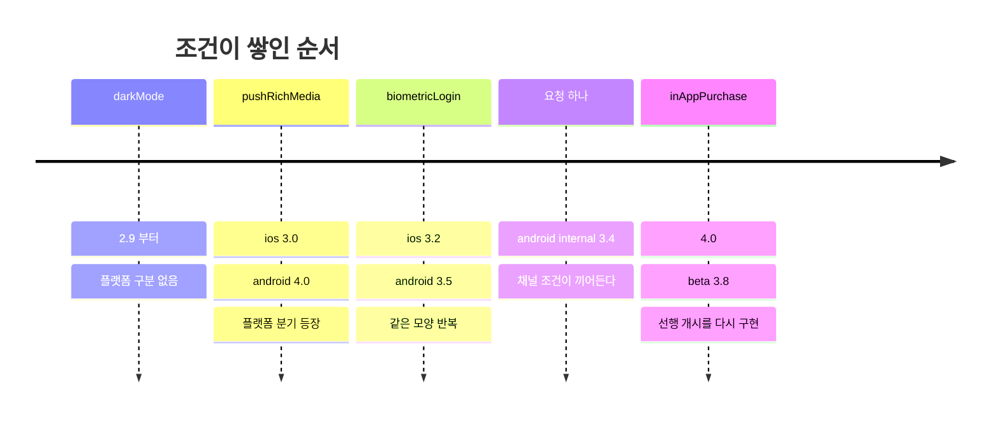
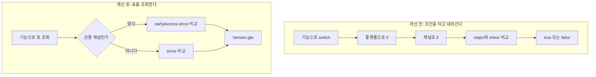
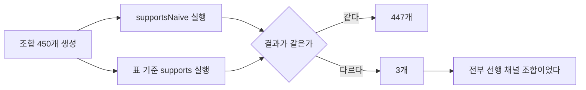

# switch로 범벅된 버전 분기를 표로 옮기기

## 고민

SDK는 하나인데 동작은 여러 갈래다. 플랫폼이 다르고, 앱 버전이 다르고,
배포 채널이 다르다. 기능마다 "어디서부터 켤 것인가"가 따로 정해진다.

순진하게 짜면 이렇게 된다.

```typescript
case 'biometricLogin':
  if (platform === 'ios') {
    if (major > 3) return true
    if (major === 3 && minor >= 2) return true
    return false
  }
  if (platform === 'android') {
    // 안드로이드는 3.5부터. 단 내부 채널은 3.4부터 켰다.
    if (channel === 'internal' && major === 3 && minor >= 4) return true
    if (major > 3) return true
    if (major === 3 && minor >= 5) return true
    return false
  }
  return false
```

한 번에 놓고 보면 이상하다. 그런데 이 코드는 한 번에 쓰인 적이 없다.

### 코드가 이 모양이 되는 순서

기록은 남아 있지 않다. 코드에 박힌 버전 숫자로 순서를 되짚으면 이렇게 읽힌다.

처음은 `darkMode`였을 것이다. 2.9부터 켠다. 플랫폼도 채널도 나뉘지 않는다.
조건이 두 줄이고, 그 두 줄이 전부다.

다음은 `pushRichMedia`다. iOS 작업이 먼저 끝나 3.0에 나갔다.
안드로이드는 일정이 밀려 4.0이 됐다. 여기서 플랫폼 분기가 처음 생긴다.
한 줄이 두 줄이 됐을 뿐이다. 아직 아무 문제가 없다.

`biometricLogin`이 들어온다. iOS 3.2, 안드로이드 3.5.
앞선 기능과 같은 모양을 한 번 더 쓴다. 여전히 읽을 만하다.

그리고 요청이 하나 온다. 안드로이드 내부 채널에 먼저 열어달라는 것이다.
QA가 3.4 사내 빌드로 시나리오를 돌려야 한다.
정식 개시 버전은 3.5로 이미 공지돼서 당길 수 없다.



### 그 한 줄의 합리성

개발자는 `case 'biometricLogin'`의 안드로이드 블록에 한 줄을 넣는다.

```typescript
if (channel === 'internal' && major === 3 && minor >= 4) return true
```

이 선택은 그 시점의 거의 모든 기준에서 옳다.

**영향 범위가 닫혀 있다.** 조건 앞에 `channel === 'internal'`이 붙어 있다.
프로덕션 사용자는 어떤 버전이어도 이 줄을 타지 않는다.
잘못 짜도 사내 빌드 안에서만 잘못된다.

**리뷰가 싸다.** 바뀐 줄이 하나다. 리뷰어가 맥락을 새로 잡을 필요가 없다.
조건문을 읽으면 의도가 그대로 보인다.

**되돌릴 수 있어 보인다.** QA가 끝나면 지우면 된다.
실제로 지우는 사람은 없다. 다만 넣는 시점에는 지울 수 있는 줄로 보인다.

**대안이 그 자리에서 비싸다.** 선행 채널이라는 개념을 제대로 만들려면
나머지 네 기능도 같이 손봐야 한다. 지금 필요한 건 안드로이드 하나다.
요청받지 않은 코드를 건드리면 리뷰가 커지고 배포 위험이 늘어난다.
받은 일만 하는 쪽이 더 조심스러운 선택으로 보인다.

요청한 사람도 정확했다. 필요한 건 안드로이드 내부 채널이었고 그렇게 말했다.
iOS나 베타 이야기가 나올 이유가 없었다.

### 반년 뒤의 결과

다음은 `inAppPurchase`다. 비슷한 요청이 온다. 이번엔 베타 채널이다.
요청한 사람이 다르고, 쓴 단어도 다르다.

개발자는 `case 'inAppPurchase'` 안에 한 줄을 넣는다.
`biometricLogin`을 열어볼 이유가 없다.
`case`끼리 공유하는 코드가 없어서 참고 대상으로 떠오르지도 않는다.

```typescript
// 4.0 미만이지만 베타 채널에는 미리 열어줬다.
if (channel === 'beta' && major === 3 && minor >= 8) return true
```

`offlineCart` 차례에는 요청이 "내부랑 베타 둘 다"였다.
그래서 세 번째 모양이 나온다. `production`만 따로 빼고 나머지를 묶는 형태다.

```typescript
if (channel === 'production') {
  if (major >= 5) return true
  return false
}
// 베타와 내부는 4.7부터
if (major > 4) return true
if (major === 4 && minor >= 7) return true
```

각 시점에는 아무도 잘못하지 않았다. 반년 뒤 결과만 잘못돼 있다.
같은 정책이 세 가지 모양으로 적혀 있고, 그중 둘은 절반만 적혀 있다.

**이건 실력 문제가 아니다.** 구조가 사람에게 전체를 보여주지 않았다.
한 기능을 고치는 사람에게 다른 기능의 정책은 보이지 않는다.
보이지 않는 것과 맞출 방법은 없다.

### 진짜 질문

궁금했던 것은 이거다. **이 구조가 실제로 틀린 동작을 만드는가,
아니면 그냥 보기 싫을 뿐인가.**

이 구분이 중요했다. 보기 싫은 것은 고칠 근거가 약하다.
리팩터링에는 시간이 들고, 돌아가는 코드를 건드리는 위험이 따라온다.
"읽기 불편하다"만으로는 그 값을 치를 이유가 안 된다.

반대로 틀린 동작이 나온다면 이야기가 달라진다.
그때는 취향이 아니라 결함이고, 다음 기능에서도 반복될 결함이다.

## 접근

### 버린 선택지

기능이 열리는 조건을 코드가 아니라 표로 옮겼다.
그 전에 다른 방법을 놓고 따졌다.

**원격 설정 서버.** 배포 없이 기능을 켜고 끌 수 있다.
가장 먼저 떠오르는 방법이고, 실제로 많이 쓰는 방법이다.
버린 이유는 푸는 문제가 다르기 때문이다.
원격 설정은 "지금 이 기능을 켤 것인가"에 답한다.
여기서 정하는 건 "이 버전의 클라이언트가 이 기능을 수행할 수 있는가"다.
3.1 앱에 `biometricLogin`을 켜면 그냥 깨진다. 서버가 바꿀 수 있는 값이 아니다.
클라이언트의 능력은 빌드에 박혀 있고, 그 사실은 원격으로 바뀌지 않는다.
게다가 설정을 못 받아온 순간의 기본값이 필요하고, 그 기본값이 결국 같은 표다.

**기능마다 클래스, 전략 패턴.** `BiometricLoginPolicy` 같은 클래스를 다섯 개 만든다.
`switch`가 사라지고 분기가 각 클래스 안으로 들어간다.
분기문의 모양은 확실히 나아진다. 정책이 흩어진 것은 그대로다.
`internal`만 열린 곳과 `beta`만 열린 곳을 찾으려면 다섯 파일을 전부 열어야 한다.
문제는 `switch`라는 문법이 아니라 정책이 한눈에 안 들어오는 것이었다.
파일을 다섯 개로 나누면 그 문제는 더 나빠진다.

**빌드 타임 제거.** 버전별로 다른 번들을 만들어 분기 자체를 없앤다.
이미 배포된 앱은 다시 빌드할 수 없다. 3.4 앱은 3.4 코드를 그대로 들고 있다.
하나의 SDK가 여러 버전의 클라이언트를 상대하는 구조에서는 쓸 수 없다.
분기는 어떤 식으로든 런타임에 남는다.

**semver 라이브러리.** `satisfies(version, '>=3.2.0')` 한 줄로 끝난다.
따져본 것 중 가장 가까운 대안이었다.
버리기로 한 이유는 필요한 연산이 `gte` 하나뿐이기 때문이다.
prerelease, caret, tilde, 범위 문법은 쓸 일이 없었다.
그리고 버전 형식이 바뀔 여지를 우리 쪽에 두고 싶었다.
사내 빌드 번호가 네 번째 자리로 붙는 경우가 흔하다.
실무에서 버전이 semver를 그대로 따른다면 라이브러리를 쓰는 쪽이 낫다.
여기서는 비교 규칙을 직접 들고 있는 값이 더 컸다.

**JSON 파일로 외부화.** 표를 `capabilities.json`으로 빼면
코드를 모르는 사람도 고칠 수 있다. 대신 타입 검사가 사라진다.
지금은 `Record<Feature, Capability>`라서 기능을 추가하면
컴파일러가 빠진 항목을 짚는다. 플랫폼 이름 오타도 그 자리에서 잡힌다.
JSON으로 빼면 그 검사를 런타임 검증으로 다시 만들어야 한다.
표를 고치는 사람이 결국 개발자라면 검사만 잃고 얻는 게 없다.

### 코드 안의 표를 고른 이유

표의 목적은 정책 전체를 한 화면에서 보는 것이다.
그 목적을 만족하는 가장 싼 방법이 코드 안의 리터럴이었다.

```typescript
export const CAPABILITIES: Record<Feature, Capability> = {
  biometricLogin: {
    since: { ios: '3.2.0', android: '3.5.0' },
    earlyAccess: {
      channels: ['beta', 'internal'],
      since: { ios: '3.2.0', android: '3.4.0' },
    },
  },
  ...
}
```

타입 검사가 공짜로 붙는다. 테스트가 같은 언어로 같은 파일 옆에 붙는다.
새 기능을 추가할 때 고칠 곳이 이 리터럴 한 곳이다.
배포 주기가 짧다면 외부화로 얻는 이득이 크지 않다.

빠뜨린 조합을 눈으로 잡는 것이 목표라면, 그 조합들이 세로로 나란히
쌓여 있어야 한다. 위 형태가 그걸 만든다.

### 버전 비교를 값으로 빼기

버전 비교는 값 객체로 뺐다.

```typescript
Version.parse('3.10.0').gte(Version.parse('3.9.0'))  // true
```

처음에는 이게 과한 분리로 보였다. 숫자 세 개를 비교하는 일이다.
그런데 흩어진 비교가 만드는 문제가 한 종류가 아니었다.

**문자열 비교는 두 자리에서 틀린다.** `'3.10.0' < '3.9.0'`이 참이다.
사전순으로 `1`이 `9`보다 앞이기 때문이다.
minor가 10번대에 들어가기 전까지는 멀쩡히 동작한다.
개선 전 코드는 `split` 후 숫자로 바꿔서 이 함정은 피했다.
다만 다음 사람이 한 줄 줄이겠다고 문자열 비교를 넣으면 그날 들어온다.
비교하는 곳이 열댓 군데면 그런 한 줄이 들어올 자리도 열댓 군데다.

**patch 자리가 아예 없다.** 개선 전 코드는 이렇게 시작한다.

```typescript
const [major, minor] = appVersion.split('.').map(Number)
```

`patch`를 꺼내지 않는다. 3.4.0과 3.4.9가 같은 값으로 취급된다.
지금 정책에는 patch 기준이 없으니 아무 문제가 없다.
문제는 patch 기준이 생기는 날이다.
크래시 핫픽스를 3.5.2에 내보내고 "3.5.2부터"라고 적어야 하는 순간이 온다.
그날 고칠 곳은 저 한 줄이 아니다. 그 아래 비교문 전부다.

**두 줄이 한 쌍으로 묶여 있다.** "3.2 이상"을 적으려면 두 줄이 필요하다.

```typescript
if (major > 3) return true
if (major === 3 && minor >= 2) return true
```

윗줄만 있으면 3.2부터 3.9까지가 통째로 빠진다.
아랫줄만 있으면 4.0 이상이 빠진다. 둘 다 조용히 틀린다.
이 쌍이 네 군데에 복사돼 있고, 복사한 뒤 숫자만 고치는 방식이다.

게다가 기준값에 따라 필요한 줄 수가 달라진다.
`pushRichMedia`는 기준이 3.0.0이라 `major >= 3` 한 줄로 맞다.
기준이 3.1로 바뀌면 그 한 줄로는 안 된다.
정책을 바꿀 때마다 코드의 모양도 같이 판단해야 한다.

값 객체로 빼면 그 판단이 사라진다.
`version.gte(Version.parse(min))` 한 줄이 모든 경우를 덮는다.
기준이 3.0이든 3.1.2든 같은 코드다.

**잘못된 입력이 조용히 통과하지 않는다.** `'4.x.0'`을 `split` 하면
`NaN`이 나온다. `NaN >= 3`은 거짓이다.
흩어진 비교에서는 기능이 그냥 꺼진 채로 넘어간다.
`Version.parse`는 그 자리에서 예외를 던진다.

자리별로 비교하는 곳이 하나면 한 번만 맞추면 된다.

## 전수 비교

### 찾는 방식이 달라진다



개선 전에는 기능마다 경로의 모양이 다르다. 그래서 기능마다 다르게 틀릴 수 있다.
개선 후에는 경로가 하나다. 틀린다면 표의 값이 틀린 것이고, 값은 눈으로 본다.

### 읽기로는 못 찾는 이유

틀린 동작이 있는지부터 확인해야 했다. 처음에는 코드를 읽어서 찾으려 했다.
잘 안 됐다.

각 `case`를 따로 읽으면 전부 말이 된다.
안드로이드 내부 채널을 3.4부터 여는 것도 말이 되고,
베타 채널에 4.0 전에 여는 것도 말이 된다.
틀렸다고 말하려면 무엇이 옳은지를 먼저 알아야 하는데,
그 기준이 코드 밖에도 안에도 없었다.

방향을 바꿨다. 옳다고 생각하는 기준을 따로 적고,
두 구현을 전부 돌려 답이 갈리는 지점을 찾는다.
표는 그래서 두 가지 역할을 한다. 새 구현이면서, 기존 구현을 재는 자다.

### 450개라는 크기

입력 공간이 작다는 것이 이 방법을 가능하게 했다.
플랫폼 3개, 채널 3개, 버전 10개, 기능 5개다.
곱하면 450이다. 샘플링도 속성 기반 생성도 필요 없다.


전부 돌려서 전부 비교하면 된다.

버전 10개는 아무 값이나 고른 것이 아니다.
정책에 등장하는 경계값을 전부 넣었다.
2.9.0, 3.0.0, 3.2.0, 3.4.0, 3.5.0, 3.8.0, 4.0.0, 4.7.0, 5.0.0이 그것이다.
여기에 가장 낮은 경계보다 아래인 2.8.0을 더했다.
차이가 생긴다면 경계에서 생기기 때문이다.

## 결과 1. 불일치 3건

```bash
npx tsx modules/version-dispatch/bench/diff.ts
```

조합 450개 중 3개가 달랐다.

| 기능 | 플랫폼 | 채널 | 버전 | 개선 전 | 표 기준 |
|---|---|---|---|:-:|:-:|
| biometricLogin | android | beta | 3.4.0 | 닫힘 | 열림 |
| inAppPurchase | ios | internal | 3.8.0 | 닫힘 | 열림 |
| inAppPurchase | android | internal | 3.8.0 | 닫힘 | 열림 |

### 같은 종류의 실수

처음 본 감상은 "적다"였다. 450개 중 3개면 대부분이 맞았다는 뜻이다.
이 정도면 굳이 고칠 일인가 싶었다.

세 줄을 나란히 놓고 보다가 생각이 바뀌었다.
**채널 칸에 `production`이 하나도 없다.**
전부 `beta` 아니면 `internal`이다.

무작위로 생긴 실수라면 이렇게 몰리지 않는다.
버전 칸도 마찬가지다. 3.4.0과 3.8.0뿐이고, 둘 다 선행 개시 기준값이다.
한 자리에서 같은 방식으로 틀린 것이다.

**셋 다 같은 종류의 실수다.** 선행 채널에 먼저 열어주는 정책인데,
한 곳은 `internal`만 열고 `beta`를 빠뜨렸고, 다른 곳은 `beta`만 열고
`internal`을 빠뜨렸다.

같은 개념을 두 곳에서 각각 구현했고, 두 번 다 절반씩 틀렸다.
코드를 읽어서는 알아채기 어렵다. 각각을 따로 보면 둘 다 말이 되기 때문이다.

여기서 처음 질문의 답이 나왔다. 보기 싫은 문제가 아니었다.
그리고 버그 세 개도 아니었다. 구조가 만들어내는 버그다.
이름 없는 개념을 세 번 각각 구현했고 그중 둘이 반쪽이었다.
여섯 번째 기능에 같은 요청이 오면 네 번째 모양이 생긴다.

정책을 한 표에 모으니 빠진 칸이 바로 보였다.

표로 옮기고 나니 왜 빠졌는지도 보인다.

| 기능 | 정식 개시 | 선행 채널 개시 | 개선 전 코드가 열어준 채널 |
|---|---|---|---|
| biometricLogin (ios) | 3.2.0 | 3.2.0 | 해당 없음 |
| biometricLogin (android) | 3.5.0 | 3.4.0 | internal만 |
| inAppPurchase | 4.0.0 | 3.8.0 | beta만 |
| offlineCart | 5.0.0 | 4.7.0 | beta, internal |
| pushRichMedia | ios 3.0.0 / android 4.0.0 | 없음 | 해당 없음 |
| darkMode | 2.9.0 | 없음 | 해당 없음 |

오른쪽 칸이 들쭉날쭉하다. 같은 "선행 채널 조기 개시"인데 어떤 기능은
`internal`만, 어떤 기능은 `beta`만, 어떤 기능은 둘 다 열려 있었다.
정책이 아니라 요청이 들어온 순서가 남은 것이다.

## 결과 2. 고칠 곳의 수

| | 개선 전 | 개선 후 |
|---|---|---|
| 플랫폼 분기 지점 | 6곳 | 표 1곳 |
| 버전 비교 지점 | 15곳에 흩어짐 | 값 객체 1곳 |
| 의도와 어긋난 조합 | 3건 | 0건 |

새 플랫폼을 추가한다고 하자. 개선 전에는 기능마다 `switch`의 각 `case`를
찾아가 분기를 넣어야 한다. 다섯 군데다. 하나를 빠뜨리면 그 기능만
조용히 꺼진 채 배포된다.

조용히 꺼진다는 점이 중요하다. 예외가 나지 않는다. 로그도 남지 않는다.
사용자가 문의를 넣기 전까지 아무도 모른다.

표에서는 각 기능의 `since`에 한 줄씩 더하면 된다. 빠뜨리면
"이 플랫폼은 지원 안 함"이 되는데, 표를 보면 빈 칸이 눈에 띈다.

## 옮기고 난 정책 표

리팩터링 결과물은 이 표 하나다. 코드가 아니라 이걸 읽으면 된다.

| 기능 | iOS | Android | Web | 선행 채널 |
|---|---|---|---|---|
| biometricLogin | 3.2.0 | 3.5.0 | 미지원 | ios 3.2.0 / android 3.4.0 |
| inAppPurchase | 4.0.0 | 4.0.0 | 미지원 | 3.8.0 |
| pushRichMedia | 3.0.0 | 4.0.0 | 미지원 | 없음 |
| darkMode | 2.9.0 | 2.9.0 | 2.9.0 | 없음 |
| offlineCart | 5.0.0 | 5.0.0 | 미지원 | 4.7.0 |

빈 칸이 곧 "지원 안 함"이다. 새 플랫폼이 생기면 열이 하나 늘고,
채우지 않은 칸은 눈에 띈다. 코드였다면 그냥 없는 분기였을 뿐이다.

## 정책 자체의 테스트

분기가 코드에 흩어져 있을 때는 "선행 채널은 항상 정식보다 먼저 받는다"
같은 규칙을 검사할 방법이 없었다. 표가 되니 규칙 자체를 테스트한다.

```typescript
it('선행 채널의 기준이 정식 기준보다 낮거나 같다', () => {
  for (const feature of FEATURES) {
    const { since, earlyAccess } = CAPABILITIES[feature]
    if (!earlyAccess) continue
    for (const [platform, min] of Object.entries(earlyAccess.since)) {
      const normal = since[platform]
      if (!normal) continue
      expect(Version.parse(normal).gte(Version.parse(min))).toBe(true)
    }
  }
})
```

개별 조합이 아니라 정책의 성질을 검사한다.
새 기능을 표에 추가할 때 실수하면 이 테스트가 잡는다.

"베타와 내부가 같은 시점에 받는다"도 같은 방식으로 고정했다.
이번에 나온 3건이 정확히 이 규칙을 깬 경우다.
규칙을 글로 적어두면 다음에 또 깨진다. 테스트로 적으면 깨질 때 알려준다.

## 다시 한다면

### 표의 위치

**표를 코드 밖으로 뺄지는 따져봐야 한다.** 원격 설정으로 두면 배포 없이
기능을 켜고 끌 수 있다. 대신 클라이언트가 설정을 못 받아온 상황의
기본값을 정해야 하고, 그 순간 다시 분기가 생긴다.
배포 주기가 짧다면 코드에 두는 편이 단순하다.

기준은 이렇게 잡을 것 같다.
표를 고치는 사람이 개발자라면 코드에 둔다.
기획자나 운영자가 직접 고쳐야 한다면 그때 밖으로 뺀다.
지금은 전자다.

### 현실의 복잡도

**이 실험의 표는 실제보다 단순하다.** 현실에서는 특정 버전 구간만
버그가 있어 빼야 하는 경우, 지역별로 다른 경우, A/B 테스트가 겹치는 경우가
있다. 구간과 예외가 들어오면 `since` 하나로는 부족하고 범위 표현이 필요하다.
그때도 표 안에서 풀리는지가 이 구조의 진짜 시험대다.

세 가지를 따로 생각해봤다.

**버전 구간 제외는 표가 견딘다.** 3.6.0에만 크래시가 있어 그 버전만 빼야 한다.
`excludes` 칸을 하나 더 두면 된다. 칸이 하나 늘 뿐이고 여전히 한눈에 보인다.
`supports`가 읽어야 할 필드가 하나 늘어난다.

**지역별 차이는 표의 차원을 늘린다.** 한국에만 먼저 연다고 하자.
`since`는 지금 플랫폼별이다. 여기에 지역이 곱해지면 한 칸이 다시 표가 된다.
플랫폼 3개에 지역 5개면 한 기능에 15칸이다. 한 화면에 안 들어온다.
표의 장점이 사라지는 첫 번째 지점이 여기다.

**A/B 테스트는 성격이 다르다.** 표가 답하는 질문은
"이 버전의 클라이언트가 이 기능을 수행할 수 있는가"다.
A/B 테스트가 묻는 것은 "이 사용자에게 보여줄 것인가"다.
앞은 클라이언트의 능력이고 뒤는 노출 결정이다.
둘을 한 표에 넣으면 표가 두 가지 질문에 동시에 답하게 된다.
나눠 두는 쪽을 고를 것 같다. 능력 표는 그대로 두고,
노출을 정하는 계층이 그 표를 읽어서 쓴다.
능력이 없는 클라이언트는 실험 대상에서 빠지는 것이 자연스럽다.

### 표가 비대해지는 신호

표가 언제까지 답인지도 미리 정해두는 편이 낫다.
세 가지를 신호로 보고 있다.

**한 칸에 조건이 들어가기 시작할 때.**
`since: { ios: '3.2.0 || >=4.1.0 <4.3.0' }` 같은 값이 나오면
데이터를 적는 게 아니라 코드를 문자열로 적는 것이다.
그 문자열을 해석할 파서가 필요해지고, 파서에는 파서의 버그가 생긴다.

**기능 하나만 쓰는 칸이 생길 때.**
다섯 기능 중 한 곳에서만 채워지는 필드는 표의 열이 아니라 예외다.
예외를 열로 만들면 나머지 네 칸이 영원히 비어 있다.
그런 것은 표 밖에 따로 적는 편이 읽기 쉽다.

**해석기가 표보다 커질 때.**
지금 `supports`는 열댓 줄이다. 표를 읽고 답을 내는 데 그만큼이면 된다.
표에 칸이 늘수록 이 함수도 같이 자란다.
함수가 원래 `switch` 정도로 길어지면 얻은 게 없다.
분기를 표로 옮긴 게 아니라 분기를 데이터 안에 숨긴 것이다.
그 지점이 보이면 다시 코드로 돌리는 쪽이 나을 수 있다.

### 동작이 바뀐 지점

**기존 동작을 그대로 옮기지 않았다.** 전수 비교에서 나온 3건은
표 기준이 맞다고 보고 고친 것이다. 실무에서는 그 3건이 의도된 예외일 수도
있다. 리팩터링에서 동작이 바뀌는 지점을 찾았다면, 고치기 전에
왜 그렇게 되어 있었는지 먼저 확인해야 한다.

확인할 대상이 분명하다는 점은 짚어둘 만하다.
전수 비교는 "다른 곳 3개"를 정확히 짚어준다.
물어볼 것이 450개가 아니라 3개다.
고치는 결정은 사람이 하고, 후보를 좁히는 일은 비교가 한다.

---

## 직접 실행해보기

Docker가 필요 없다. 클론하고 바로 돈다.

```bash
git clone https://github.com/xo0449/backend-lab.git
cd backend-lab && npm install
```

### 1. 전수 비교 돌리기

조합 450개를 만들어 두 구현을 비교한다.

```bash
npm run lab:version
```

불일치 3건이 기능별로 묶여 나온다.

### 2. 표를 고쳐 결과가 달라지는지 보기

`modules/version-dispatch/src/capabilities.ts`에서
`biometricLogin`의 `earlyAccess.channels`에서 `beta`를 빼본다.

```bash
npm run lab:version
```

불일치가 2건으로 줄어든다. 개선 전 코드와 같아졌다는 뜻이다.

### 3. 새 플랫폼을 추가해보기

`types.ts`의 `Platform`에 `'desktop'`을 더하고
`capabilities.ts`의 `since`에 아무것도 넣지 않는다.

```bash
npx vitest run modules/version-dispatch
```

지원하지 않는 플랫폼은 어떤 버전이어도 거짓이라는 테스트가 그대로 통과한다.
표에 빈 칸이 곧 미지원이기 때문이다.

### 4. 테스트

```bash
npx vitest run modules/version-dispatch
```
