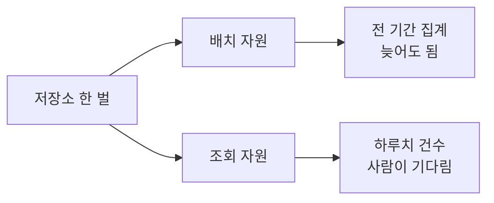
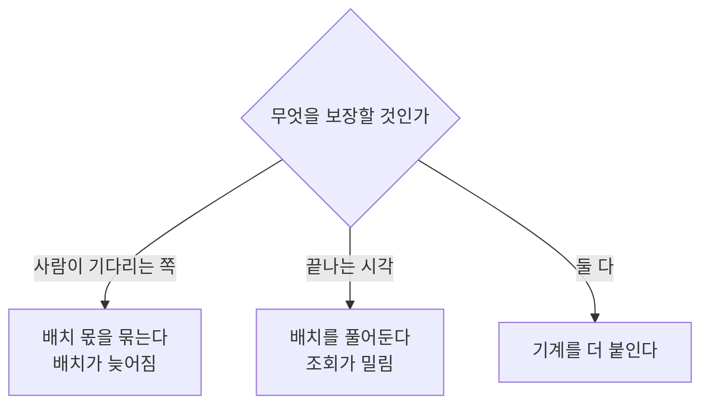

# 저장은 한 벌, 계산은 여러 개로 나누면 얼마나 달라지는가

## 상황

앞의 모듈들로 쌓고, 읽고, 운영 DB까지 붙였다.
혼자 쓸 때는 다 괜찮았다.

그런데 쓰는 사람이 늘면 성격이 다른 작업이 같이 돌게 된다.

밤에 도는 집계가 있다. 전 기간을 훑고 사용자별로 묶는다.
몇 초 늦어도 아무도 안 본다. 끝나기만 하면 된다.

아침에 오는 조회가 있다. 하루치에서 건수를 센다.
사람이 화면 앞에서 기다린다. 늦으면 바로 안다.

둘이 같은 자원에서 돌면 서로 기다린다.
이 말은 여러 번 들었는데 얼마나 기다리는지는 몰랐다.

## 확인하고 싶었던 것

**데이터를 복사하지 않고 나눌 수 있는가. 나누면 무엇을 치르는가.**

복사해서 푸는 방법은 안 보고 싶었다.
복사본이 생기면 어느 쪽이 맞는 숫자인지 다투는 일이 따라온다.

## 재현

저장소는 하나로 두고 계산하는 쪽만 바꿔가며 쟀다.



배치를 계속 돌리면서 조회를 던지고 지연을 쟀다.
하루 20만 건, 7일치다.

| | 조회 p50 | 조회 p95 | 조회 횟수 | 배치 횟수 |
|---|---|---|---|---|
| 배치가 안 돌 때 | 6ms | 7ms | 539 | 0 |
| 한 자원에서 같이 | 39ms | **52ms** (7.3배) | 121 | 122 |
| 자원을 나눠서 | 7ms | 15ms (2.1배) | 380 | 135 |

**7.3배.** 같은 질문, 같은 파일인데 배치가 옆에서 돌고 있다는 것만으로 그렇다.

조회 횟수가 539회에서 121회로 준 것도 같이 봐야 한다.
같은 시간 동안 4분의 1밖에 못 물어봤다. 한 번에 오래 붙잡히기 때문이다.

자원을 나누면 52ms가 15ms가 된다. 그런데 7ms로 돌아가지는 않는다.

## 접근

돌아가지 않는 이유는 간단하다. **같은 기계다.**

계산 자원을 나눠도 CPU는 하나다.
배치가 코어를 다 쓰면 조회 쪽도 결국 기다린다.

그래서 배치가 쓸 수 있는 몫을 정해봤다.

| | 조회 p50 | 조회 p95 | 배치 횟수 |
|---|---|---|---|
| 배치가 안 돌 때 | 6ms | 8ms | 0 |
| 배치가 스레드를 다 씀 | 7ms | 17ms (2.2배) | 132 |
| 배치를 1스레드로 묶음 | 4ms | **5ms** (0.6배) | 38 |

조회가 기준보다 빨라졌다. 배치가 거의 방해를 안 하니 그렇다.

**그런데 배치가 3.5배 덜 돌았다.**

이게 이 모듈에서 제일 중요한 줄이다.
자원을 나누는 건 공짜가 아니다. 한쪽을 보장하면 다른 쪽이 느려진다.

기계를 더 붙이지 않는 한 총량은 그대로다.
나눈다는 건 **누가 기다릴지를 정하는 일**이지 더 빠르게 만드는 게 아니다.



## 결과

### 데이터는 한 벌인가

자원을 나눴는데 데이터가 갈라지면 의미가 없다. 확인했다.

```
자원 둘이 같은 답을 내나  예
각각 걸린 시간           39ms / 39ms
저장소에 있는 파일        7개 (46.6MB)
```

자원을 둘로 나눠도 파일은 그대로 7개다.
읽는 쪽이 늘었을 뿐 저장은 한 곳이다.

이게 2편 컨퍼런스에서 들은 Single Copy 이야기의 실물이었다.
복사해서 나누면 숫자가 갈라지고, 그다음엔 어느 쪽이 맞는지를 두고 회의를 한다.

### 그래서 정한 것

| 정한 것 | 왜 |
|---|---|
| 데이터는 복사하지 않는다 | 복사본이 생기면 맞는 숫자를 다투게 된다 |
| 배치와 조회는 다른 자원에서 돌린다 | 같이 두면 조회가 7배 밀린다 |
| 배치 쪽에 몫을 정해둔다 | 안 정하면 나눠도 2배는 밀린다 |
| 몫을 정하기 전에 어느 쪽을 보장할지 먼저 정한다 | 총량은 그대로다. 누가 기다릴지를 고르는 것이다 |
| 이 문제가 오기 전까지는 나누지 않는다 | 나누는 순간 운영할 게 둘이 된다 |

마지막 줄이 중요하다.
[앞 모듈](../query-without-loading/)에서처럼 쿼리마다 자원이 따로 뜨는 방식을 쓰고 있으면
이 문제 자체가 늦게 온다. 미리 나눌 이유가 없다.

## 다시 한다면

**조회 쪽에도 한도를 건다.**
지금은 배치만 묶었다. 그런데 실수로 전 기간을 훑는 조회가 들어오면
조회 자원 안에서 같은 일이 벌어진다.

**언제 나눌지를 숫자로 정해둔다.**
"조회 p95가 배치 없을 때의 3배를 넘으면" 같은 기준이 있어야
감으로 나누지 않는다. 지금은 그 기준이 없다.

**이 모듈이 다루지 않은 것.**
기계를 더 붙이는 쪽은 안 봤다. 여기서는 노트북 하나다.
실제로는 자원을 나눈다는 게 대개 기계를 더 쓰는 것이고,
그러면 총량이 늘어서 이 글의 저울질이 달라진다.

읽기와 쓰기가 같이 도는 경우도 안 봤다.
배치가 결과를 저장소에 쓰는 동안 조회가 그 파일을 읽으면 또 다른 이야기가 된다.

### 클라우드에서는 이 자리에 무엇이 오는가

| 이 모듈 | AWS | Snowflake |
|---|---|---|
| 계산 자원 하나 | Athena Workgroup | Virtual Warehouse |
| 자원을 나누는 것 | 워크그룹을 `batch` / `adhoc` 으로 | 용도별 웨어하우스 |
| 몫을 정하는 것 | 워크그룹별 스캔 한도, Provisioned Capacity | 웨어하우스 크기 |
| 저장은 한 벌 | 같은 S3 · 같은 Glue 테이블 | 같은 저장 계층 |
| 기계를 더 붙이는 것 | Concurrency Scaling, Redshift Serverless | Multi-cluster warehouse |

Athena는 쿼리마다 자원이 따로 뜨는 편이라 이 문제가 늦게 온다.
거기서 막히는 건 계산 자원이 아니라 계정 단위 동시 실행 한도라,
워크그룹을 나누는 것만으로도 한동안 버틴다.

---

## 직접 실행해보기

### 0. 준비

```bash
git clone https://github.com/xo0449/backend-lab.git
cd backend-lab
npm install
docker compose up -d minio
```

### 1. 전부 돌리기

```bash
npm run lab:isolation
```

셋이 차례로 나옵니다. 재는 데 30초쯤 걸립니다.

### 2. 하나만 돌리기

```bash
ONLY=1 npm run lab:isolation
ONLY=2 npm run lab:isolation
ONLY=3 npm run lab:isolation
```

### 3. 숫자 바꿔보기

```bash
PER_DAY=500000 npm run lab:isolation
WINDOW=15000 npm run lab:isolation
BATCH_THREADS=4 npm run lab:isolation
```

`BATCH_THREADS`를 올리면 배치가 더 많이 도는 대신 조회가 다시 밀립니다.
**저울의 어느 쪽에 무게를 둘지가 이 값 하나로 정해집니다.**

### 4. 결론을 뒤집어보기

`bench/run.ts`의 1번 시나리오에서 조회를 배치와 같은 연결로 던집니다.

```typescript
const batchOnly = await openEngine()
const askOnly = batchOnly          // 따로 만들지 않는다
```

"자원을 나눠서" 줄이 "한 자원에서 같이"와 같아집니다.
나눈 게 연결이 아니라 자원이어야 한다는 뜻입니다.

### 5. 데이터가 한 벌인지 직접 보기

```bash
docker exec backend-lab-minio-1 mc alias set local http://localhost:9000 lab labsecret
docker exec backend-lab-minio-1 mc ls --recursive local/lake/parquet-part/
```

3번 시나리오를 몇 번 돌려도 파일 수가 그대로입니다.

### 6. 테스트

```bash
npx vitest run modules/workload-isolation
```

### 7. 정리

```bash
docker compose down -v
```
